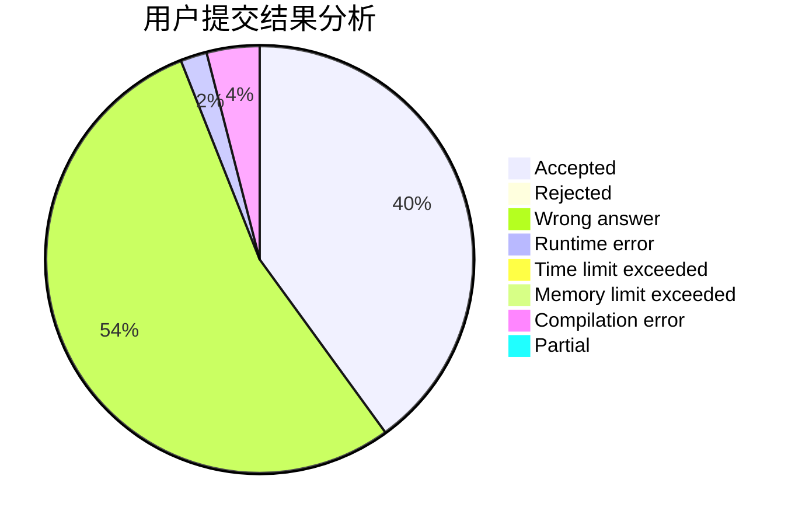
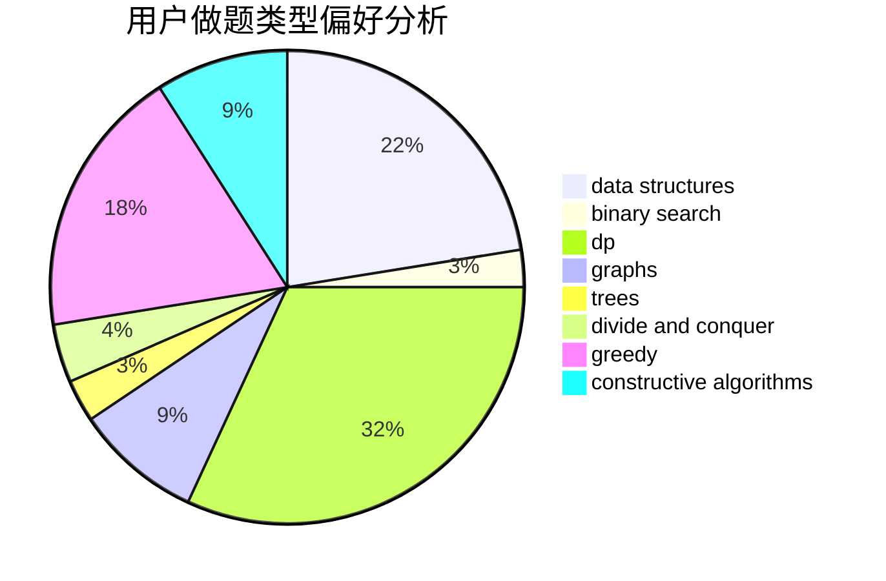

# hou_huangbolin

<!-- tabs:start -->

#### **用户提交结果分析**

#### **用户做题类型偏好分析**

#### **用户错题知识点分析**

<!-- tabs:end -->
# 推荐题目
[610B](https://codeforces.com/contest/610/problem/B)		constructive algorithms,
                        implementation		  
[1038D](https://codeforces.com/contest/1038/problem/D)		dp,
                        greedy,
                        implementation		  
[1283F](https://codeforces.com/contest/1283/problem/F)		constructive algorithms,
                        greedy,
                        trees		  
[1129B](https://codeforces.com/contest/1129/problem/B)		constructive algorithms		  
[1070C](https://codeforces.com/contest/1070/problem/C)		data structures,
                        greedy		  
[633D](https://codeforces.com/contest/633/problem/D)		brute force,
                        dp,
                        hashing,
                        implementation,
                        math		  
[639F](https://codeforces.com/contest/639/problem/F)		data structures,
                        dfs and similar,
                        graphs,
                        trees		  
[821D](https://codeforces.com/contest/821/problem/D)		dfs and similar,
                        graphs,
                        shortest paths		  
[723D](https://codeforces.com/contest/723/problem/D)		dfs and similar,
                        dsu,
                        graphs,
                        greedy,
                        implementation		  
[316C2](https://codeforces.com/contest/316C/problem/2)		flows,
                        graph matchings		  
