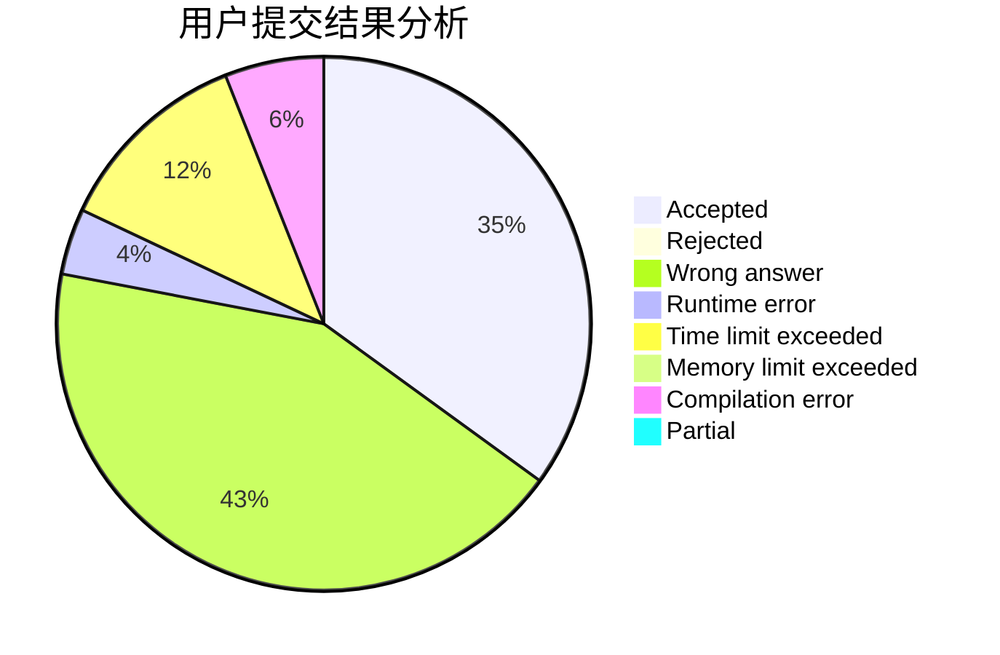
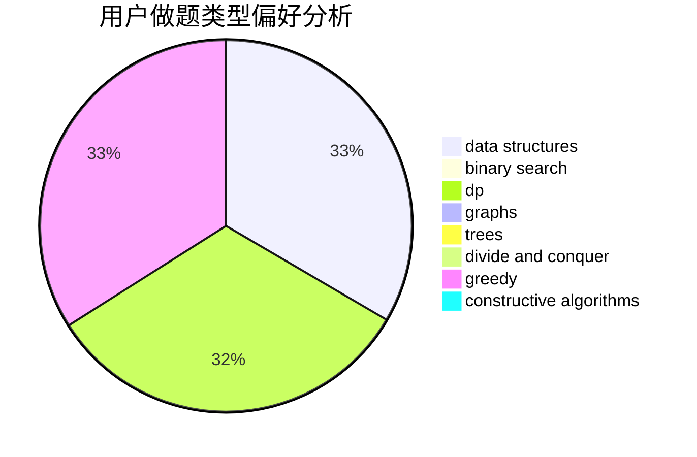

# houpingze

<!-- tabs:start -->

#### **用户提交结果分析**

#### **用户做题类型偏好分析**

#### **用户错题知识点分析**

<!-- tabs:end -->
# 推荐题目
[578B](https://codeforces.com/contest/578/problem/B)		brute force,
                        greedy		  
[627E](https://codeforces.com/contest/627/problem/E)		two pointers		  
[13932](https://codeforces.com/contest/1393/problem/2)		dsu,graphs,sortings,trees		  
[1220A](https://codeforces.com/contest/1220/problem/A)		implementation,
                        sortings,
                        strings		  
[616B](https://codeforces.com/contest/616/problem/B)		games,
                        greedy		  
[1314D](https://codeforces.com/contest/1314/problem/D)		dsu,graphs,sortings,trees		  
[750H](https://codeforces.com/contest/750/problem/H)		dfs and similar,
                        dsu,
                        graphs,
                        interactive		  
[243B](https://codeforces.com/contest/243/problem/B)		graphs,
                        sortings		  
[83B](https://codeforces.com/contest/83/problem/B)		binary search,
                        math,
                        sortings		  
[471C](https://codeforces.com/contest/471/problem/C)		binary search,
                        brute force,
                        greedy,
                        math		  
