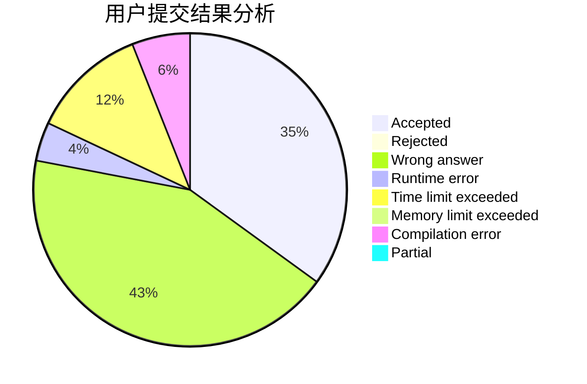
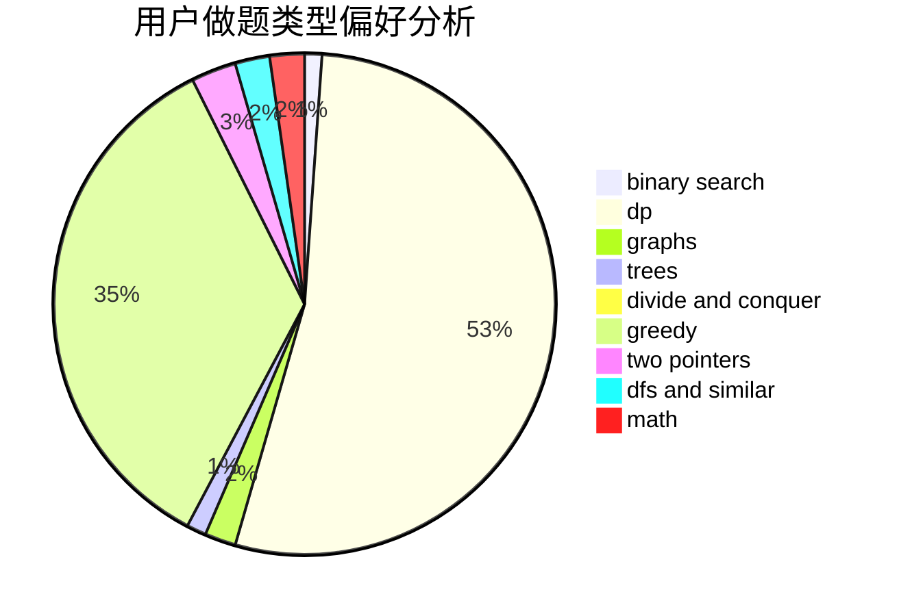

# houpingze

<!-- tabs:start -->

#### **用户提交结果分析**

#### **用户做题类型偏好分析**

<!-- tabs:end -->
# 推荐题目
[578B](https://codeforces.com/contest/578/problem/B)
[627E](https://codeforces.com/contest/627/problem/E)
[13932](https://codeforces.com/contest/1393/problem/2)
[1220A](https://codeforces.com/contest/1220/problem/A)
[616B](https://codeforces.com/contest/616/problem/B)
[1314D](https://codeforces.com/contest/1314/problem/D)
[750H](https://codeforces.com/contest/750/problem/H)
[243B](https://codeforces.com/contest/243/problem/B)
[83B](https://codeforces.com/contest/83/problem/B)
[471C](https://codeforces.com/contest/471/problem/C)
