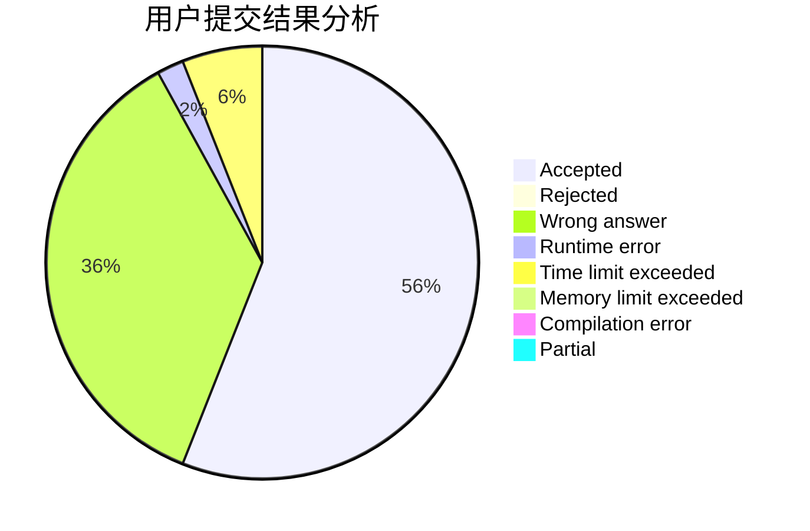
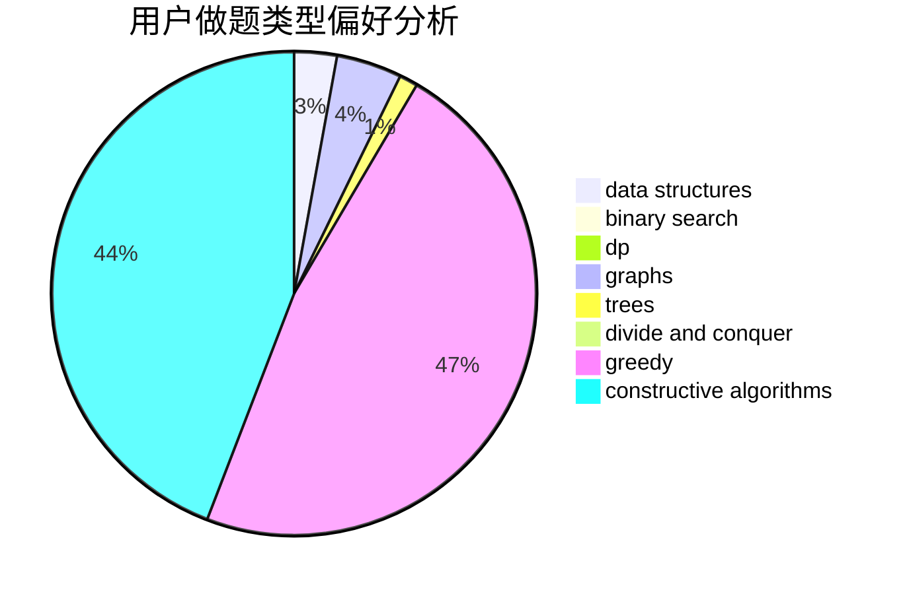
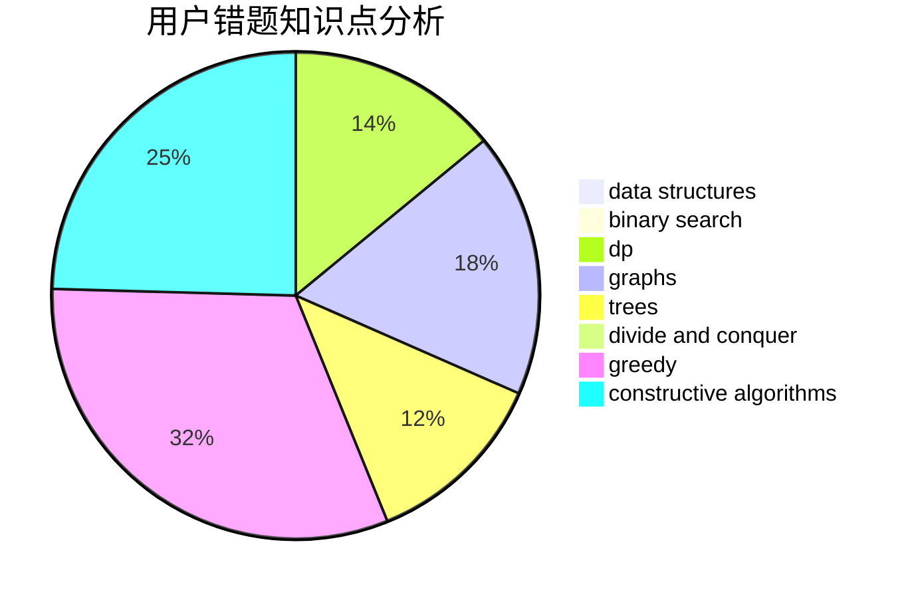

# houzhe

<!-- tabs:start -->

#### **用户提交结果分析**

#### **用户做题类型偏好分析**

#### **用户错题知识点分析**

<!-- tabs:end -->
# 推荐题目
[449C](https://codeforces.com/contest/449/problem/C)		constructive algorithms,
                        number theory		  
[228B](https://codeforces.com/contest/228/problem/B)		brute force,
                        implementation		  
[1431D](https://codeforces.com/contest/1431/problem/D)		*special problem,
                        greedy		  
[97D](https://codeforces.com/contest/97/problem/D)		bitmasks,
                        brute force,
                        implementation		  
[689B](https://codeforces.com/contest/689/problem/B)		dfs and similar,
                        graphs,
                        greedy,
                        shortest paths		  
[1459F](https://codeforces.com/contest/1459/problem/F)		dsu,graphs,sortings,trees		  
[868B](https://codeforces.com/contest/868/problem/B)		implementation		  
[1180C](https://codeforces.com/contest/1180/problem/C)		dsu,graphs,sortings,trees		  
[279D](https://codeforces.com/contest/279/problem/D)		bitmasks,
                        dp		  
[876C](https://codeforces.com/contest/876/problem/C)		dsu,graphs,sortings,trees		  
