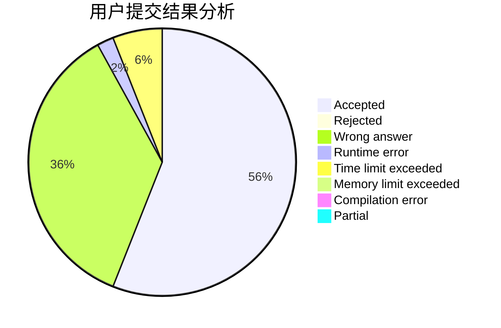
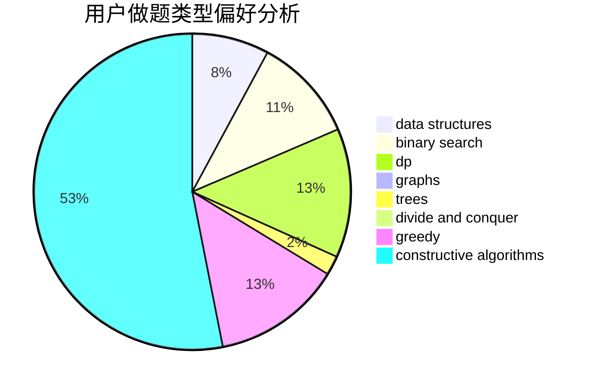
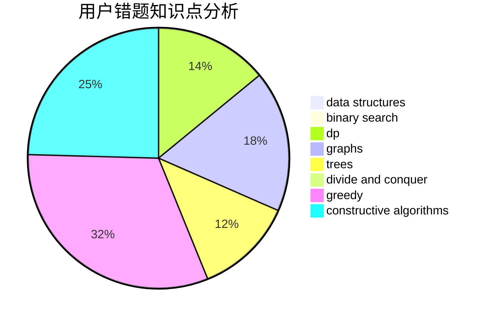

# houzhe

<!-- tabs:start -->

#### **用户提交结果分析**

#### **用户做题类型偏好分析**

#### **用户错题知识点分析**

<!-- tabs:end -->
# 推荐题目
[425E](https://codeforces.com/contest/425/problem/E)		dp		  
[204C](https://codeforces.com/contest/204/problem/C)		math,
                        probabilities		  
[1423I](https://codeforces.com/contest/1423/problem/I)		bitmasks		  
[958D1](https://codeforces.com/contest/958D/problem/1)		expression parsing,
                        math		  
[667B](https://codeforces.com/contest/667/problem/B)		constructive algorithms,
                        geometry		  
[1450H2](https://codeforces.com/contest/1450H/problem/2)		combinatorics,
                        implementation,
                        math		  
[848E](https://codeforces.com/contest/848/problem/E)		combinatorics,
                        divide and conquer,
                        dp,
                        fft,
                        math		  
[1178D](https://codeforces.com/contest/1178/problem/D)		constructive algorithms,
                        greedy,
                        math,
                        number theory		  
[260E](https://codeforces.com/contest/260/problem/E)		binary search,
                        brute force,
                        data structures		  
[858F](https://codeforces.com/contest/858/problem/F)		constructive algorithms,
                        dfs and similar,
                        graphs		  
