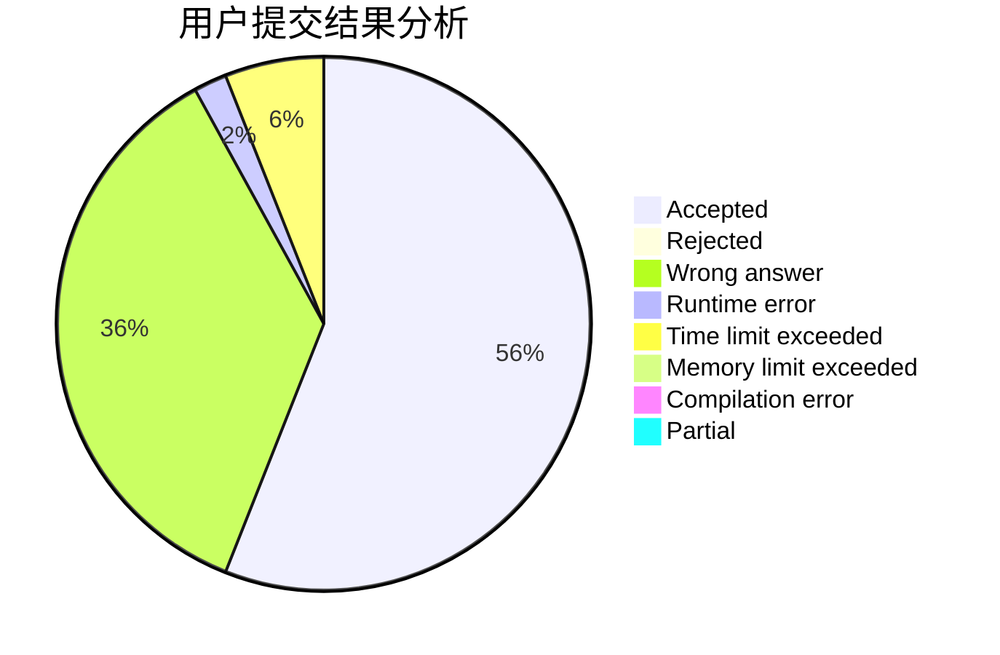
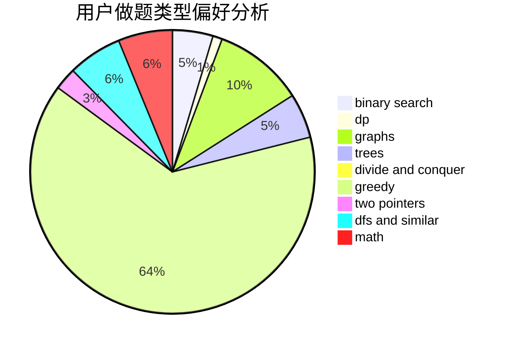

# houzhe

<!-- tabs:start -->

#### **用户提交结果分析**

#### **用户做题类型偏好分析**

<!-- tabs:end -->
# 推荐题目
[449C](https://codeforces.com/contest/449/problem/C)
[228B](https://codeforces.com/contest/228/problem/B)
[1431D](https://codeforces.com/contest/1431/problem/D)
[97D](https://codeforces.com/contest/97/problem/D)
[689B](https://codeforces.com/contest/689/problem/B)
[1459F](https://codeforces.com/contest/1459/problem/F)
[868B](https://codeforces.com/contest/868/problem/B)
[1180C](https://codeforces.com/contest/1180/problem/C)
[279D](https://codeforces.com/contest/279/problem/D)
[876C](https://codeforces.com/contest/876/problem/C)
