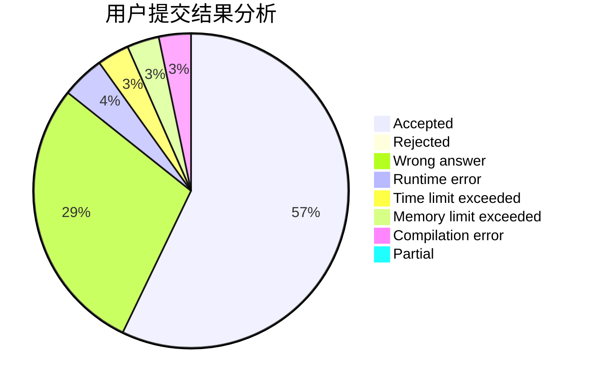
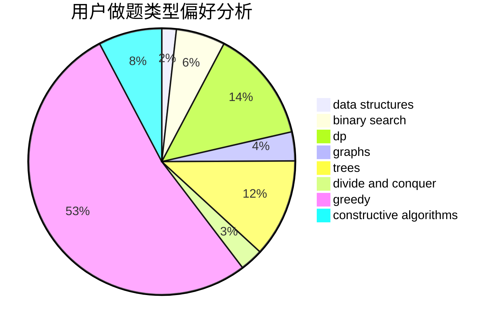
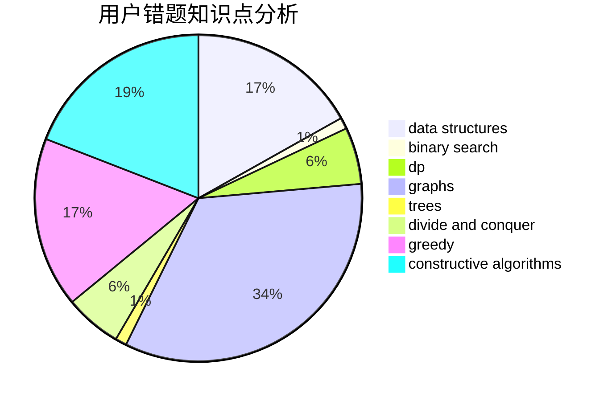

# houzhibin

<!-- tabs:start -->

#### **用户提交结果分析**

#### **用户做题类型偏好分析**

#### **用户错题知识点分析**

<!-- tabs:end -->
# 推荐题目
[1280A](https://codeforces.com/contest/1280/problem/A)		implementation,
                        math		  
[834B](https://codeforces.com/contest/834/problem/B)		data structures,
                        implementation		  
[215A](https://codeforces.com/contest/215/problem/A)		brute force,
                        implementation		  
[1465B](https://codeforces.com/contest/1465/problem/B)		dsu,graphs,sortings,trees		  
[887D](https://codeforces.com/contest/887/problem/D)		data structures,
                        two pointers		  
[988F](https://codeforces.com/contest/988/problem/F)		dp		  
[976A](https://codeforces.com/contest/976/problem/A)		implementation		  
[62A](https://codeforces.com/contest/62/problem/A)		greedy,
                        math		  
[505A](https://codeforces.com/contest/505/problem/A)		brute force,
                        implementation,
                        strings		  
[1489G](https://codeforces.com/contest/1489/problem/G)		dsu,graphs,sortings,trees		  
