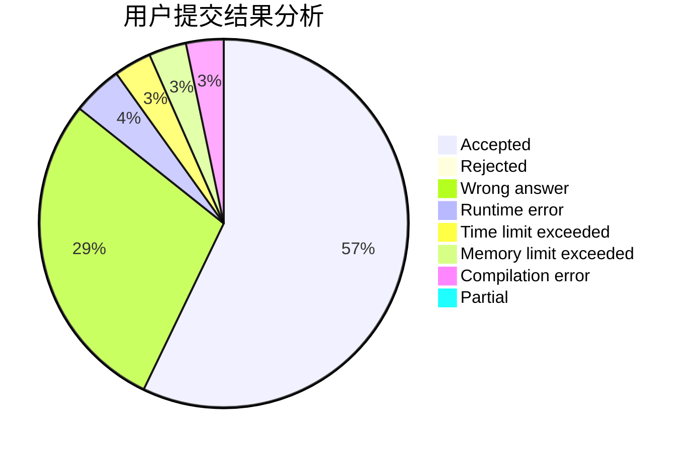
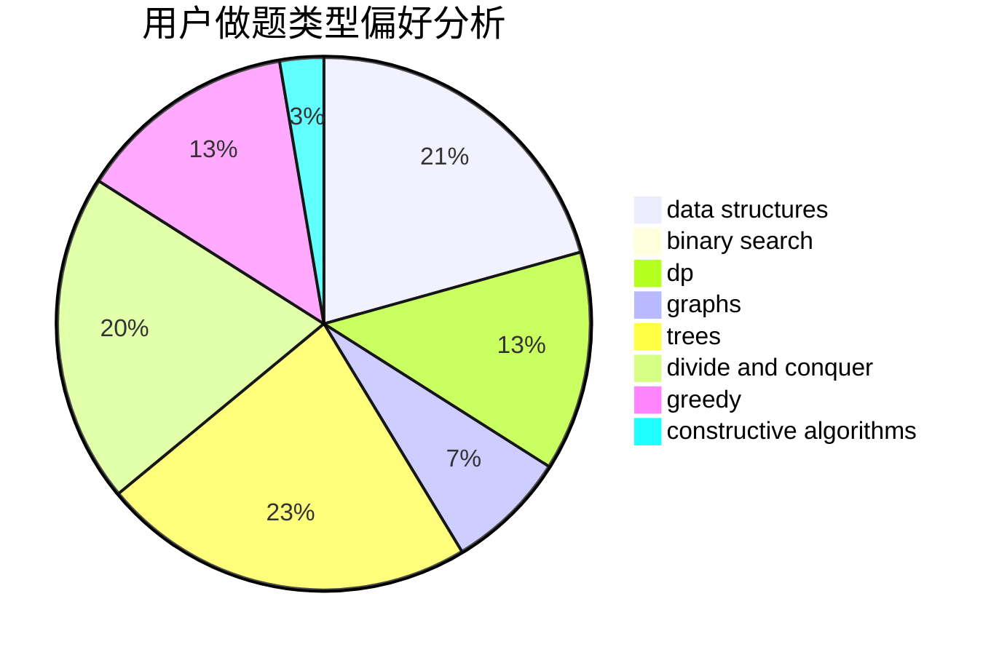
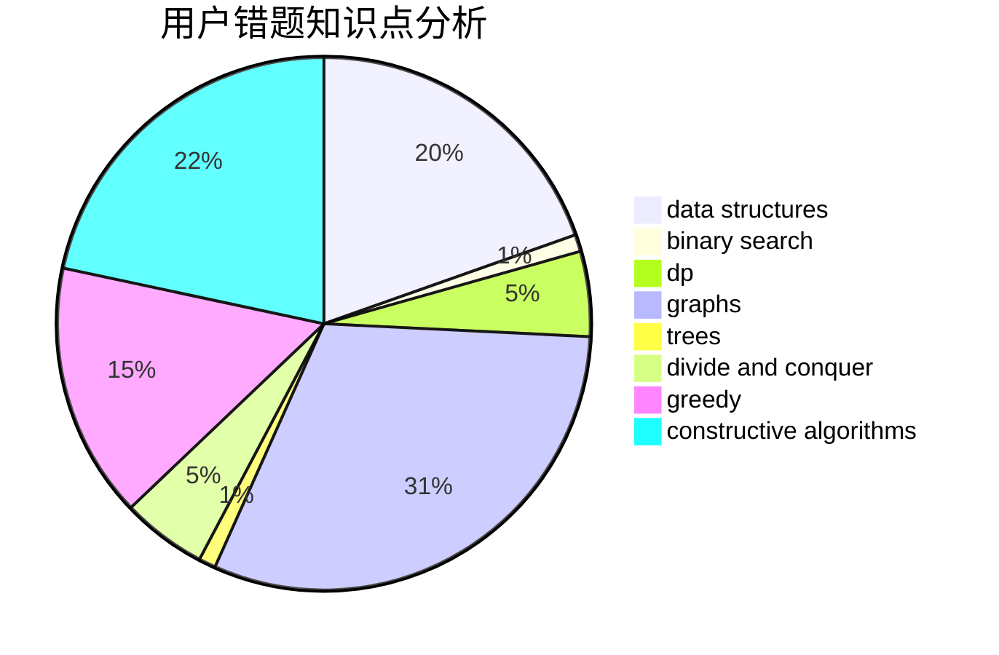

# houzhibin

<!-- tabs:start -->

#### **用户提交结果分析**

#### **用户做题类型偏好分析**

#### **用户错题知识点分析**

<!-- tabs:end -->
# 推荐题目
[1270H](https://codeforces.com/contest/1270/problem/H)		data structures		  
[815B](https://codeforces.com/contest/815/problem/B)		brute force,
                        combinatorics,
                        constructive algorithms,
                        math		  
[18A](https://codeforces.com/contest/18/problem/A)		brute force,
                        geometry		  
[1455E](https://codeforces.com/contest/1455/problem/E)		brute force,
                        constructive algorithms,
                        flows,
                        geometry,
                        greedy,
                        implementation,
                        math,
                        ternary search		  
[868B](https://codeforces.com/contest/868/problem/B)		implementation		  
[967C](https://codeforces.com/contest/967/problem/C)		dsu,graphs,sortings,trees		  
[954B](https://codeforces.com/contest/954/problem/B)		implementation,
                        strings		  
[610D](https://codeforces.com/contest/610/problem/D)		constructive algorithms,
                        data structures,
                        geometry,
                        two pointers		  
[483E](https://codeforces.com/contest/483/problem/E)		dsu,graphs,sortings,trees		  
[1481E](https://codeforces.com/contest/1481/problem/E)		data structures,
                        dp,
                        greedy		  
