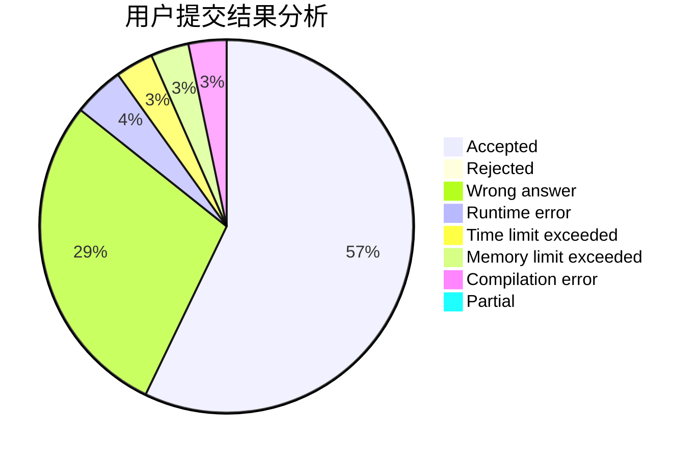
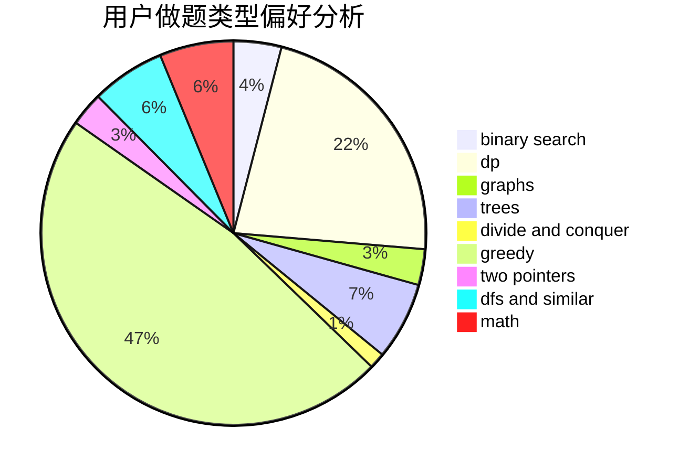

# houzhibin

<!-- tabs:start -->

#### **用户提交结果分析**

#### **用户做题类型偏好分析**

<!-- tabs:end -->
# 推荐题目
[1280A](https://codeforces.com/contest/1280/problem/A)
[834B](https://codeforces.com/contest/834/problem/B)
[215A](https://codeforces.com/contest/215/problem/A)
[1465B](https://codeforces.com/contest/1465/problem/B)
[887D](https://codeforces.com/contest/887/problem/D)
[988F](https://codeforces.com/contest/988/problem/F)
[976A](https://codeforces.com/contest/976/problem/A)
[62A](https://codeforces.com/contest/62/problem/A)
[505A](https://codeforces.com/contest/505/problem/A)
[1489G](https://codeforces.com/contest/1489/problem/G)
