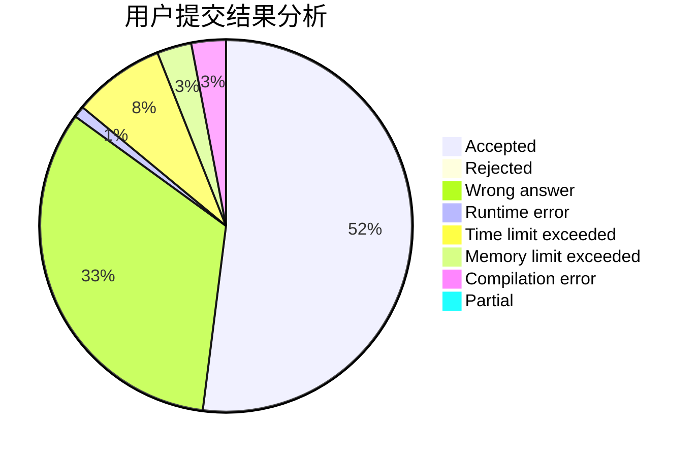
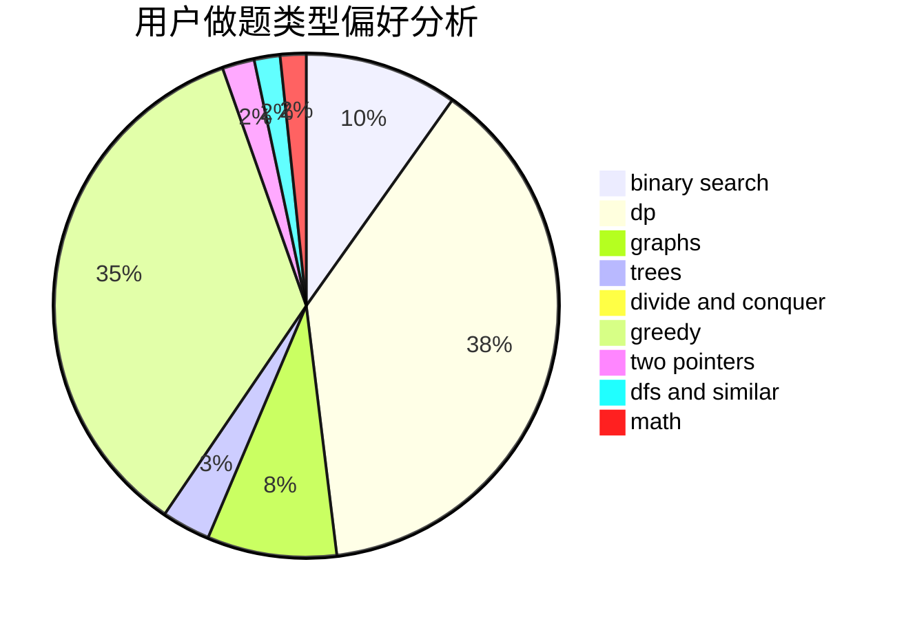

# hpp

<!-- tabs:start -->

#### **用户提交结果分析**

#### **用户做题类型偏好分析**

<!-- tabs:end -->
# 推荐题目
[683B](https://codeforces.com/contest/683/problem/B)
[794G](https://codeforces.com/contest/794/problem/G)
[789D](https://codeforces.com/contest/789/problem/D)
[1145B](https://codeforces.com/contest/1145/problem/B)
[1091H](https://codeforces.com/contest/1091/problem/H)
[300B](https://codeforces.com/contest/300/problem/B)
[713E](https://codeforces.com/contest/713/problem/E)
[652B](https://codeforces.com/contest/652/problem/B)
[1156F](https://codeforces.com/contest/1156/problem/F)
[976E](https://codeforces.com/contest/976/problem/E)
