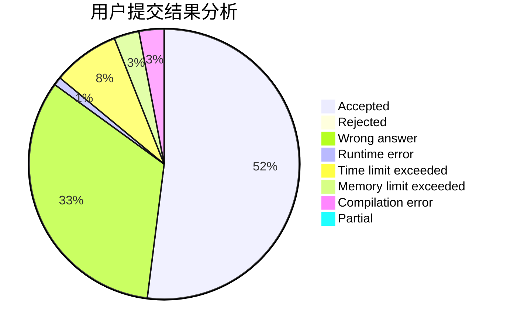
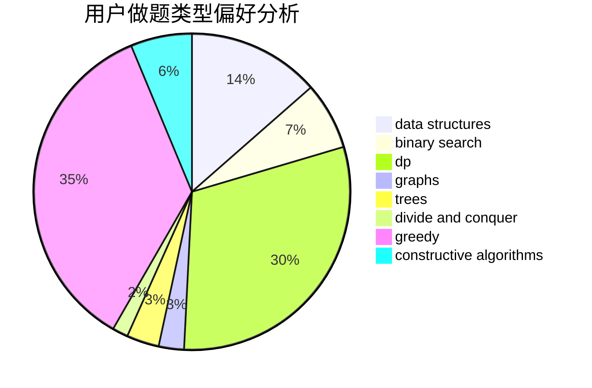
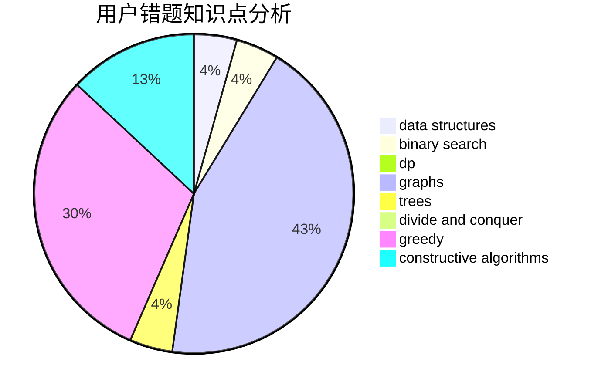

# hpp

<!-- tabs:start -->

#### **用户提交结果分析**

#### **用户做题类型偏好分析**

#### **用户错题知识点分析**

<!-- tabs:end -->
# 推荐题目
[683B](https://codeforces.com/contest/683/problem/B)		*special problem		  
[794G](https://codeforces.com/contest/794/problem/G)		combinatorics,
                        dp,
                        math		  
[789D](https://codeforces.com/contest/789/problem/D)		dsu,graphs,sortings,trees		  
[1145B](https://codeforces.com/contest/1145/problem/B)		brute force		  
[1091H](https://codeforces.com/contest/1091/problem/H)		games		  
[300B](https://codeforces.com/contest/300/problem/B)		brute force,
                        dfs and similar,
                        graphs		  
[713E](https://codeforces.com/contest/713/problem/E)		binary search,
                        dp		  
[652B](https://codeforces.com/contest/652/problem/B)		sortings		  
[1156F](https://codeforces.com/contest/1156/problem/F)		dp,
                        math,
                        probabilities		  
[976E](https://codeforces.com/contest/976/problem/E)		greedy,
                        sortings		  
