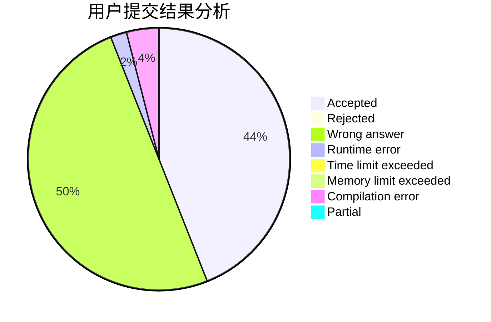
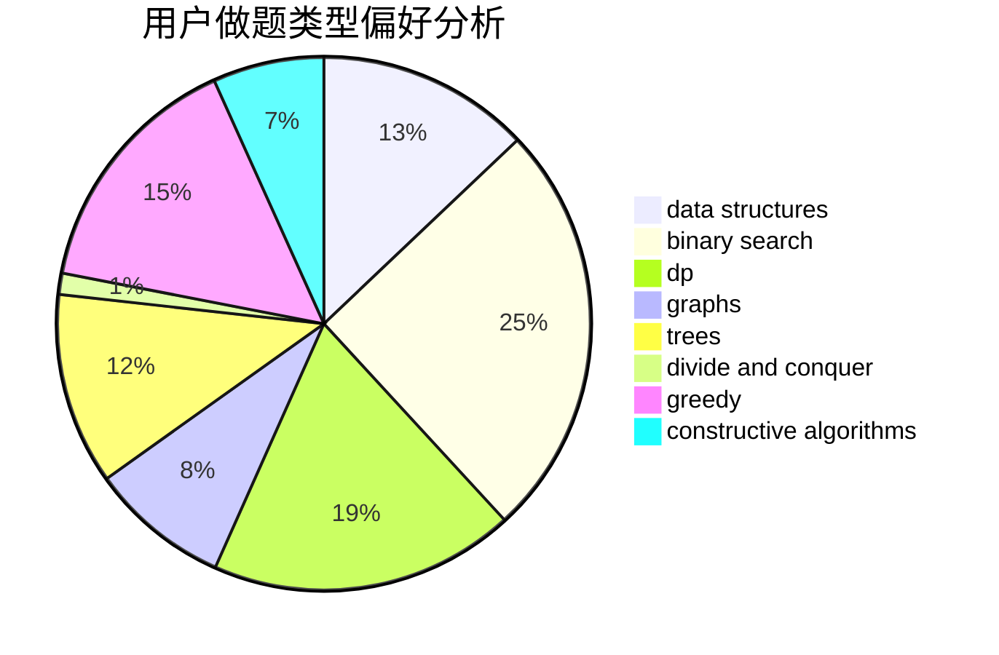
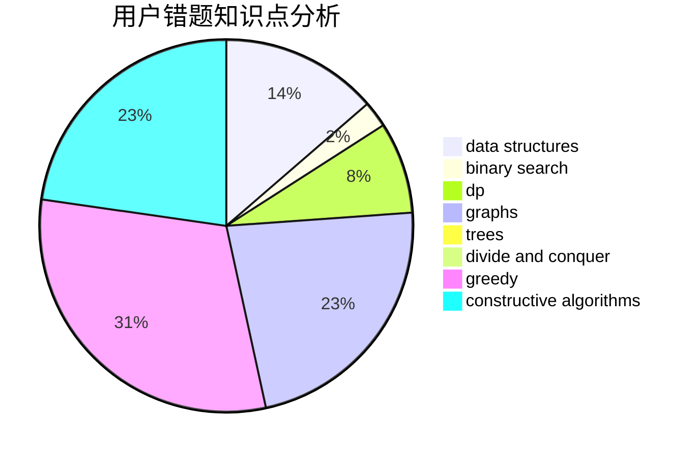

# hrbust_jyq
<!-- tabs:start -->
#### **用户提交结果分析**

#### **用户做题类型偏好分析**

#### **用户错题知识点分析**

<!-- tabs:end -->
# 推荐题目
[Almost Rectangle](http://codeforces.com/problemset/problem/1512/B)		implementation		  
[Happy New Year](http://codeforces.com/problemset/problem/1313/D)		bitmasks,
                        dp,
                        implementation		  
[Jamie and Tree](http://codeforces.com/problemset/problem/916/E)		data structures,
                        trees		  
[Dominant Piranha](http://codeforces.com/problemset/problem/1433/C)		constructive algorithms,
                        greedy		  
[Add and Divide](http://codeforces.com/problemset/problem/1485/A)		brute force,
                        greedy,
                        math,
                        number theory		  
[Equilateral Triangles (2 points)](https://codeforces.com/contest/1164/problem/P)		nan		  
[Arrays](http://codeforces.com/problemset/problem/572/A)		sortings		  
[Cow Tennis Tournament](http://codeforces.com/problemset/problem/283/E)		combinatorics,
                        data structures,
                        math		  
[Skyline Photo](http://codeforces.com/problemset/problem/1482/E)		data structures,
                        divide and conquer,
                        dp		  
[Error Correct System](http://codeforces.com/problemset/problem/527/B)		greedy		  
<!-- tabs:start -->
#### **data structures**
[Almost Rectangle](http://codeforces.com/problemset/problem/916/E)		data structures,
                        trees		  
[Happy New Year](http://codeforces.com/problemset/problem/283/E)		combinatorics,
                        data structures,
                        math		  
[Jamie and Tree](http://codeforces.com/problemset/problem/1482/E)		data structures,
                        divide and conquer,
                        dp		  
[Dominant Piranha](https://codeforces.com/contest/136/problem/C)		constructive algorithms,
                        data structures,
                        implementation		  
[Add and Divide](http://codeforces.com/problemset/problem/983/D)		data structures		  
[Equilateral Triangles (2 points)](http://codeforces.com/problemset/problem/1359/F)		binary search,
                        brute force,
                        data structures,
                        geometry,
                        math		  
[Arrays](https://codeforces.com/contest/871/problem/D)		data structures,
                        number theory		  
[Cow Tennis Tournament](http://codeforces.com/problemset/problem/1166/F)		data structures,
                        dsu,
                        graphs,
                        hashing		  
[Skyline Photo](http://codeforces.com/problemset/problem/777/B)		data structures,
                        dp,
                        greedy,
                        sortings		  
[Error Correct System](http://codeforces.com/problemset/problem/1492/C)		binary search,
                        data structures,
                        dp,
                        greedy,
                        two pointers		  
#### **binary search**
[Almost Rectangle](http://codeforces.com/problemset/problem/216/D)		binary search,
                        sortings,
                        two pointers		  
[Happy New Year](https://codeforces.com/contest/1169/problem/C)		binary search,
                        greedy		  
[Jamie and Tree](http://codeforces.com/problemset/problem/1359/F)		binary search,
                        brute force,
                        data structures,
                        geometry,
                        math		  
[Dominant Piranha](http://codeforces.com/problemset/problem/1348/D)		binary search,
                        constructive algorithms,
                        greedy,
                        implementation,
                        math		  
[Add and Divide](http://codeforces.com/problemset/problem/1251/D)		binary search,
                        greedy,
                        sortings		  
[Equilateral Triangles (2 points)](http://codeforces.com/problemset/problem/1492/C)		binary search,
                        data structures,
                        dp,
                        greedy,
                        two pointers		  
[Arrays](http://codeforces.com/problemset/problem/1463/D)		binary search,
                        constructive algorithms,
                        greedy,
                        two pointers		  
[Cow Tennis Tournament](http://codeforces.com/problemset/problem/1490/G)		binary search,
                        data structures,
                        math		  
[Skyline Photo](http://codeforces.com/problemset/problem/1479/D)		binary search,
                        bitmasks,
                        brute force,
                        data structures,
                        probabilities,
                        trees		  
[Error Correct System](http://codeforces.com/problemset/problem/1436/E)		binary search,
                        data structures,
                        two pointers		  
#### **dp**
[Almost Rectangle](http://codeforces.com/problemset/problem/1313/D)		bitmasks,
                        dp,
                        implementation		  
[Happy New Year](http://codeforces.com/problemset/problem/1482/E)		data structures,
                        divide and conquer,
                        dp		  
[Jamie and Tree](http://codeforces.com/problemset/problem/76/C)		bitmasks,
                        dp,
                        math		  
[Dominant Piranha](http://codeforces.com/problemset/problem/758/E)		dfs and similar,
                        dp,
                        graphs,
                        greedy,
                        trees		  
[Add and Divide](http://codeforces.com/problemset/problem/1163/D)		dp,
                        strings		  
[Equilateral Triangles (2 points)](http://codeforces.com/problemset/problem/698/A)		dp		  
[Arrays](http://codeforces.com/problemset/problem/777/B)		data structures,
                        dp,
                        greedy,
                        sortings		  
[Cow Tennis Tournament](http://codeforces.com/problemset/problem/1492/C)		binary search,
                        data structures,
                        dp,
                        greedy,
                        two pointers		  
[Skyline Photo](https://codeforces.com/contest/1457/problem/C)		brute force,
                        dp,
                        implementation		  
[Error Correct System](http://codeforces.com/problemset/problem/1491/C)		brute force,
                        data structures,
                        dp,
                        greedy,
                        implementation		  
#### **graph**
[Almost Rectangle](http://codeforces.com/problemset/problem/758/E)		dfs and similar,
                        dp,
                        graphs,
                        greedy,
                        trees		  
[Happy New Year](http://codeforces.com/problemset/problem/1346/D)		*special problem,
                        graphs,
                        greedy		  
[Jamie and Tree](http://codeforces.com/problemset/problem/1166/F)		data structures,
                        dsu,
                        graphs,
                        hashing		  
[Dominant Piranha](http://codeforces.com/problemset/problem/36/E)		constructive algorithms,
                        dsu,
                        graphs,
                        implementation		  
[Add and Divide](http://codeforces.com/problemset/problem/1487/C)		brute force,
                        constructive algorithms,
                        dfs and similar,
                        graphs,
                        greedy,
                        implementation,
                        math		  
[Equilateral Triangles (2 points)](http://codeforces.com/problemset/problem/1437/C)		dp,
                        flows,
                        graph matchings,
                        greedy,
                        math,
                        sortings		  
[Arrays](http://codeforces.com/problemset/problem/1470/D)		constructive algorithms,
                        dfs and similar,
                        graph matchings,
                        graphs,
                        greedy		  
[Cow Tennis Tournament](http://codeforces.com/problemset/problem/1476/C)		dp,
                        graphs,
                        greedy		  
[Skyline Photo](http://codeforces.com/problemset/problem/1304/D)		constructive algorithms,
                        graphs,
                        greedy,
                        two pointers		  
[Error Correct System](http://codeforces.com/problemset/problem/1475/C)		combinatorics,
                        graphs,
                        math		  
#### **trees**
[Almost Rectangle](http://codeforces.com/problemset/problem/916/E)		data structures,
                        trees		  
[Happy New Year](http://codeforces.com/problemset/problem/758/E)		dfs and similar,
                        dp,
                        graphs,
                        greedy,
                        trees		  
[Jamie and Tree](http://codeforces.com/problemset/problem/1479/D)		binary search,
                        bitmasks,
                        brute force,
                        data structures,
                        probabilities,
                        trees		  
[Dominant Piranha](http://codeforces.com/problemset/problem/1511/C)		brute force,
                        data structures,
                        implementation,
                        trees		  
[Add and Divide](http://codeforces.com/problemset/problem/1499/F)		combinatorics,
                        dfs and similar,
                        dp,
                        trees		  
[Equilateral Triangles (2 points)](http://codeforces.com/problemset/problem/1491/E)		brute force,
                        dfs and similar,
                        divide and conquer,
                        number theory,
                        trees		  
[Arrays](http://codeforces.com/problemset/problem/1466/D)		data structures,
                        greedy,
                        sortings,
                        trees		  
[Cow Tennis Tournament](http://codeforces.com/problemset/problem/1495/D)		combinatorics,
                        dfs and similar,
                        graphs,
                        math,
                        shortest paths,
                        trees		  
[Skyline Photo](http://codeforces.com/problemset/problem/1303/G)		data structures,
                        divide and conquer,
                        geometry,
                        trees		  
[Error Correct System](http://codeforces.com/problemset/problem/1454/E)		combinatorics,
                        dfs and similar,
                        graphs,
                        trees		  
#### **divide and conquer**
[Almost Rectangle](http://codeforces.com/problemset/problem/1482/E)		data structures,
                        divide and conquer,
                        dp		  
[Happy New Year](http://codeforces.com/problemset/problem/1461/D)		binary search,
                        brute force,
                        data structures,
                        divide and conquer,
                        implementation,
                        sortings		  
[Jamie and Tree](http://codeforces.com/problemset/problem/1466/G)		combinatorics,
                        divide and conquer,
                        hashing,
                        math,
                        string suffix structures,
                        strings		  
[Dominant Piranha](http://codeforces.com/problemset/problem/1490/D)		dfs and similar,
                        divide and conquer,
                        implementation		  
[Add and Divide](https://codeforces.com/contest/1483/problem/C)		data structures,
                        divide and conquer,
                        dp		  
[Equilateral Triangles (2 points)](http://codeforces.com/problemset/problem/1491/E)		brute force,
                        dfs and similar,
                        divide and conquer,
                        number theory,
                        trees		  
[Arrays](http://codeforces.com/problemset/problem/1303/G)		data structures,
                        divide and conquer,
                        geometry,
                        trees		  
[Cow Tennis Tournament](http://codeforces.com/problemset/problem/1494/D)		constructive algorithms,
                        data structures,
                        dfs and similar,
                        divide and conquer,
                        dsu,
                        greedy,
                        sortings,
                        trees		  
[Skyline Photo](http://codeforces.com/problemset/problem/1482/E)		data structures,
                        divide and conquer,
                        dp		  
[Error Correct System](http://codeforces.com/problemset/problem/566/C)		dfs and similar,
                        divide and conquer,
                        trees		  
#### **greedy**
[Almost Rectangle](http://codeforces.com/problemset/problem/1433/C)		constructive algorithms,
                        greedy		  
[Happy New Year](http://codeforces.com/problemset/problem/1485/A)		brute force,
                        greedy,
                        math,
                        number theory		  
[Jamie and Tree](http://codeforces.com/problemset/problem/527/B)		greedy		  
[Dominant Piranha](http://codeforces.com/problemset/problem/491/B)		greedy,
                        math		  
[Add and Divide](https://codeforces.com/contest/1169/problem/C)		binary search,
                        greedy		  
[Equilateral Triangles (2 points)](http://codeforces.com/problemset/problem/381/B)		greedy,
                        implementation,
                        sortings		  
[Arrays](http://codeforces.com/problemset/problem/758/E)		dfs and similar,
                        dp,
                        graphs,
                        greedy,
                        trees		  
[Cow Tennis Tournament](https://codeforces.com/contest/709/problem/C)		constructive algorithms,
                        greedy,
                        implementation,
                        strings		  
[Skyline Photo](http://codeforces.com/problemset/problem/802/A)		greedy		  
[Error Correct System](http://codeforces.com/problemset/problem/1157/C2)		greedy		  
#### **constructive algorithms**
[Almost Rectangle](http://codeforces.com/problemset/problem/1433/C)		constructive algorithms,
                        greedy		  
[Happy New Year](http://codeforces.com/problemset/problem/282/C)		constructive algorithms,
                        implementation,
                        math		  
[Jamie and Tree](https://codeforces.com/contest/136/problem/C)		constructive algorithms,
                        data structures,
                        implementation		  
[Dominant Piranha](http://codeforces.com/problemset/problem/899/D)		constructive algorithms,
                        math		  
[Add and Divide](https://codeforces.com/contest/709/problem/C)		constructive algorithms,
                        greedy,
                        implementation,
                        strings		  
[Equilateral Triangles (2 points)](http://codeforces.com/problemset/problem/226/D)		constructive algorithms,
                        greedy		  
[Arrays](http://codeforces.com/problemset/problem/1348/D)		binary search,
                        constructive algorithms,
                        greedy,
                        implementation,
                        math		  
[Cow Tennis Tournament](https://codeforces.com/contest/709/problem/D)		constructive algorithms,
                        greedy,
                        implementation,
                        math		  
[Skyline Photo](http://codeforces.com/problemset/problem/1054/C)		constructive algorithms,
                        implementation		  
[Error Correct System](https://codeforces.com/contest/1262/problem/B)		constructive algorithms		  
#### **sortings**
[Almost Rectangle](http://codeforces.com/problemset/problem/572/A)		sortings		  
[Happy New Year](http://codeforces.com/problemset/problem/216/D)		binary search,
                        sortings,
                        two pointers		  
[Jamie and Tree](http://codeforces.com/problemset/problem/381/B)		greedy,
                        implementation,
                        sortings		  
[Dominant Piranha](http://codeforces.com/problemset/problem/777/B)		data structures,
                        dp,
                        greedy,
                        sortings		  
[Add and Divide](http://codeforces.com/problemset/problem/1110/E)		constructive algorithms,
                        math,
                        sortings		  
[Equilateral Triangles (2 points)](http://codeforces.com/problemset/problem/1251/D)		binary search,
                        greedy,
                        sortings		  
[Arrays](https://codeforces.com/contest/1496/problem/C)		geometry,
                        greedy,
                        math,
                        sortings		  
[Cow Tennis Tournament](http://codeforces.com/problemset/problem/1495/A)		geometry,
                        greedy,
                        math,
                        sortings		  
[Skyline Photo](http://codeforces.com/problemset/problem/1497/A)		brute force,
                        data structures,
                        greedy,
                        sortings		  
[Error Correct System](http://codeforces.com/problemset/problem/1427/A)		math,
                        sortings		  
<!-- tabs:end -->
