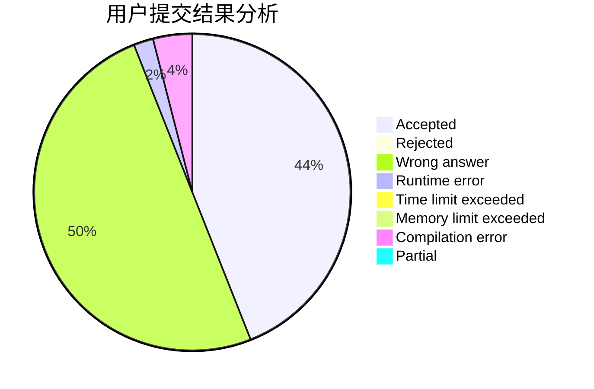
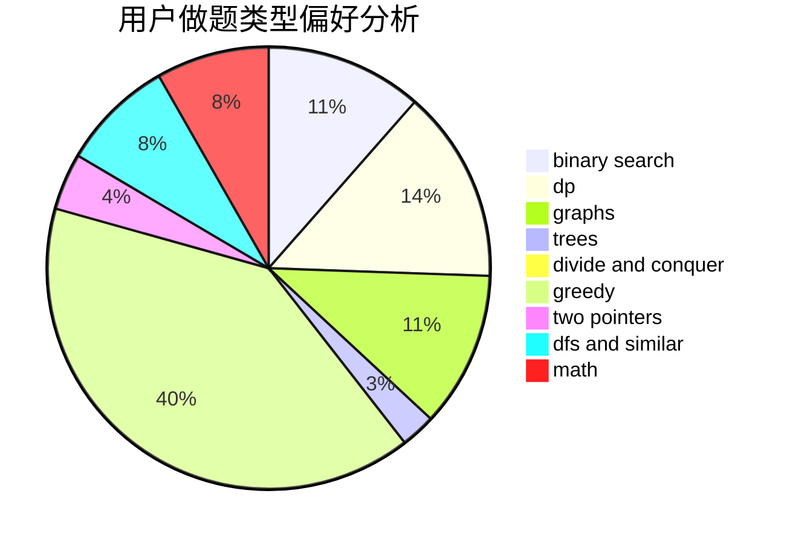

# hrbust_jyq

<!-- tabs:start -->

#### **用户提交结果分析**

#### **用户做题类型偏好分析**

<!-- tabs:end -->
# 推荐题目
[1490C](https://codeforces.com/contest/1490/problem/C)
[1443B](https://codeforces.com/contest/1443/problem/B)
[1166F](https://codeforces.com/contest/1166/problem/F)
[592C](https://codeforces.com/contest/592/problem/C)
[1254E](https://codeforces.com/contest/1254/problem/E)
[777E](https://codeforces.com/contest/777/problem/E)
[937A](https://codeforces.com/contest/937/problem/A)
[789D](https://codeforces.com/contest/789/problem/D)
[13781](https://codeforces.com/contest/1378/problem/1)
[551B](https://codeforces.com/contest/551/problem/B)
