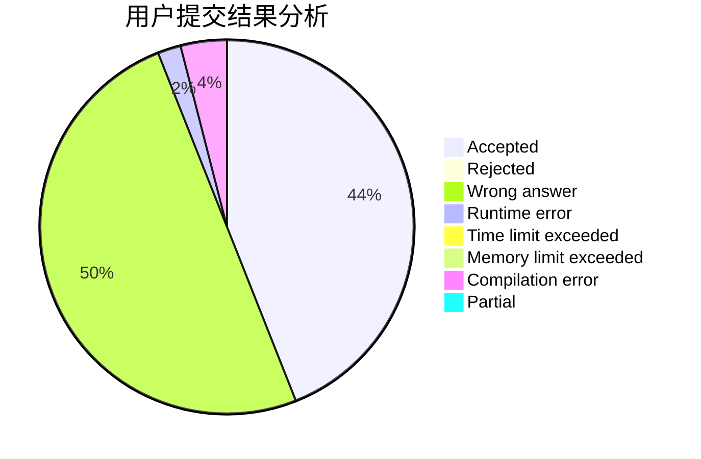
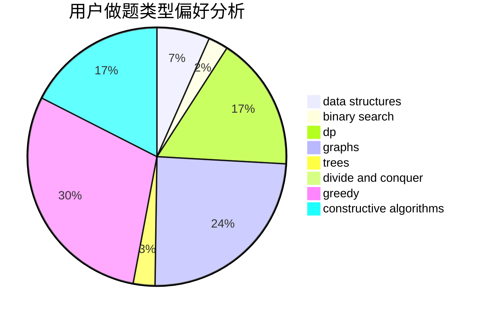
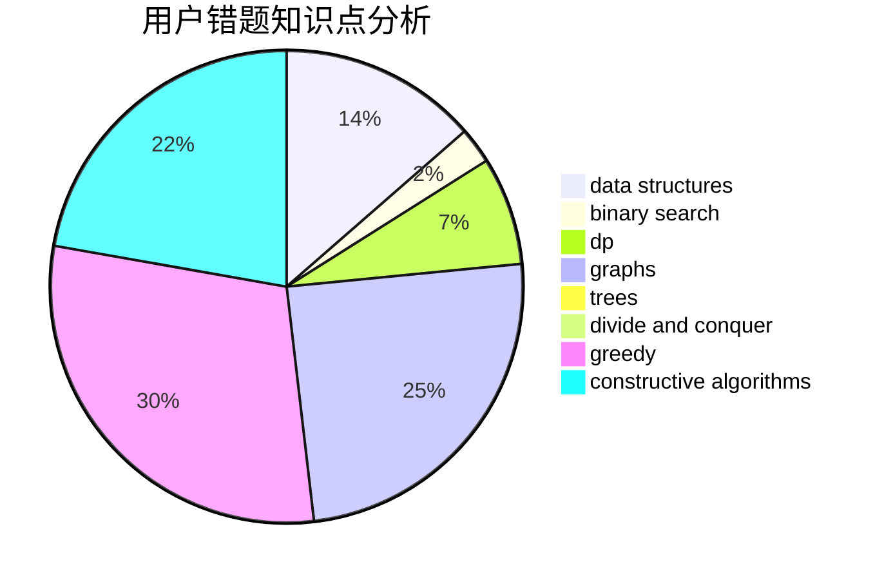

# hrbust_jyq

<!-- tabs:start -->

#### **用户提交结果分析**

#### **用户做题类型偏好分析**

#### **用户错题知识点分析**

<!-- tabs:end -->
# 推荐题目
[1490C](https://codeforces.com/contest/1490/problem/C)		binary search,
                        brute force,
                        brute force,
                        math		  
[1443B](https://codeforces.com/contest/1443/problem/B)		dp,
                        greedy,
                        math,
                        sortings		  
[1166F](https://codeforces.com/contest/1166/problem/F)		data structures,
                        dsu,
                        graphs,
                        hashing		  
[592C](https://codeforces.com/contest/592/problem/C)		math		  
[1254E](https://codeforces.com/contest/1254/problem/E)		combinatorics,
                        dfs and similar,
                        dsu,
                        trees		  
[777E](https://codeforces.com/contest/777/problem/E)		brute force,
                        data structures,
                        dp,
                        greedy,
                        sortings		  
[937A](https://codeforces.com/contest/937/problem/A)		implementation,
                        sortings		  
[789D](https://codeforces.com/contest/789/problem/D)		dsu,graphs,sortings,trees		  
[13781](https://codeforces.com/contest/1378/problem/1)		dsu,graphs,sortings,trees		  
[551B](https://codeforces.com/contest/551/problem/B)		brute force,
                        constructive algorithms,
                        implementation,
                        strings		  
