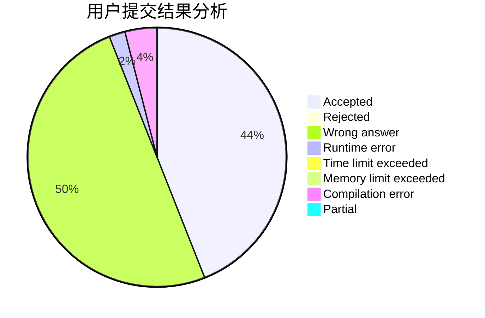
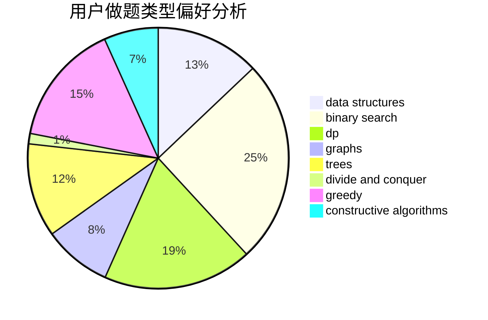
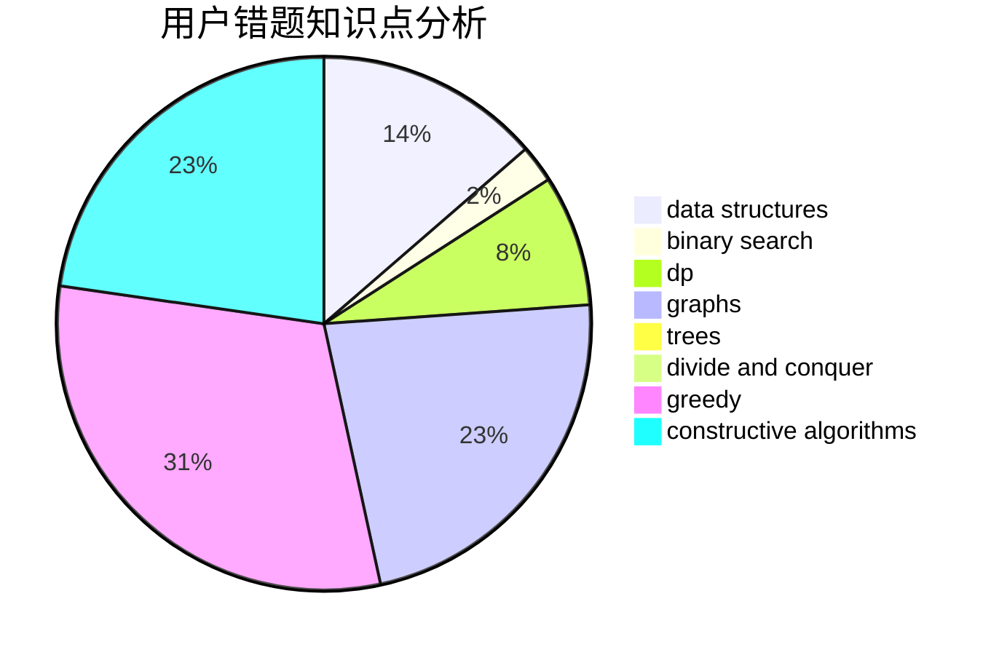

# hrbust_jyq

<!-- tabs:start -->

#### **用户提交结果分析**

#### **用户做题类型偏好分析**

#### **用户错题知识点分析**

<!-- tabs:end -->
# 推荐题目
[1482E](https://codeforces.com/contest/1482/problem/E)		data structures,
                        divide and conquer,
                        dp		  
[1433C](https://codeforces.com/contest/1433/problem/C)		constructive algorithms,
                        greedy		  
[1164P](https://codeforces.com/contest/1164/problem/P)		dsu,graphs,sortings,trees		  
[572A](https://codeforces.com/contest/572/problem/A)		sortings		  
[1250F](https://codeforces.com/contest/1250/problem/F)		brute force,
                        implementation		  
[758E](https://codeforces.com/contest/758/problem/E)		dfs and similar,
                        dp,
                        graphs,
                        greedy,
                        trees		  
[916E](https://codeforces.com/contest/916/problem/E)		data structures,
                        trees		  
[76C](https://codeforces.com/contest/76/problem/C)		bitmasks,
                        dp,
                        math		  
[136C](https://codeforces.com/contest/136/problem/C)		dsu,graphs,sortings,trees		  
[527B](https://codeforces.com/contest/527/problem/B)		greedy		  
