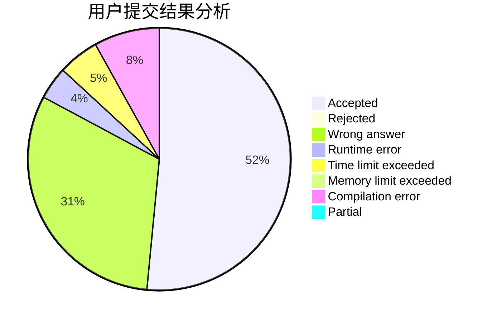
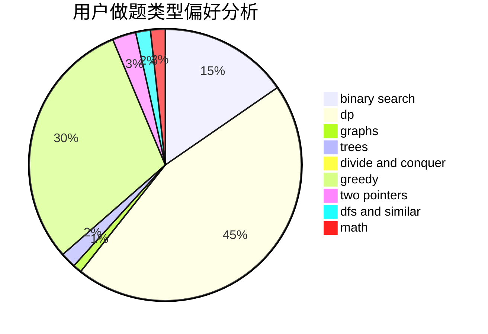

# hrdate

<!-- tabs:start -->

#### **用户提交结果分析**

#### **用户做题类型偏好分析**

<!-- tabs:end -->
# 推荐题目
[9A](https://codeforces.com/contest/9/problem/A)
[573C](https://codeforces.com/contest/573/problem/C)
[1207B](https://codeforces.com/contest/1207/problem/B)
[797C](https://codeforces.com/contest/797/problem/C)
[295B](https://codeforces.com/contest/295/problem/B)
[1341E](https://codeforces.com/contest/1341/problem/E)
[1364D](https://codeforces.com/contest/1364/problem/D)
[13042](https://codeforces.com/contest/1304/problem/2)
[772A](https://codeforces.com/contest/772/problem/A)
[1150E](https://codeforces.com/contest/1150/problem/E)
