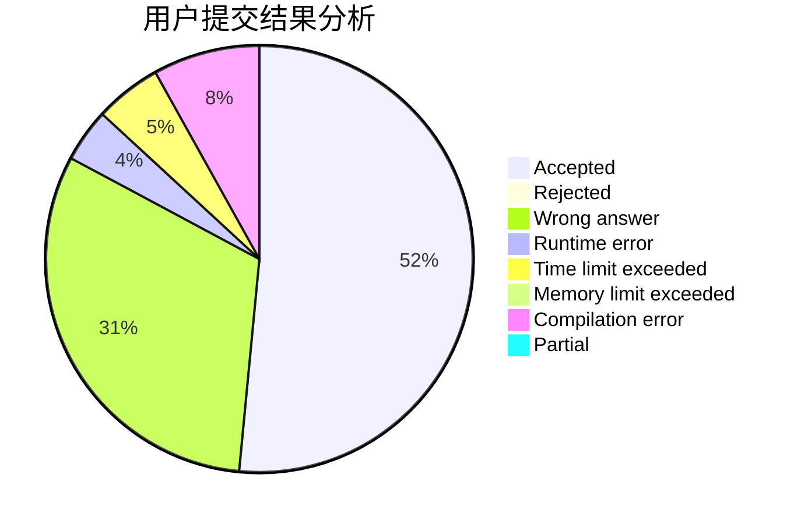
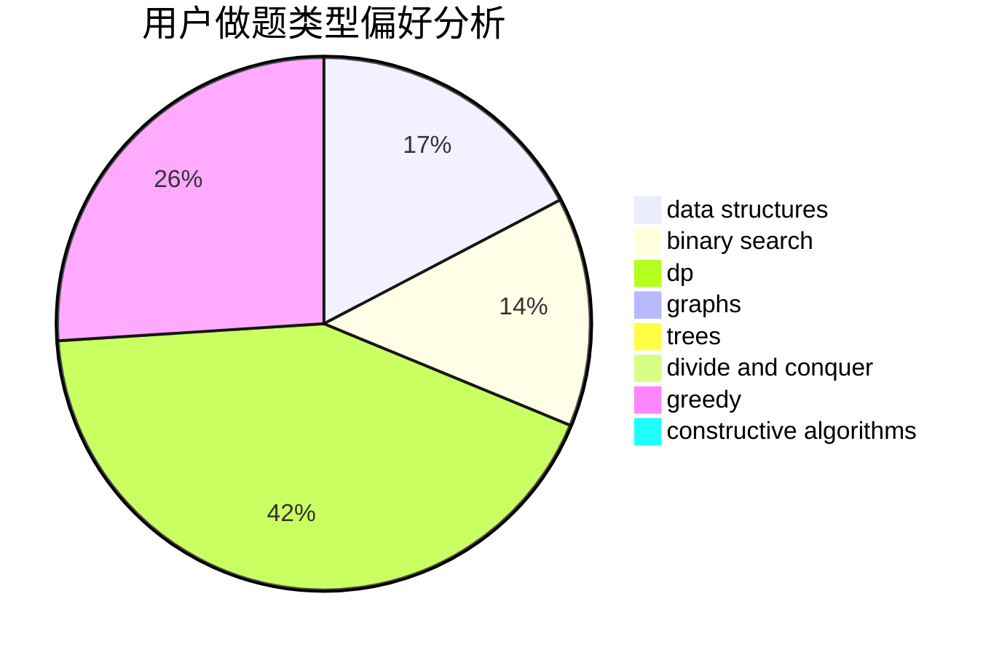
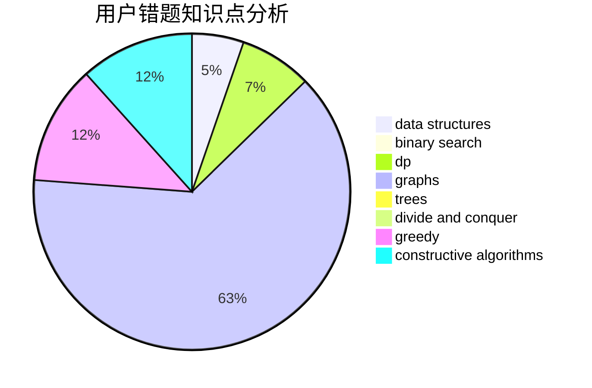

# hrdate

<!-- tabs:start -->

#### **用户提交结果分析**

#### **用户做题类型偏好分析**

#### **用户错题知识点分析**

<!-- tabs:end -->
# 推荐题目
[9A](https://codeforces.com/contest/9/problem/A)		math,
                        probabilities		  
[573C](https://codeforces.com/contest/573/problem/C)		constructive algorithms,
                        dfs and similar,
                        trees		  
[1207B](https://codeforces.com/contest/1207/problem/B)		constructive algorithms,
                        greedy,
                        implementation		  
[797C](https://codeforces.com/contest/797/problem/C)		data structures,
                        greedy,
                        strings		  
[295B](https://codeforces.com/contest/295/problem/B)		dp,
                        graphs,
                        shortest paths		  
[1341E](https://codeforces.com/contest/1341/problem/E)		dsu,graphs,sortings,trees		  
[1364D](https://codeforces.com/contest/1364/problem/D)		constructive algorithms,
                        dfs and similar,
                        graphs,
                        greedy,
                        implementation,
                        trees		  
[13042](https://codeforces.com/contest/1304/problem/2)		dsu,graphs,sortings,trees		  
[772A](https://codeforces.com/contest/772/problem/A)		binary search,
                        math		  
[1150E](https://codeforces.com/contest/1150/problem/E)		dsu,graphs,sortings,trees		  
