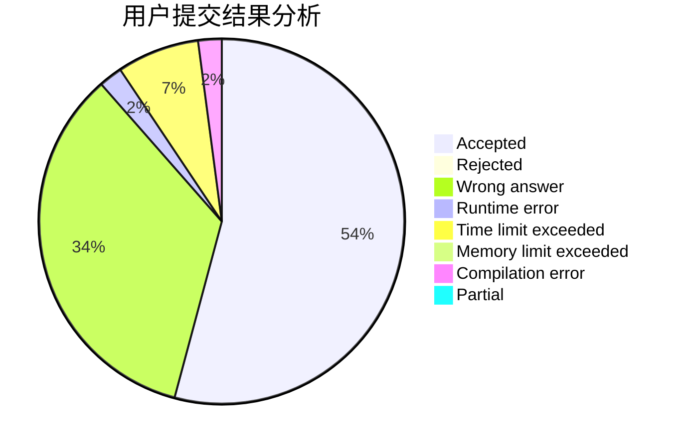
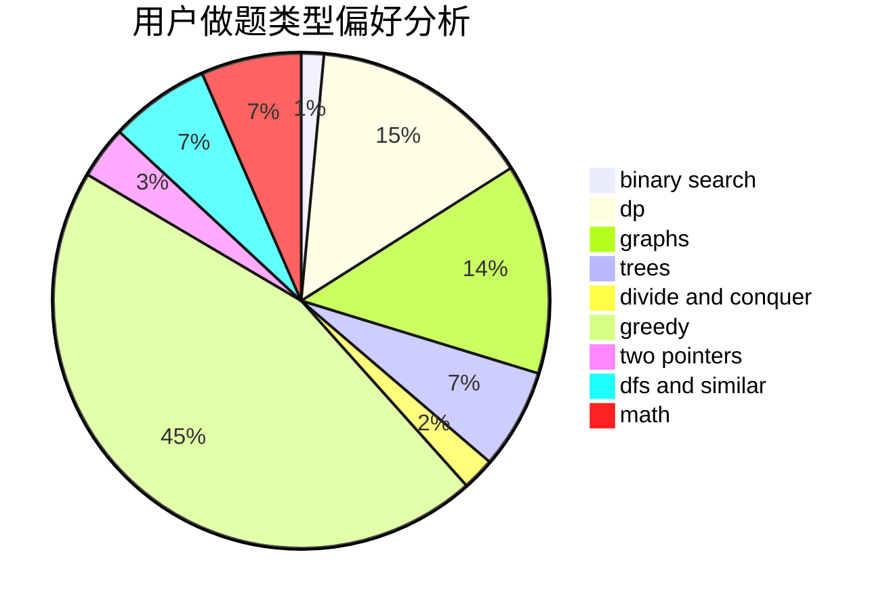

# hrs_Fe_fw

<!-- tabs:start -->

#### **用户提交结果分析**

#### **用户做题类型偏好分析**

<!-- tabs:end -->
# 推荐题目
[13821](https://codeforces.com/contest/1382/problem/1)
[13351](https://codeforces.com/contest/1335/problem/1)
[1340B](https://codeforces.com/contest/1340/problem/B)
[1153C](https://codeforces.com/contest/1153/problem/C)
[1229F](https://codeforces.com/contest/1229/problem/F)
[707B](https://codeforces.com/contest/707/problem/B)
[817D](https://codeforces.com/contest/817/problem/D)
[1076B](https://codeforces.com/contest/1076/problem/B)
[1292F](https://codeforces.com/contest/1292/problem/F)
[1140G](https://codeforces.com/contest/1140/problem/G)
