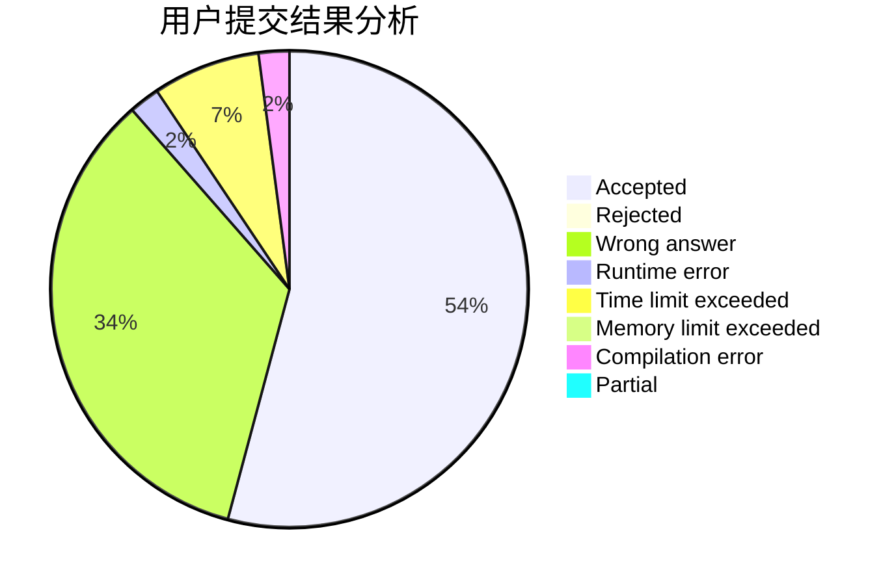
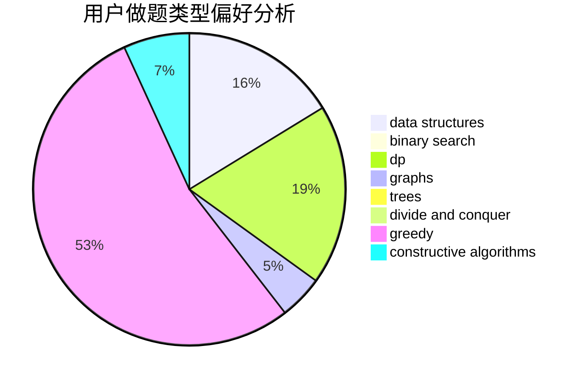
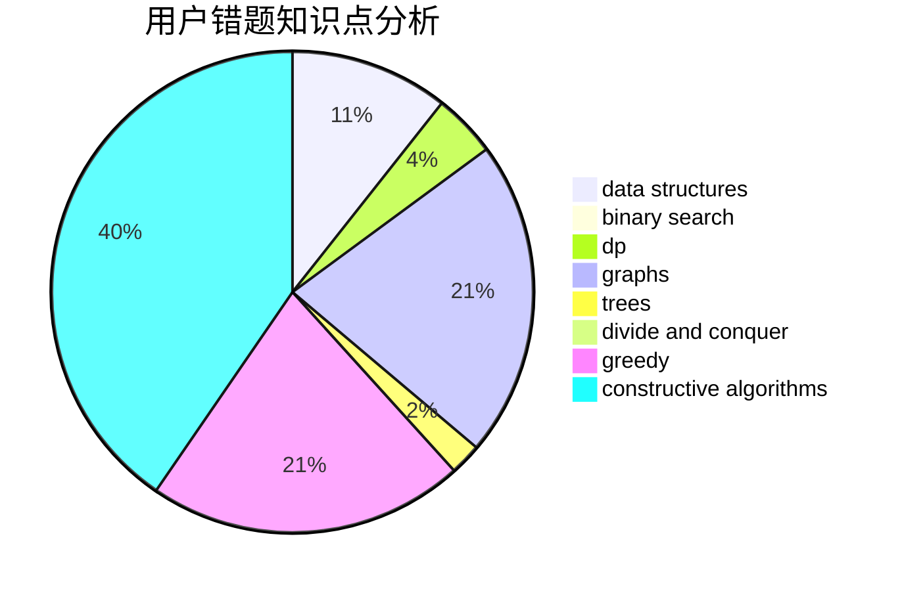

# hrs_Fe_fw

<!-- tabs:start -->

#### **用户提交结果分析**

#### **用户做题类型偏好分析**

#### **用户错题知识点分析**

<!-- tabs:end -->
# 推荐题目
[1373C](https://codeforces.com/contest/1373/problem/C)		math		  
[1328E](https://codeforces.com/contest/1328/problem/E)		dfs and similar,
                        graphs,
                        trees		  
[1333C](https://codeforces.com/contest/1333/problem/C)		binary search,
                        data structures,
                        implementation,
                        two pointers		  
[1151C](https://codeforces.com/contest/1151/problem/C)		constructive algorithms,
                        math		  
[1221D](https://codeforces.com/contest/1221/problem/D)		dp		  
[683A](https://codeforces.com/contest/683/problem/A)		*special problem,
                        geometry		  
[802G](https://codeforces.com/contest/802/problem/G)		implementation,
                        strings		  
[1074C](https://codeforces.com/contest/1074/problem/C)		dsu,graphs,sortings,trees		  
[1285E](https://codeforces.com/contest/1285/problem/E)		brute force,
                        constructive algorithms,
                        data structures,
                        dp,
                        graphs,
                        sortings,
                        trees,
                        two pointers		  
[1139C](https://codeforces.com/contest/1139/problem/C)		dfs and similar,
                        dsu,
                        graphs,
                        math,
                        trees		  
