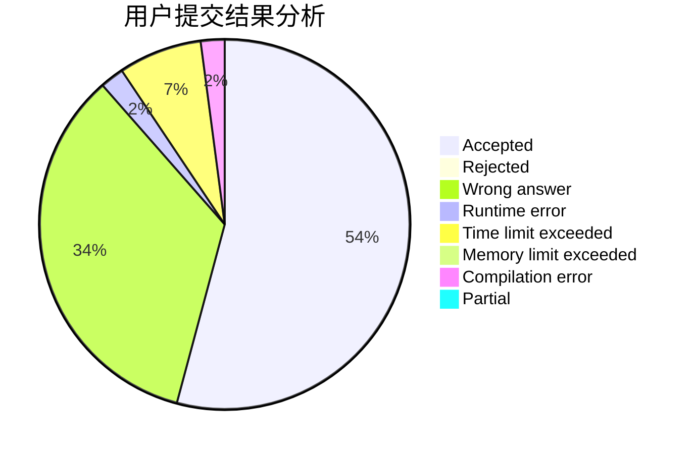
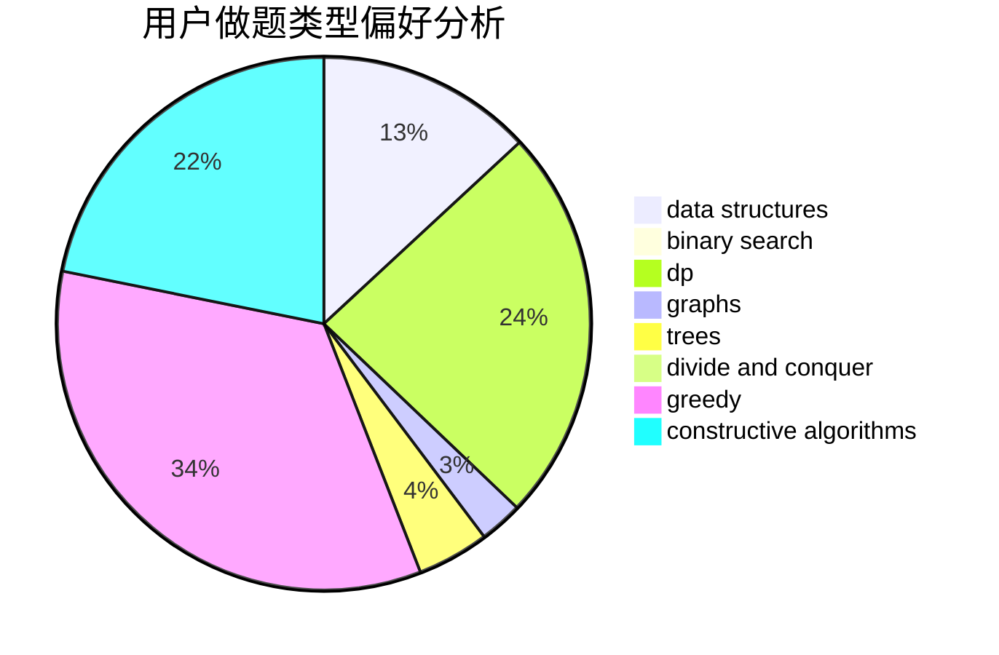
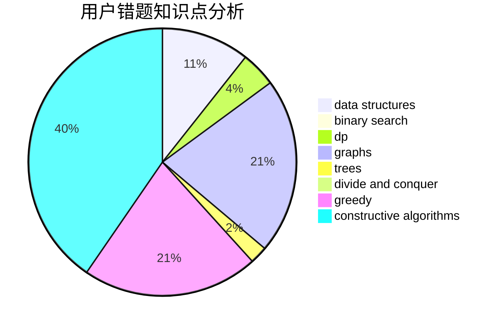

# hrs_Fe_fw

<!-- tabs:start -->

#### **用户提交结果分析**

#### **用户做题类型偏好分析**

#### **用户错题知识点分析**

<!-- tabs:end -->
# 推荐题目
[13821](https://codeforces.com/contest/1382/problem/1)		dsu,graphs,sortings,trees		  
[13351](https://codeforces.com/contest/1335/problem/1)		dsu,graphs,sortings,trees		  
[1340B](https://codeforces.com/contest/1340/problem/B)		bitmasks,
                        dp,
                        graphs,
                        greedy		  
[1153C](https://codeforces.com/contest/1153/problem/C)		greedy,
                        strings		  
[1229F](https://codeforces.com/contest/1229/problem/F)		dsu,graphs,sortings,trees		  
[707B](https://codeforces.com/contest/707/problem/B)		graphs		  
[817D](https://codeforces.com/contest/817/problem/D)		data structures,
                        divide and conquer,
                        dsu,
                        sortings		  
[1076B](https://codeforces.com/contest/1076/problem/B)		implementation,
                        math,
                        number theory		  
[1292F](https://codeforces.com/contest/1292/problem/F)		bitmasks,
                        combinatorics,
                        dp		  
[1140G](https://codeforces.com/contest/1140/problem/G)		data structures,
                        divide and conquer,
                        shortest paths,
                        trees		  
