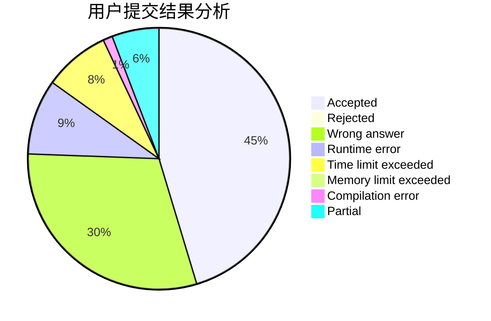
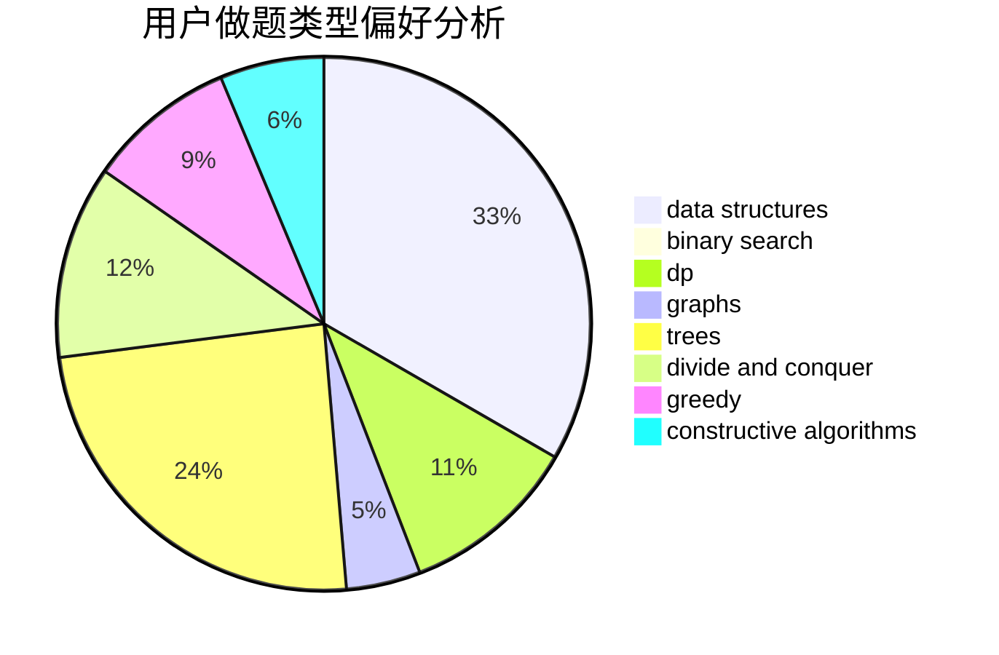
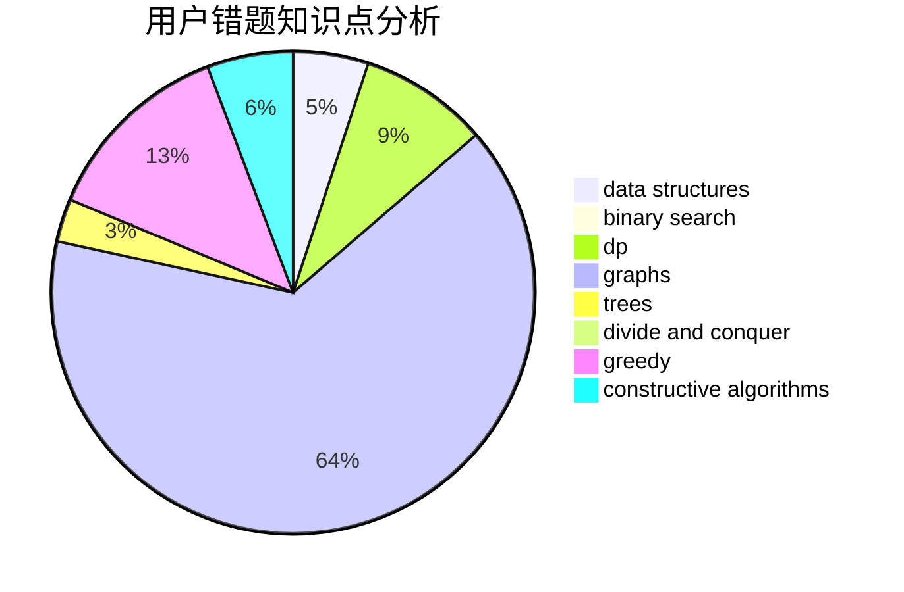

# hrynb

<!-- tabs:start -->

#### **用户提交结果分析**

#### **用户做题类型偏好分析**

#### **用户错题知识点分析**

<!-- tabs:end -->
# 推荐题目
[834B](https://codeforces.com/contest/834/problem/B)		data structures,
                        implementation		  
[414C](https://codeforces.com/contest/414/problem/C)		combinatorics,
                        divide and conquer		  
[516B](https://codeforces.com/contest/516/problem/B)		dsu,graphs,sortings,trees		  
[737C](https://codeforces.com/contest/737/problem/C)		dsu,graphs,sortings,trees		  
[893E](https://codeforces.com/contest/893/problem/E)		combinatorics,
                        dp,
                        math,
                        number theory		  
[1011D](https://codeforces.com/contest/1011/problem/D)		dsu,graphs,sortings,trees		  
[1053A](https://codeforces.com/contest/1053/problem/A)		dsu,graphs,sortings,trees		  
[229E](https://codeforces.com/contest/229/problem/E)		combinatorics,
                        dp,
                        math,
                        probabilities		  
[1091E](https://codeforces.com/contest/1091/problem/E)		binary search,
                        data structures,
                        graphs,
                        greedy,
                        implementation,
                        math,
                        sortings		  
[286E](https://codeforces.com/contest/286/problem/E)		constructive algorithms,
                        fft,
                        math		  
