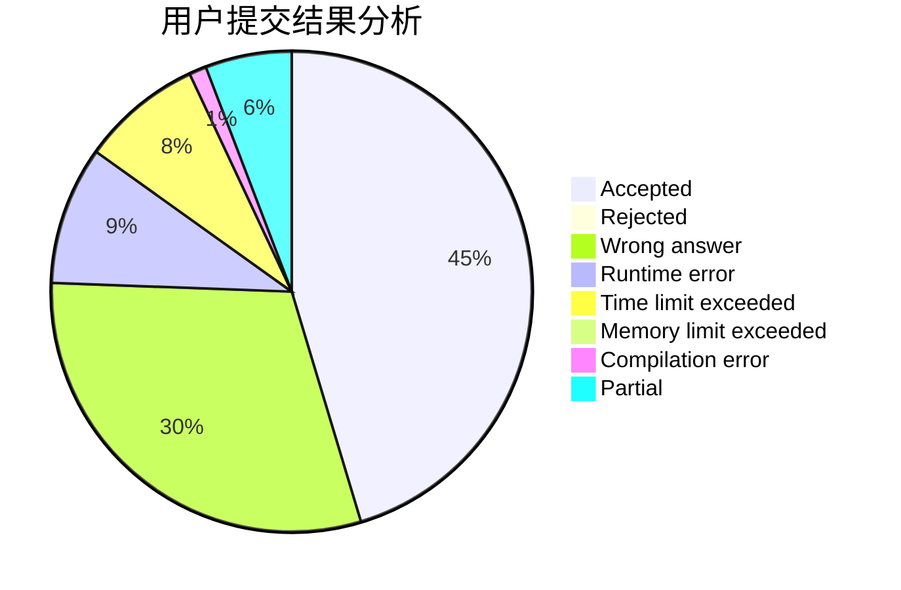
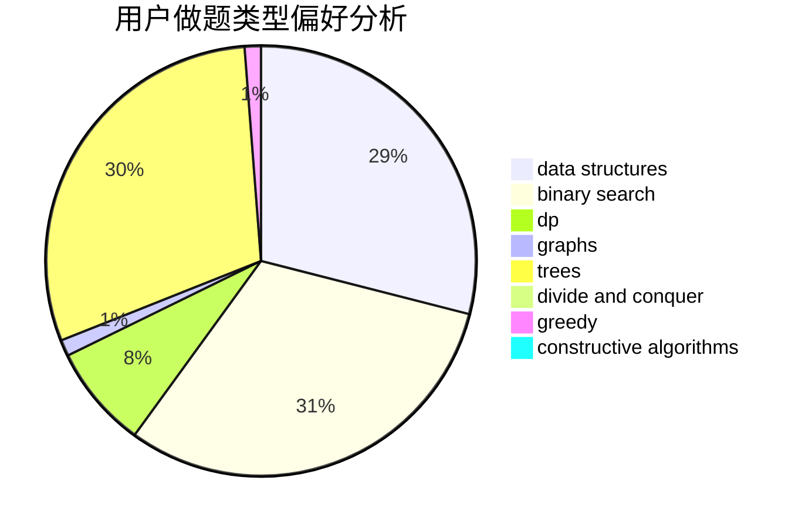
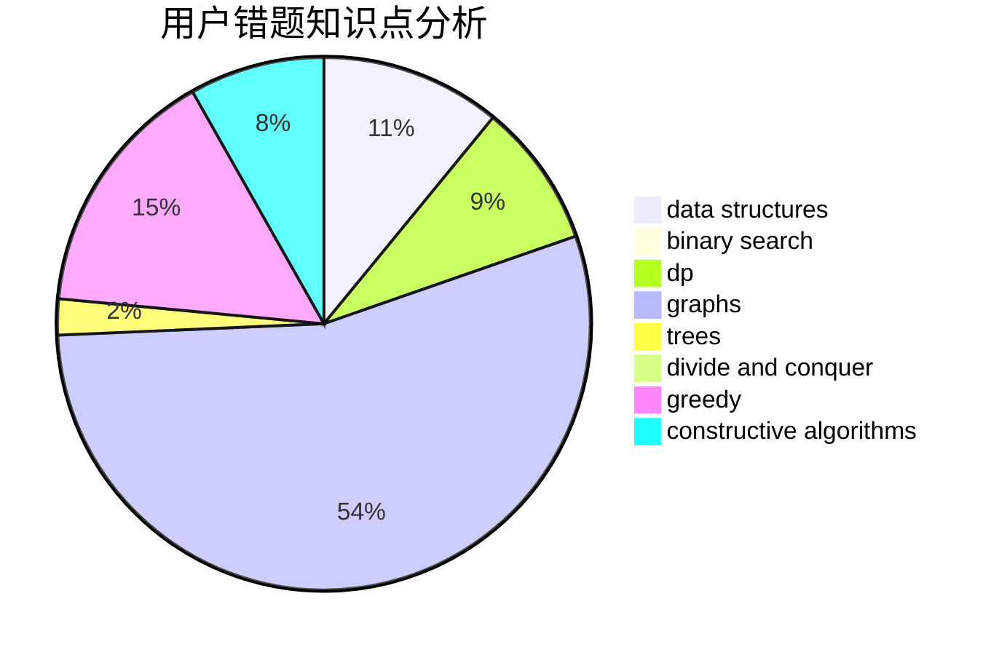

# hrynb

<!-- tabs:start -->

#### **用户提交结果分析**

#### **用户做题类型偏好分析**

#### **用户错题知识点分析**

<!-- tabs:end -->
# 推荐题目
[815B](https://codeforces.com/contest/815/problem/B)		brute force,
                        combinatorics,
                        constructive algorithms,
                        math		  
[383C](https://codeforces.com/contest/383/problem/C)		data structures,
                        dfs and similar,
                        trees		  
[497A](https://codeforces.com/contest/497/problem/A)		dsu,graphs,sortings,trees		  
[720C](https://codeforces.com/contest/720/problem/C)		constructive algorithms		  
[872C](https://codeforces.com/contest/872/problem/C)		dsu,graphs,sortings,trees		  
[1011A](https://codeforces.com/contest/1011/problem/A)		greedy,
                        implementation,
                        sortings		  
[1051E](https://codeforces.com/contest/1051/problem/E)		binary search,
                        data structures,
                        dp,
                        hashing,
                        strings		  
[205C](https://codeforces.com/contest/205/problem/C)		dsu,graphs,sortings,trees		  
[1091B](https://codeforces.com/contest/1091/problem/B)		brute force,
                        constructive algorithms,
                        greedy,
                        implementation		  
[270A](https://codeforces.com/contest/270/problem/A)		geometry,
                        implementation,
                        math		  
