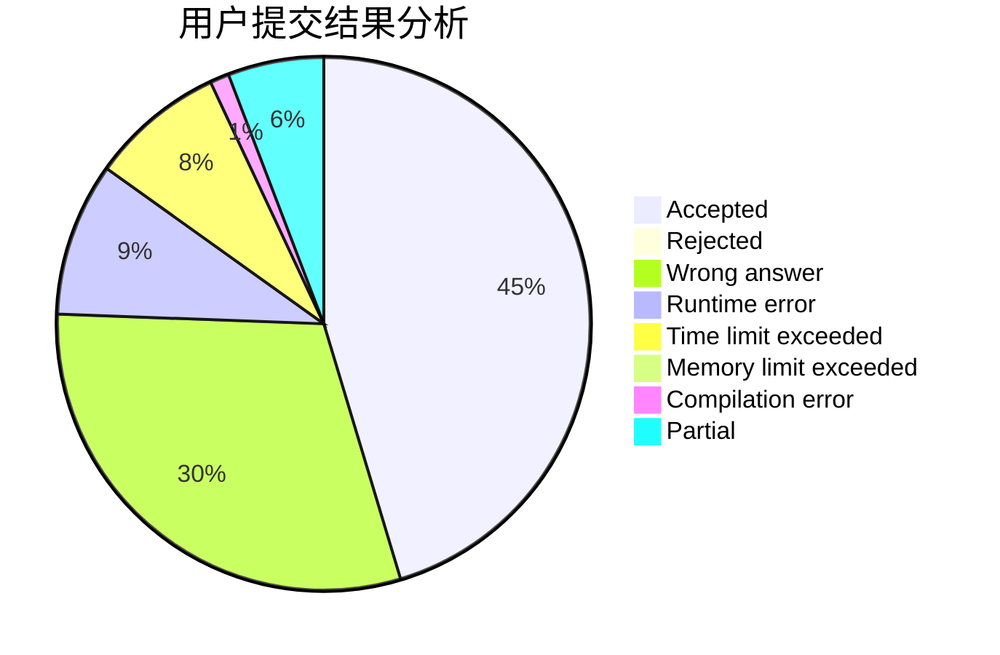
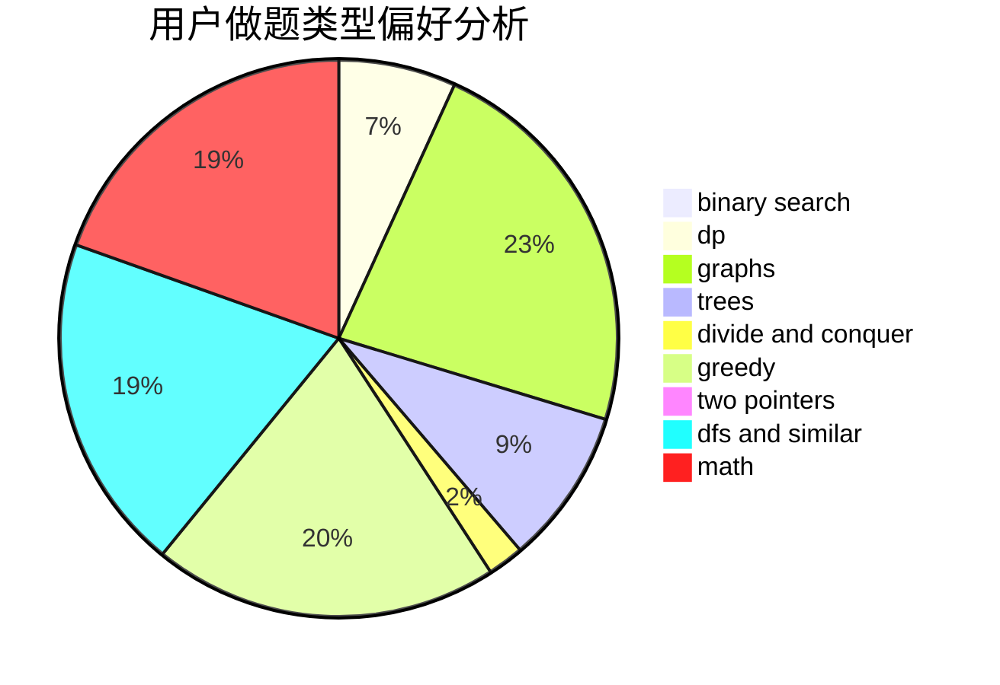

# hrynb

<!-- tabs:start -->

#### **用户提交结果分析**

#### **用户做题类型偏好分析**

<!-- tabs:end -->
# 推荐题目
[834B](https://codeforces.com/contest/834/problem/B)
[414C](https://codeforces.com/contest/414/problem/C)
[516B](https://codeforces.com/contest/516/problem/B)
[737C](https://codeforces.com/contest/737/problem/C)
[893E](https://codeforces.com/contest/893/problem/E)
[1011D](https://codeforces.com/contest/1011/problem/D)
[1053A](https://codeforces.com/contest/1053/problem/A)
[229E](https://codeforces.com/contest/229/problem/E)
[1091E](https://codeforces.com/contest/1091/problem/E)
[286E](https://codeforces.com/contest/286/problem/E)
