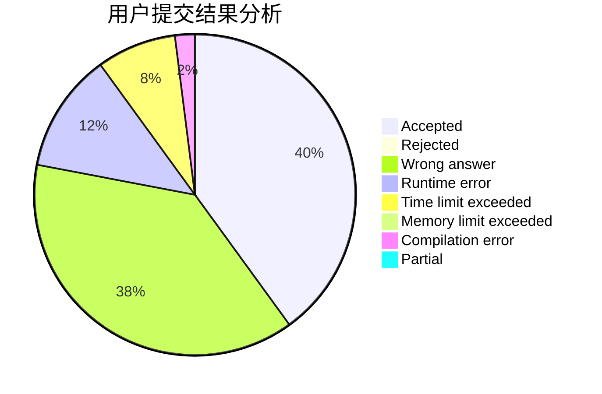
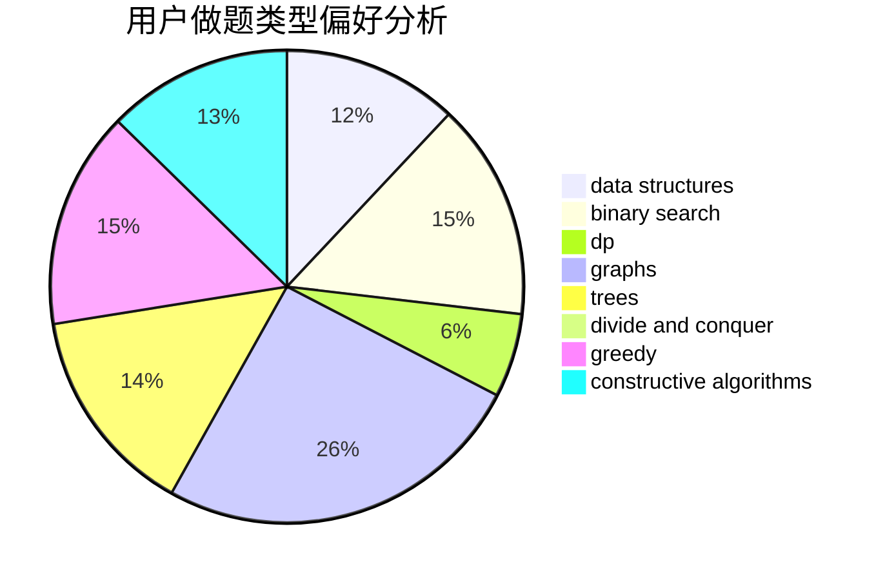
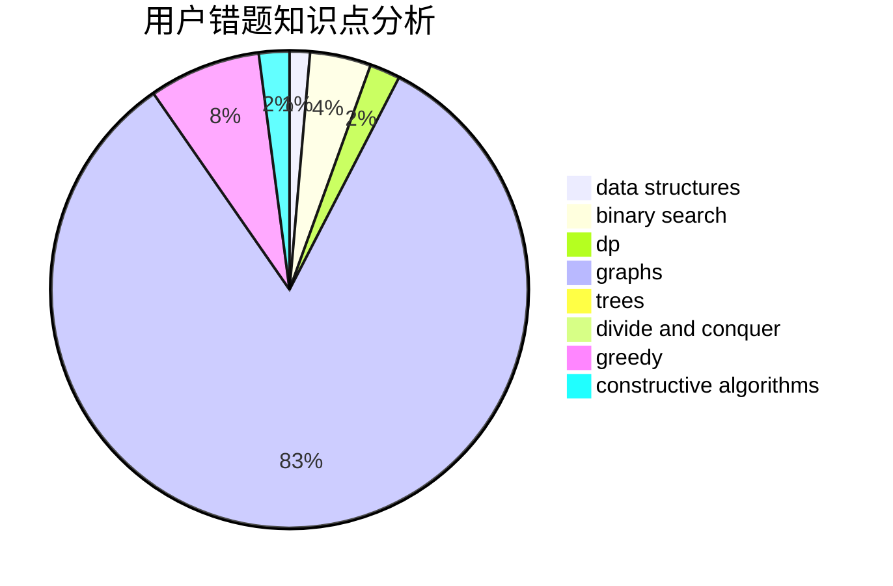

# Barbatos

<!-- tabs:start -->

#### **用户提交结果分析**

#### **用户做题类型偏好分析**

#### **用户错题知识点分析**

<!-- tabs:end -->
# 推荐题目
[480E](https://codeforces.com/contest/480/problem/E)		data structures,
                        divide and conquer		  
[371E](https://codeforces.com/contest/371/problem/E)		greedy,
                        math,
                        two pointers		  
[482D](https://codeforces.com/contest/482/problem/D)		combinatorics,
                        dp,
                        trees		  
[1247A](https://codeforces.com/contest/1247/problem/A)		dsu,graphs,sortings,trees		  
[1036B](https://codeforces.com/contest/1036/problem/B)		math		  
[1118D1](https://codeforces.com/contest/1118D/problem/1)		brute force,
                        greedy		  
[1144D](https://codeforces.com/contest/1144/problem/D)		constructive algorithms,
                        greedy		  
[1141E](https://codeforces.com/contest/1141/problem/E)		math		  
[482C](https://codeforces.com/contest/482/problem/C)		bitmasks,
                        dp,
                        probabilities		  
[482B](https://codeforces.com/contest/482/problem/B)		constructive algorithms,
                        data structures,
                        trees		  
