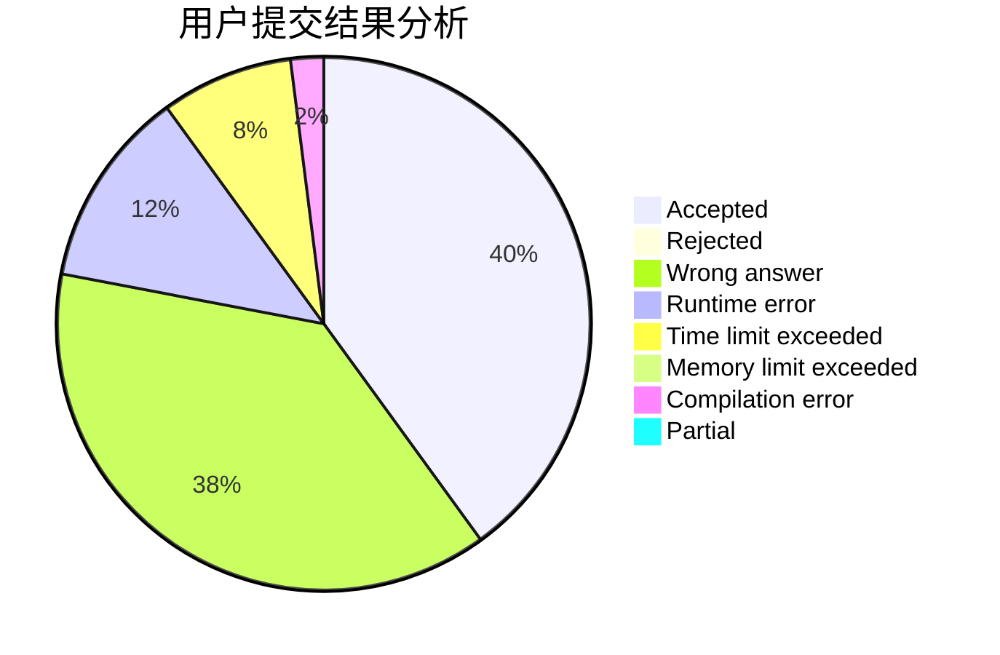
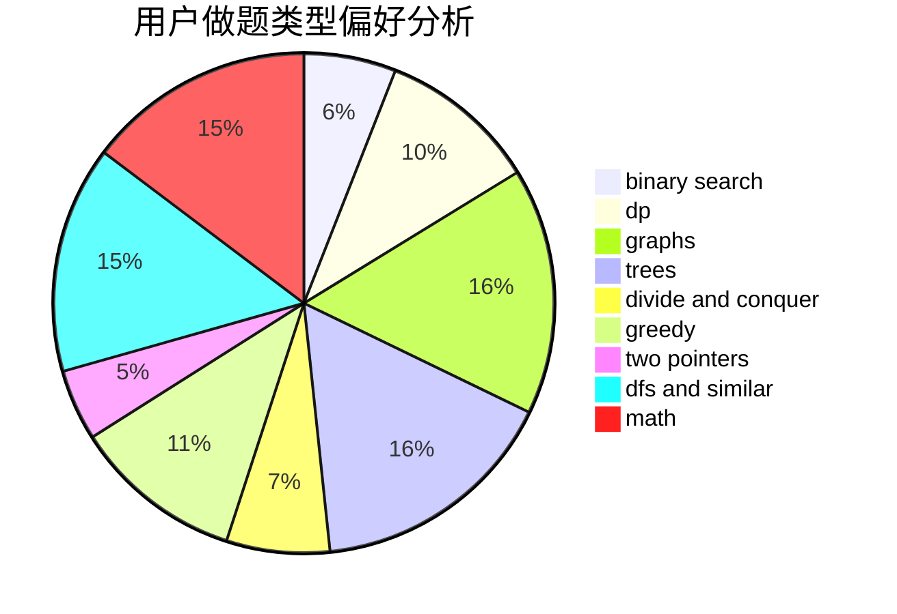

# Barbatos

<!-- tabs:start -->

#### **用户提交结果分析**

#### **用户做题类型偏好分析**

<!-- tabs:end -->
# 推荐题目
[500D](https://codeforces.com/contest/500/problem/D)
[401D](https://codeforces.com/contest/401/problem/D)
[501C](https://codeforces.com/contest/501/problem/C)
[12511](https://codeforces.com/contest/1251/problem/1)
[1036E](https://codeforces.com/contest/1036/problem/E)
[1120A](https://codeforces.com/contest/1120/problem/A)
[1146E](https://codeforces.com/contest/1146/problem/E)
[1143E](https://codeforces.com/contest/1143/problem/E)
[501A](https://codeforces.com/contest/501/problem/A)
[500F](https://codeforces.com/contest/500/problem/F)
