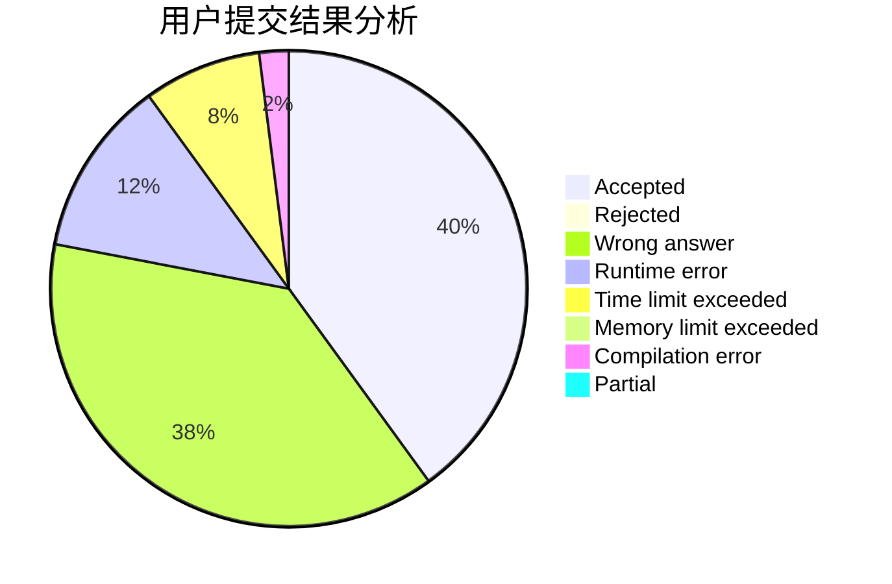
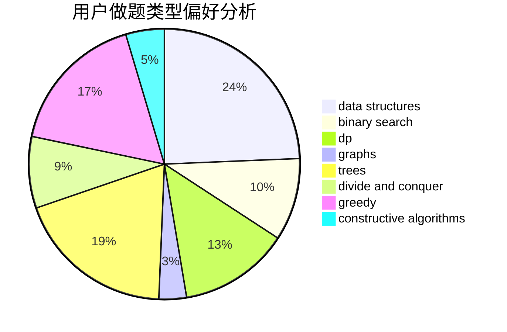
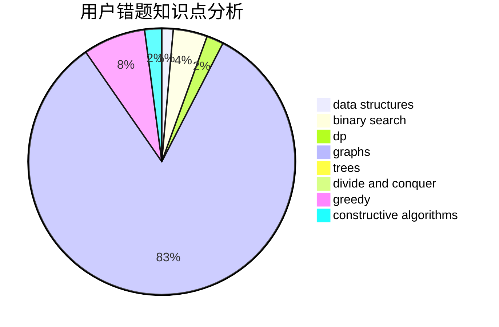

# Barbatos

<!-- tabs:start -->

#### **用户提交结果分析**

#### **用户做题类型偏好分析**

#### **用户错题知识点分析**

<!-- tabs:end -->
# 推荐题目
[500D](https://codeforces.com/contest/500/problem/D)		combinatorics,
                        dfs and similar,
                        graphs,
                        trees		  
[401D](https://codeforces.com/contest/401/problem/D)		bitmasks,
                        brute force,
                        combinatorics,
                        dp,
                        number theory		  
[501C](https://codeforces.com/contest/501/problem/C)		constructive algorithms,
                        data structures,
                        greedy,
                        sortings,
                        trees		  
[12511](https://codeforces.com/contest/1251/problem/1)		dsu,graphs,sortings,trees		  
[1036E](https://codeforces.com/contest/1036/problem/E)		fft,
                        geometry,
                        number theory		  
[1120A](https://codeforces.com/contest/1120/problem/A)		greedy,
                        implementation,
                        two pointers		  
[1146E](https://codeforces.com/contest/1146/problem/E)		bitmasks,
                        data structures,
                        divide and conquer,
                        implementation		  
[1143E](https://codeforces.com/contest/1143/problem/E)		dsu,graphs,sortings,trees		  
[501A](https://codeforces.com/contest/501/problem/A)		implementation		  
[500F](https://codeforces.com/contest/500/problem/F)		divide and conquer,
                        dp		  
