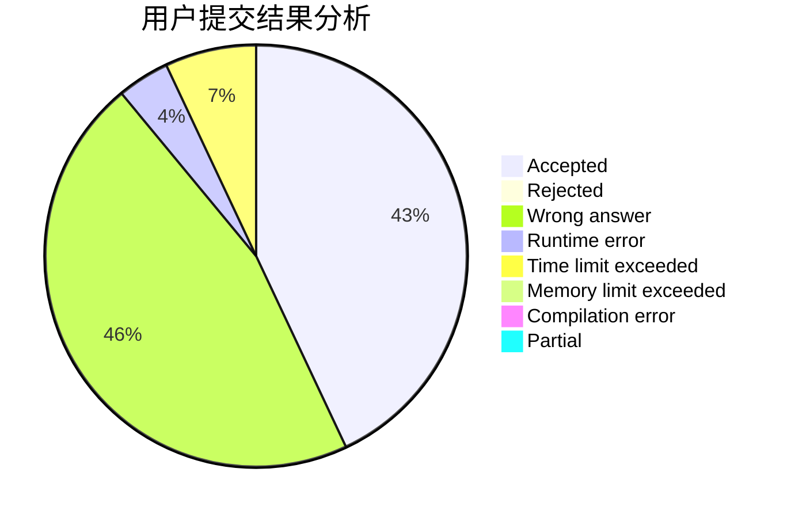
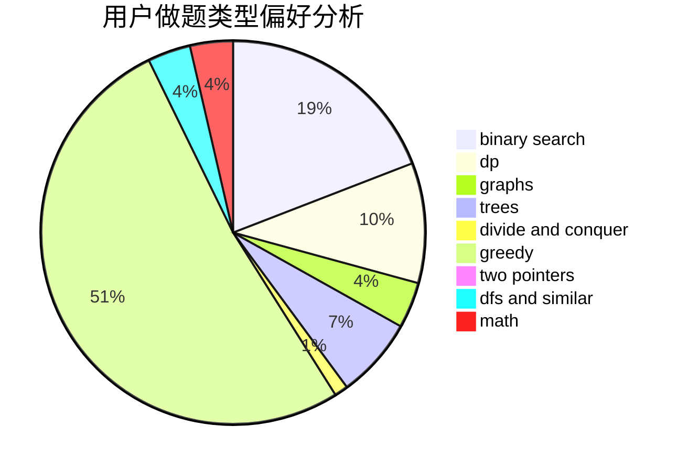

# hs_wfz_orz

<!-- tabs:start -->

#### **用户提交结果分析**

#### **用户做题类型偏好分析**

<!-- tabs:end -->
# 推荐题目
[679E](https://codeforces.com/contest/679/problem/E)
[985E](https://codeforces.com/contest/985/problem/E)
[519D](https://codeforces.com/contest/519/problem/D)
[1379E](https://codeforces.com/contest/1379/problem/E)
[285E](https://codeforces.com/contest/285/problem/E)
[913B](https://codeforces.com/contest/913/problem/B)
[1295F](https://codeforces.com/contest/1295/problem/F)
[652E](https://codeforces.com/contest/652/problem/E)
[851B](https://codeforces.com/contest/851/problem/B)
[883I](https://codeforces.com/contest/883/problem/I)
