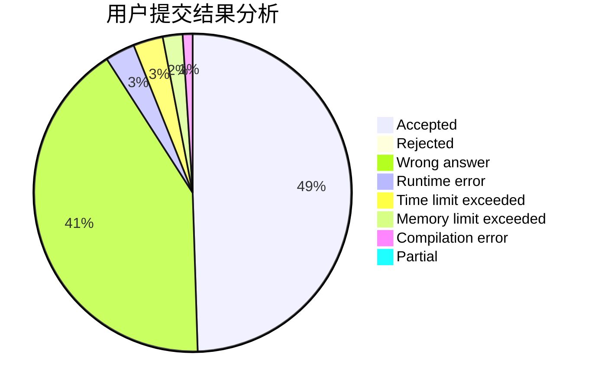
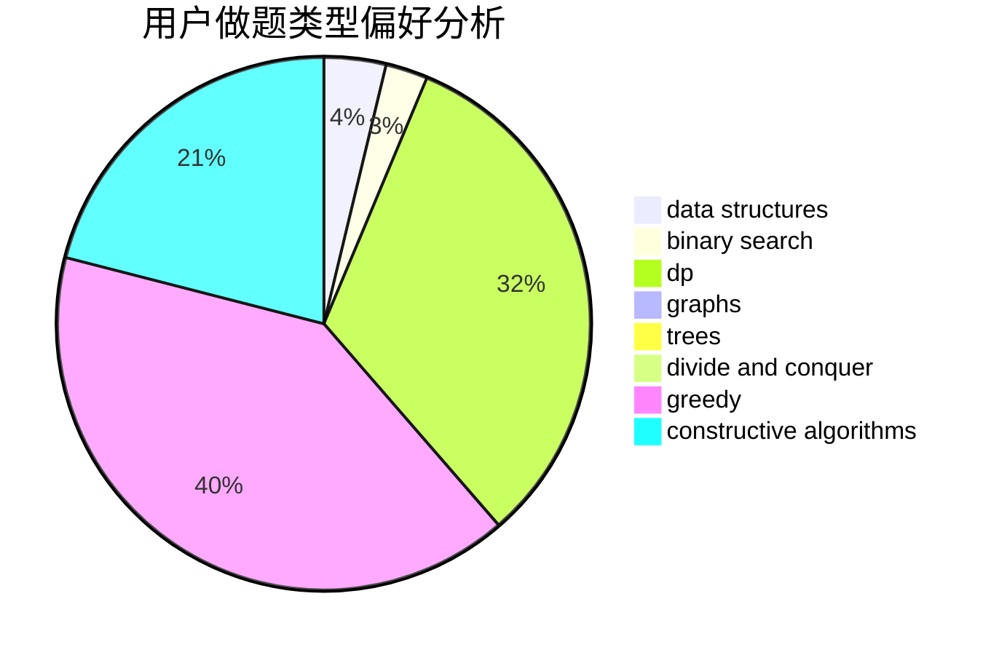
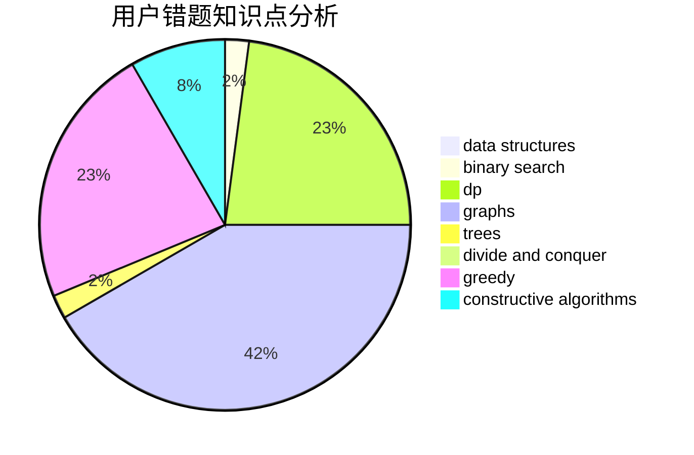

# hsfzLZH1

<!-- tabs:start -->

#### **用户提交结果分析**

#### **用户做题类型偏好分析**

#### **用户错题知识点分析**

<!-- tabs:end -->
# 推荐题目
[14511](https://codeforces.com/contest/1451/problem/1)		dsu,graphs,sortings,trees		  
[1379E](https://codeforces.com/contest/1379/problem/E)		constructive algorithms,
                        divide and conquer,
                        dp,
                        math,
                        trees		  
[385E](https://codeforces.com/contest/385/problem/E)		math,
                        matrices		  
[12642](https://codeforces.com/contest/1264/problem/2)		dsu,graphs,sortings,trees		  
[20A](https://codeforces.com/contest/20/problem/A)		implementation		  
[919D](https://codeforces.com/contest/919/problem/D)		dfs and similar,
                        dp,
                        graphs		  
[1292F](https://codeforces.com/contest/1292/problem/F)		bitmasks,
                        combinatorics,
                        dp		  
[772D](https://codeforces.com/contest/772/problem/D)		bitmasks,
                        dp		  
[462E](https://codeforces.com/contest/462/problem/E)		dsu,graphs,sortings,trees		  
[377E](https://codeforces.com/contest/377/problem/E)		dp,
                        geometry		  
