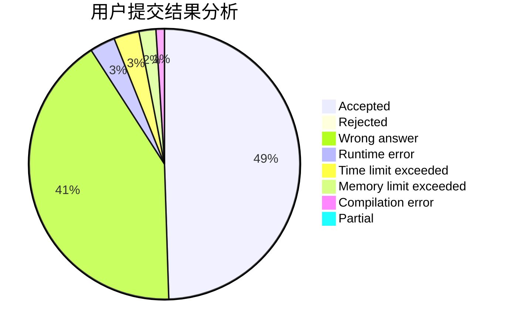
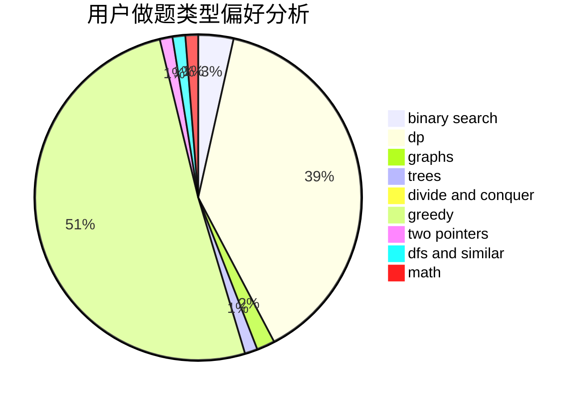

# hsfzLZH1

<!-- tabs:start -->

#### **用户提交结果分析**

#### **用户做题类型偏好分析**

<!-- tabs:end -->
# 推荐题目
[14511](https://codeforces.com/contest/1451/problem/1)
[1379E](https://codeforces.com/contest/1379/problem/E)
[385E](https://codeforces.com/contest/385/problem/E)
[12642](https://codeforces.com/contest/1264/problem/2)
[20A](https://codeforces.com/contest/20/problem/A)
[919D](https://codeforces.com/contest/919/problem/D)
[1292F](https://codeforces.com/contest/1292/problem/F)
[772D](https://codeforces.com/contest/772/problem/D)
[462E](https://codeforces.com/contest/462/problem/E)
[377E](https://codeforces.com/contest/377/problem/E)
