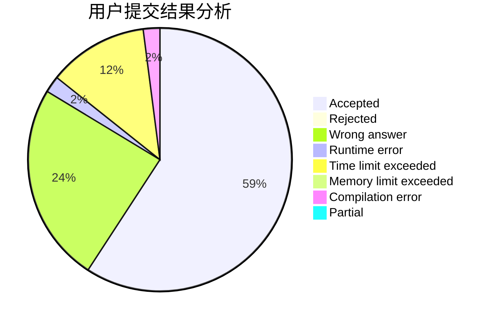
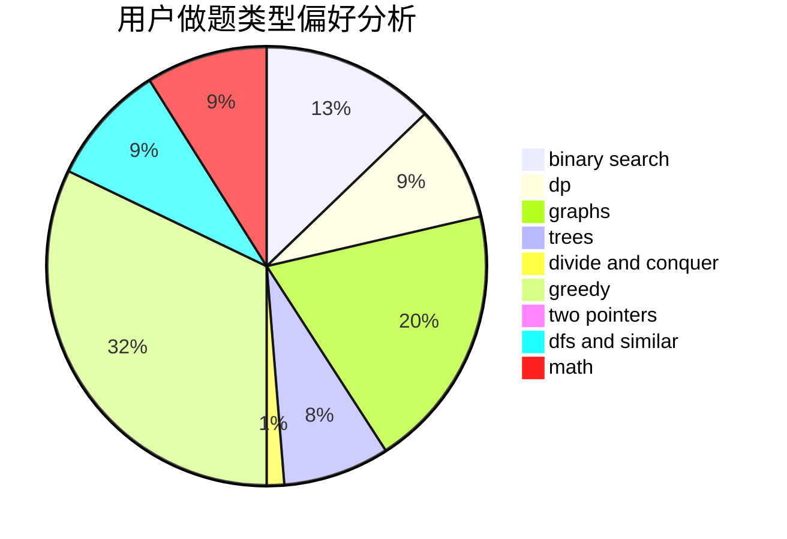

# htbb2

<!-- tabs:start -->

#### **用户提交结果分析**

#### **用户做题类型偏好分析**

<!-- tabs:end -->
# 推荐题目
[166A](https://codeforces.com/contest/166/problem/A)
[11882](https://codeforces.com/contest/1188/problem/2)
[1104E](https://codeforces.com/contest/1104/problem/E)
[938A](https://codeforces.com/contest/938/problem/A)
[809C](https://codeforces.com/contest/809/problem/C)
[1335B](https://codeforces.com/contest/1335/problem/B)
[1243D](https://codeforces.com/contest/1243/problem/D)
[75D](https://codeforces.com/contest/75/problem/D)
[167E](https://codeforces.com/contest/167/problem/E)
[1187B](https://codeforces.com/contest/1187/problem/B)
