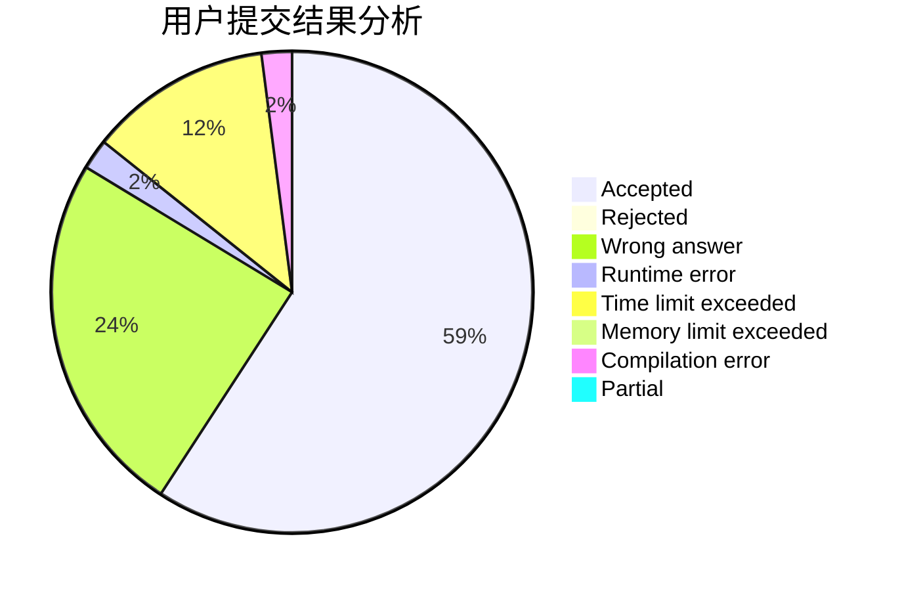
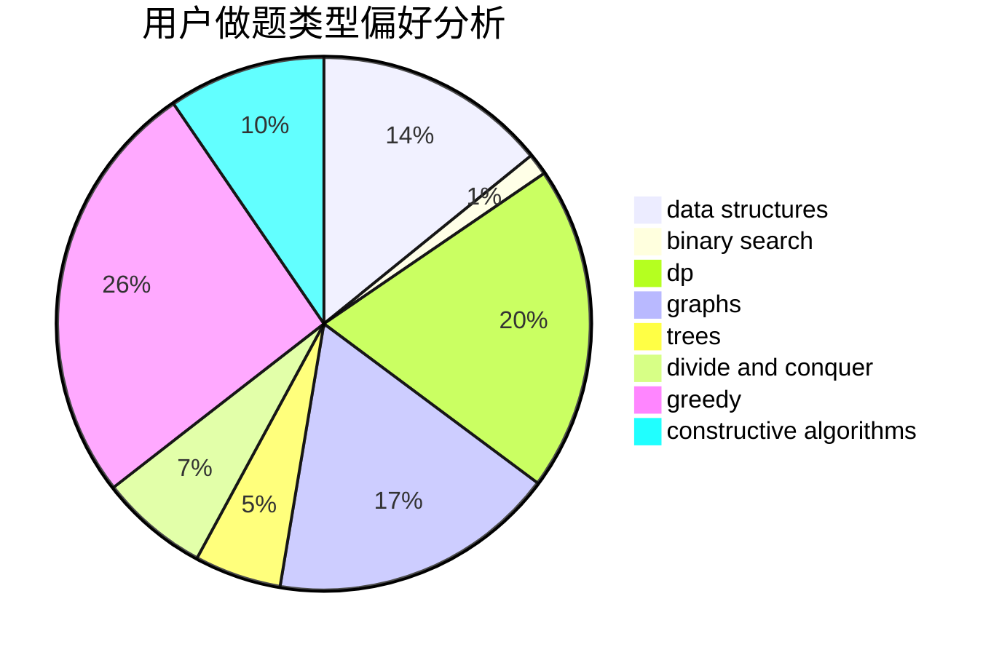
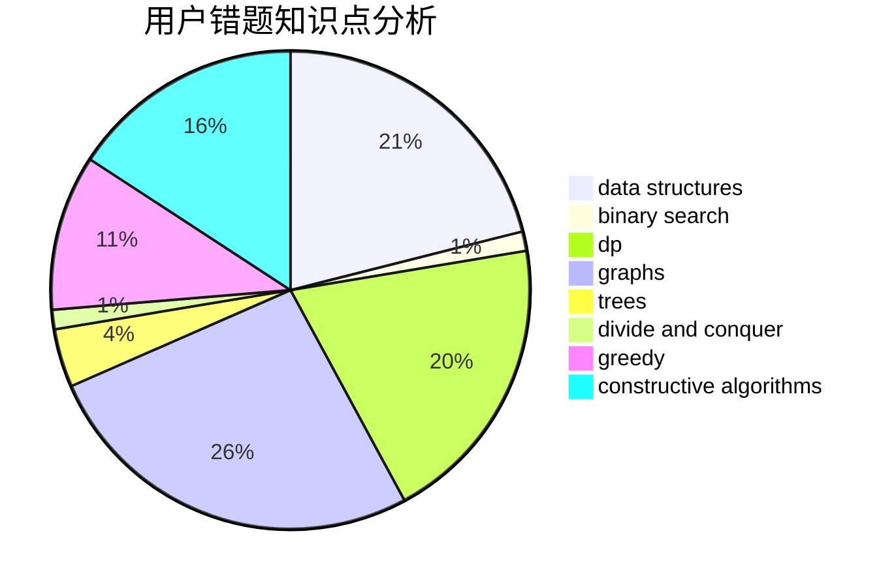

# htbb2

<!-- tabs:start -->

#### **用户提交结果分析**

#### **用户做题类型偏好分析**

#### **用户错题知识点分析**

<!-- tabs:end -->
# 推荐题目
[1510I](https://codeforces.com/contest/1510/problem/I)		greedy,
                        interactive,
                        math,
                        probabilities		  
[1184C3](https://codeforces.com/contest/1184C/problem/3)		nan		  
[1104B](https://codeforces.com/contest/1104/problem/B)		data structures,
                        implementation,
                        math		  
[917C](https://codeforces.com/contest/917/problem/C)		combinatorics,
                        dp,
                        matrices		  
[794B](https://codeforces.com/contest/794/problem/B)		geometry,
                        math		  
[1329B](https://codeforces.com/contest/1329/problem/B)		bitmasks,
                        combinatorics,
                        math		  
[1238D](https://codeforces.com/contest/1238/problem/D)		binary search,
                        combinatorics,
                        dp,
                        strings		  
[739D](https://codeforces.com/contest/739/problem/D)		graph matchings		  
[1511C](https://codeforces.com/contest/1511/problem/C)		brute force,
                        data structures,
                        implementation,
                        trees		  
[1184A1](https://codeforces.com/contest/1184A/problem/1)		brute force,
                        math,
                        number theory		  
