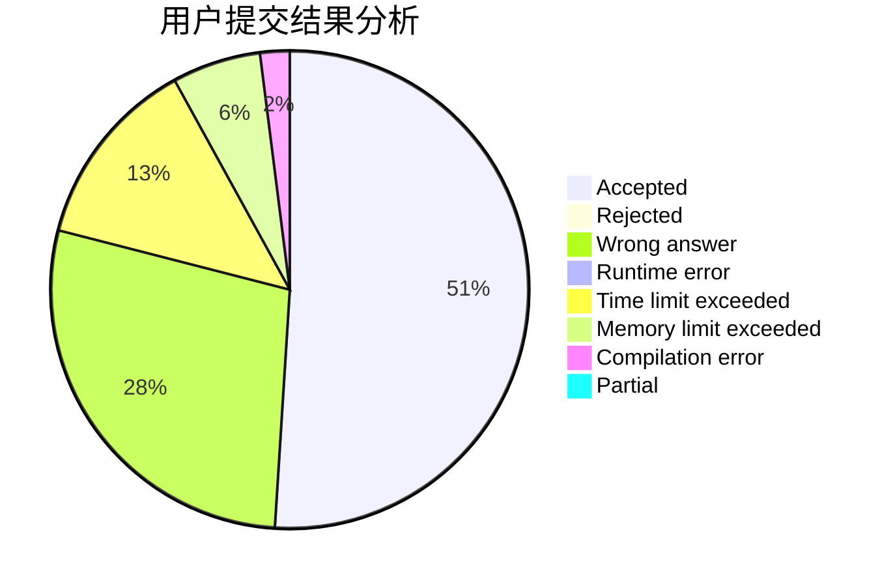
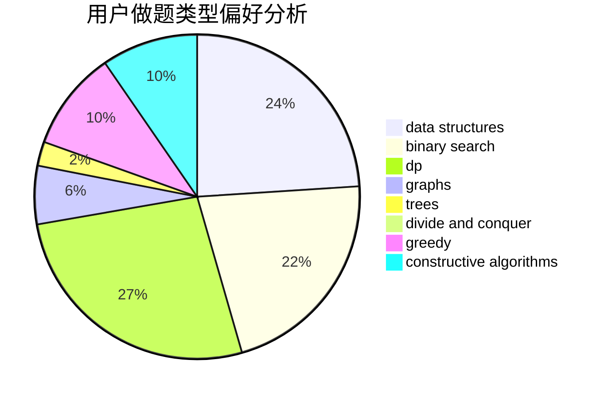
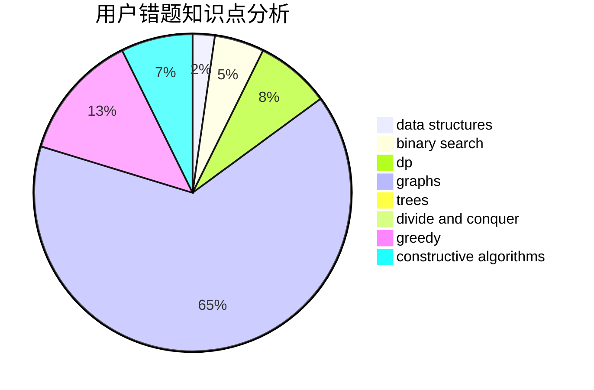

# htc001

<!-- tabs:start -->

#### **用户提交结果分析**

#### **用户做题类型偏好分析**

#### **用户错题知识点分析**

<!-- tabs:end -->
# 推荐题目
[1419D1](https://codeforces.com/contest/1419D/problem/1)		binary search,
                        constructive algorithms,
                        greedy,
                        sortings		  
[928B](https://codeforces.com/contest/928/problem/B)		*special problem,
                        dp		  
[827E](https://codeforces.com/contest/827/problem/E)		fft,
                        math,
                        strings		  
[1189D1](https://codeforces.com/contest/1189D/problem/1)		dsu,graphs,sortings,trees		  
[856F](https://codeforces.com/contest/856/problem/F)		greedy		  
[1497A](https://codeforces.com/contest/1497/problem/A)		brute force,
                        data structures,
                        greedy,
                        sortings		  
[1191C](https://codeforces.com/contest/1191/problem/C)		dsu,graphs,sortings,trees		  
[8B](https://codeforces.com/contest/8/problem/B)		constructive algorithms,
                        graphs,
                        implementation		  
[629E](https://codeforces.com/contest/629/problem/E)		combinatorics,
                        data structures,
                        dfs and similar,
                        dp,
                        probabilities,
                        trees		  
[932C](https://codeforces.com/contest/932/problem/C)		brute force,
                        constructive algorithms		  
