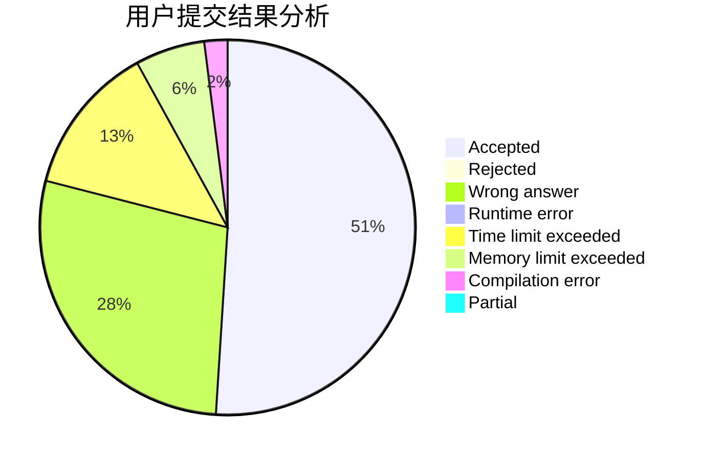
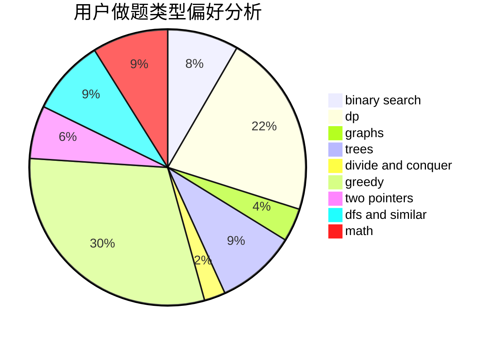

# htc001

<!-- tabs:start -->

#### **用户提交结果分析**

#### **用户做题类型偏好分析**

<!-- tabs:end -->
# 推荐题目
[1427B](https://codeforces.com/contest/1427/problem/B)
[949E](https://codeforces.com/contest/949/problem/E)
[846A](https://codeforces.com/contest/846/problem/A)
[1194F](https://codeforces.com/contest/1194/problem/F)
[875F](https://codeforces.com/contest/875/problem/F)
[1505G](https://codeforces.com/contest/1505/problem/G)
[1197B](https://codeforces.com/contest/1197/problem/B)
[915G](https://codeforces.com/contest/915/problem/G)
[659E](https://codeforces.com/contest/659/problem/E)
[954C](https://codeforces.com/contest/954/problem/C)
