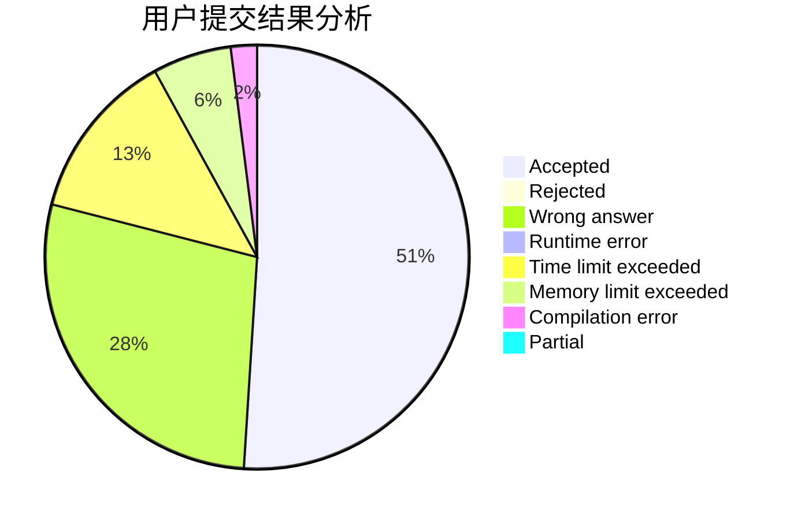
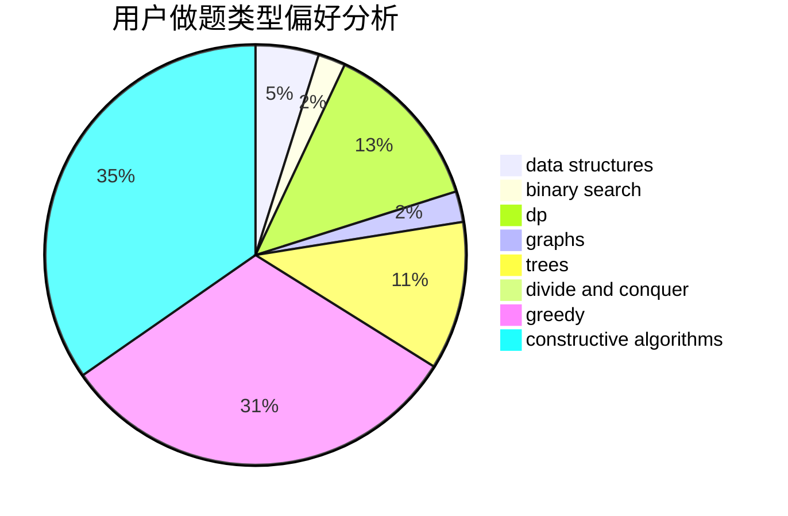
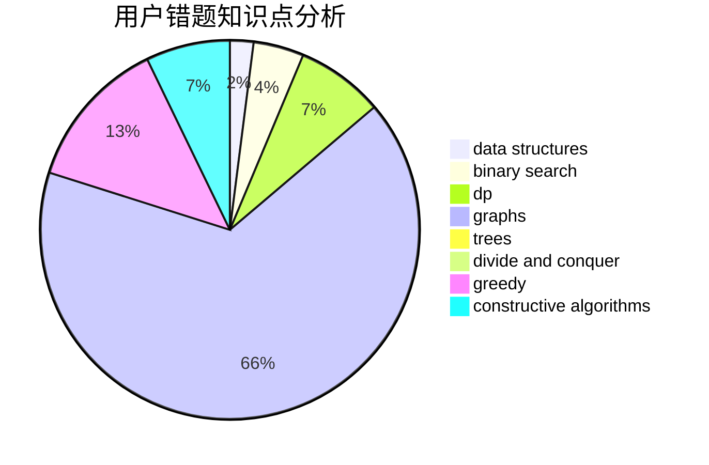

# htc001

<!-- tabs:start -->

#### **用户提交结果分析**

#### **用户做题类型偏好分析**

#### **用户错题知识点分析**

<!-- tabs:end -->
# 推荐题目
[1427B](https://codeforces.com/contest/1427/problem/B)		greedy,
                        implementation,
                        sortings		  
[949E](https://codeforces.com/contest/949/problem/E)		brute force		  
[846A](https://codeforces.com/contest/846/problem/A)		brute force,
                        implementation		  
[1194F](https://codeforces.com/contest/1194/problem/F)		combinatorics,
                        dp,
                        number theory,
                        probabilities,
                        two pointers		  
[875F](https://codeforces.com/contest/875/problem/F)		dsu,
                        graphs,
                        greedy		  
[1505G](https://codeforces.com/contest/1505/problem/G)		implementation		  
[1197B](https://codeforces.com/contest/1197/problem/B)		greedy,
                        implementation		  
[915G](https://codeforces.com/contest/915/problem/G)		math,
                        number theory		  
[659E](https://codeforces.com/contest/659/problem/E)		data structures,
                        dfs and similar,
                        dsu,
                        graphs,
                        greedy		  
[954C](https://codeforces.com/contest/954/problem/C)		implementation		  
