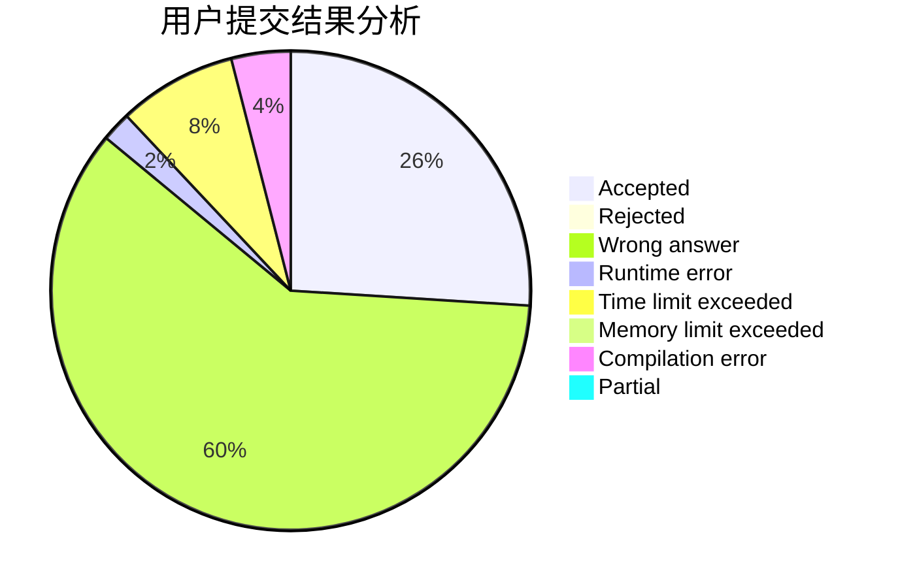
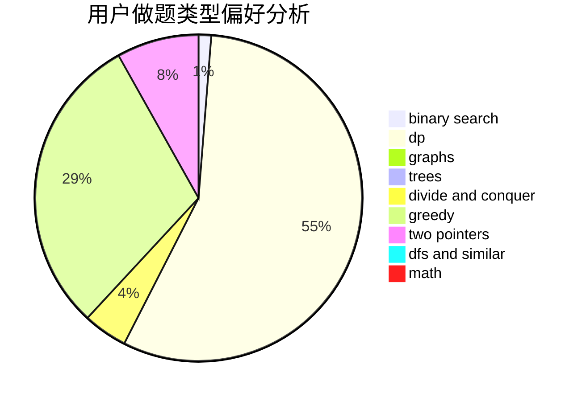

# httohu

<!-- tabs:start -->

#### **用户提交结果分析**

#### **用户做题类型偏好分析**

<!-- tabs:end -->
# 推荐题目
[1380G](https://codeforces.com/contest/1380/problem/G)
[282C](https://codeforces.com/contest/282/problem/C)
[758F](https://codeforces.com/contest/758/problem/F)
[1087C](https://codeforces.com/contest/1087/problem/C)
[1114C](https://codeforces.com/contest/1114/problem/C)
[847F](https://codeforces.com/contest/847/problem/F)
[483D](https://codeforces.com/contest/483/problem/D)
[1240A](https://codeforces.com/contest/1240/problem/A)
[1208G](https://codeforces.com/contest/1208/problem/G)
[1140F](https://codeforces.com/contest/1140/problem/F)
