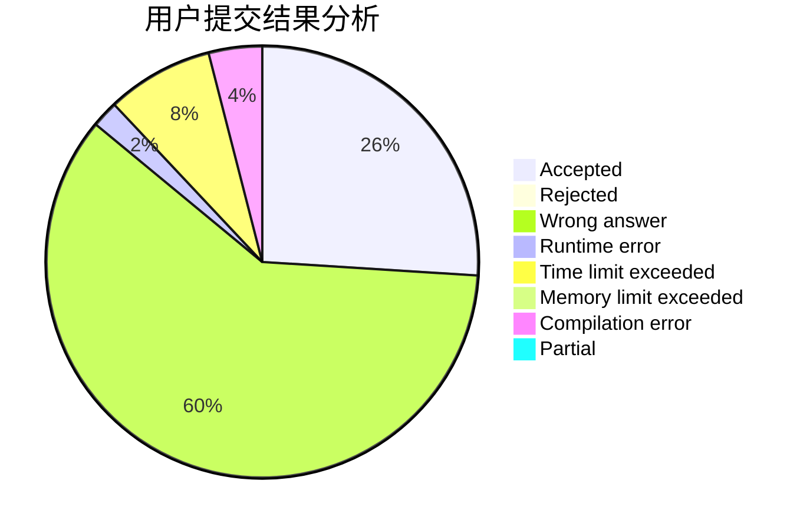
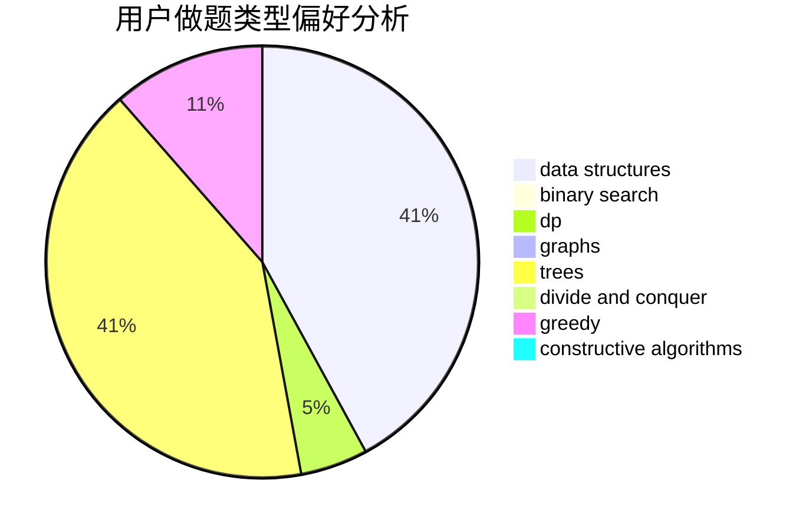
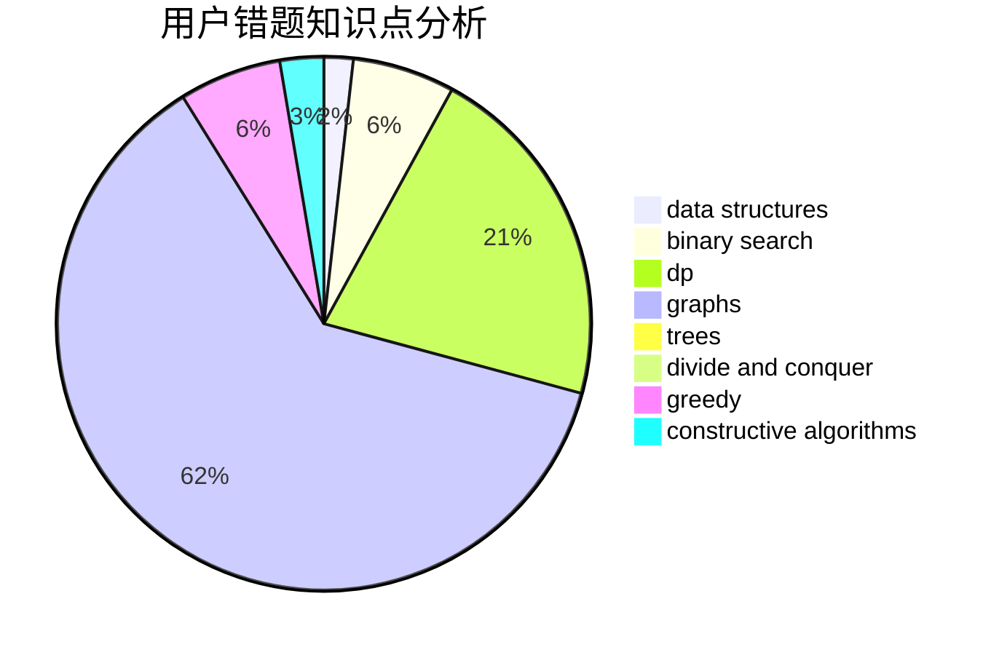

# httohu

<!-- tabs:start -->

#### **用户提交结果分析**

#### **用户做题类型偏好分析**

#### **用户错题知识点分析**

<!-- tabs:end -->
# 推荐题目
[1372B](https://codeforces.com/contest/1372/problem/B)		greedy,
                        math,
                        number theory		  
[266D](https://codeforces.com/contest/266/problem/D)		graphs,
                        math,
                        shortest paths		  
[737B](https://codeforces.com/contest/737/problem/B)		dsu,graphs,sortings,trees		  
[1086E](https://codeforces.com/contest/1086/problem/E)		dsu,graphs,sortings,trees		  
[1113F](https://codeforces.com/contest/1113/problem/F)		dsu,graphs,sortings,trees		  
[82A](https://codeforces.com/contest/82/problem/A)		implementation,
                        math		  
[463D](https://codeforces.com/contest/463/problem/D)		dfs and similar,
                        dp,
                        graphs,
                        implementation		  
[1234D](https://codeforces.com/contest/1234/problem/D)		data structures		  
[1204B](https://codeforces.com/contest/1204/problem/B)		greedy,
                        math		  
[1139B](https://codeforces.com/contest/1139/problem/B)		greedy,
                        implementation		  
