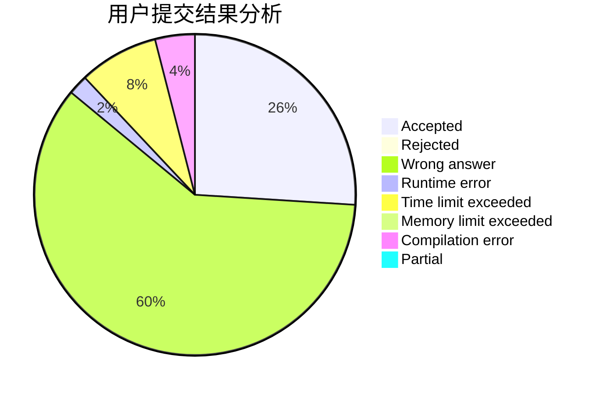
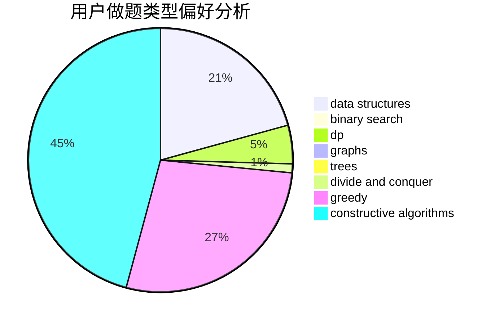
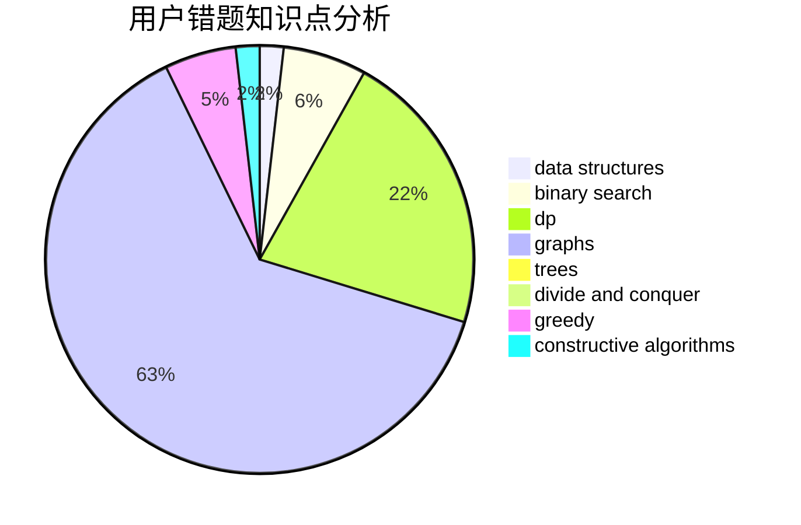

# httohu

<!-- tabs:start -->

#### **用户提交结果分析**

#### **用户做题类型偏好分析**

#### **用户错题知识点分析**

<!-- tabs:end -->
# 推荐题目
[1380G](https://codeforces.com/contest/1380/problem/G)		greedy,
                        math,
                        probabilities		  
[282C](https://codeforces.com/contest/282/problem/C)		constructive algorithms,
                        implementation,
                        math		  
[758F](https://codeforces.com/contest/758/problem/F)		brute force,
                        math,
                        number theory		  
[1087C](https://codeforces.com/contest/1087/problem/C)		dsu,graphs,sortings,trees		  
[1114C](https://codeforces.com/contest/1114/problem/C)		brute force,
                        implementation,
                        math,
                        number theory		  
[847F](https://codeforces.com/contest/847/problem/F)		greedy,
                        sortings		  
[483D](https://codeforces.com/contest/483/problem/D)		dsu,graphs,sortings,trees		  
[1240A](https://codeforces.com/contest/1240/problem/A)		dsu,graphs,sortings,trees		  
[1208G](https://codeforces.com/contest/1208/problem/G)		greedy,
                        math,
                        number theory		  
[1140F](https://codeforces.com/contest/1140/problem/F)		data structures,
                        divide and conquer,
                        dsu		  
