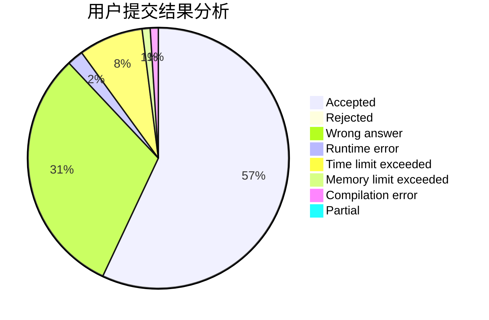
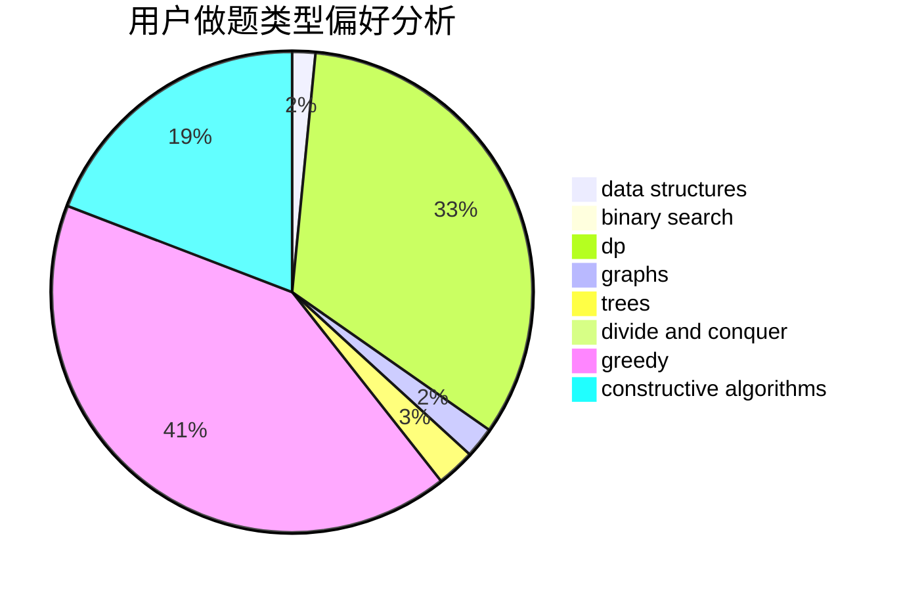
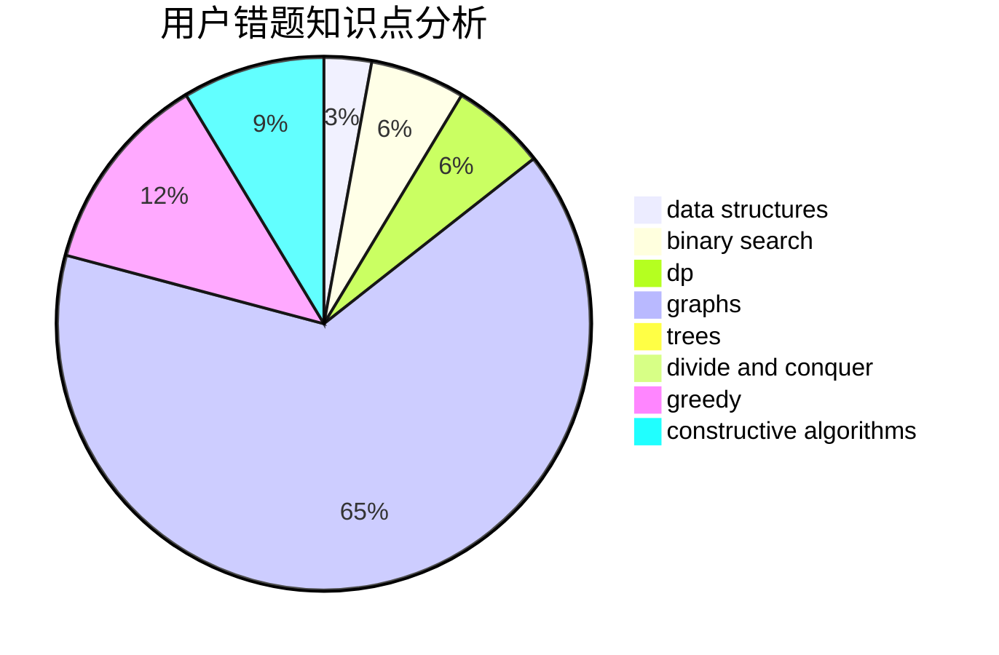

# huagaohan

<!-- tabs:start -->

#### **用户提交结果分析**

#### **用户做题类型偏好分析**

#### **用户错题知识点分析**

<!-- tabs:end -->
# 推荐题目
[1347A](https://codeforces.com/contest/1347/problem/A)		dsu,graphs,sortings,trees		  
[1178C](https://codeforces.com/contest/1178/problem/C)		combinatorics,
                        greedy,
                        math		  
[115B](https://codeforces.com/contest/115/problem/B)		greedy,
                        sortings		  
[548B](https://codeforces.com/contest/548/problem/B)		brute force,
                        dp,
                        greedy,
                        implementation		  
[908F](https://codeforces.com/contest/908/problem/F)		graphs,
                        greedy,
                        implementation		  
[1B](https://codeforces.com/contest/1/problem/B)		implementation,
                        math		  
[852G](https://codeforces.com/contest/852/problem/G)		implementation		  
[442D](https://codeforces.com/contest/442/problem/D)		data structures,
                        trees		  
[1118E](https://codeforces.com/contest/1118/problem/E)		constructive algorithms,
                        implementation		  
[763B](https://codeforces.com/contest/763/problem/B)		constructive algorithms,
                        geometry		  
