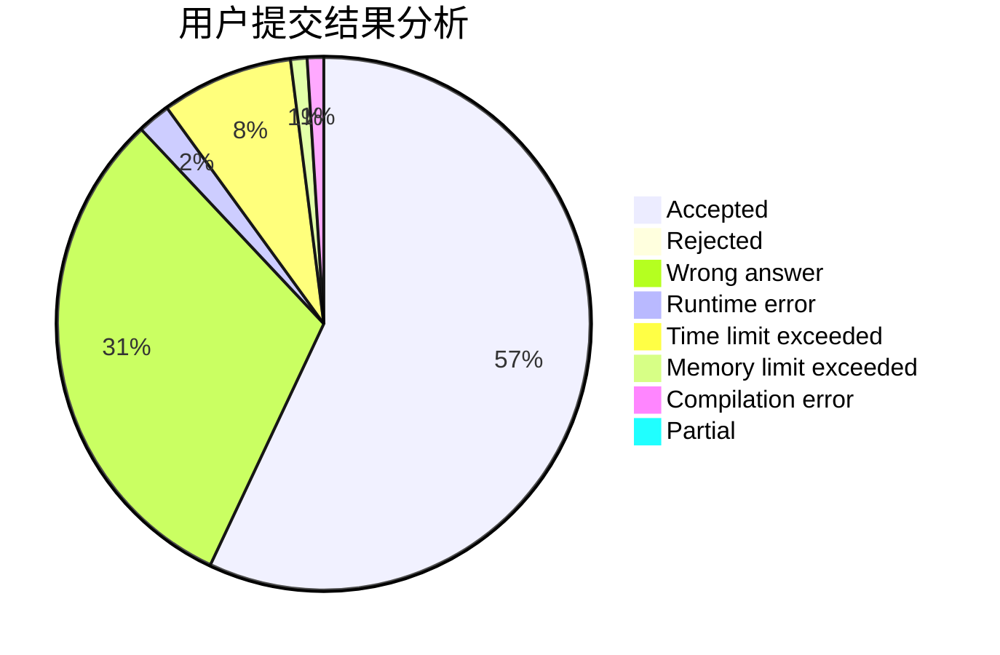
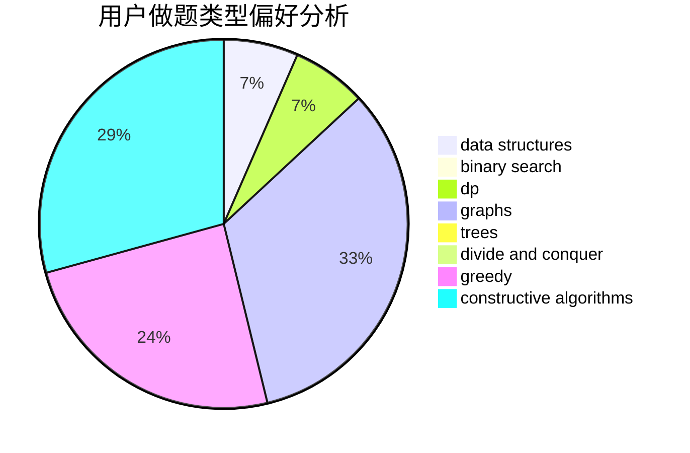
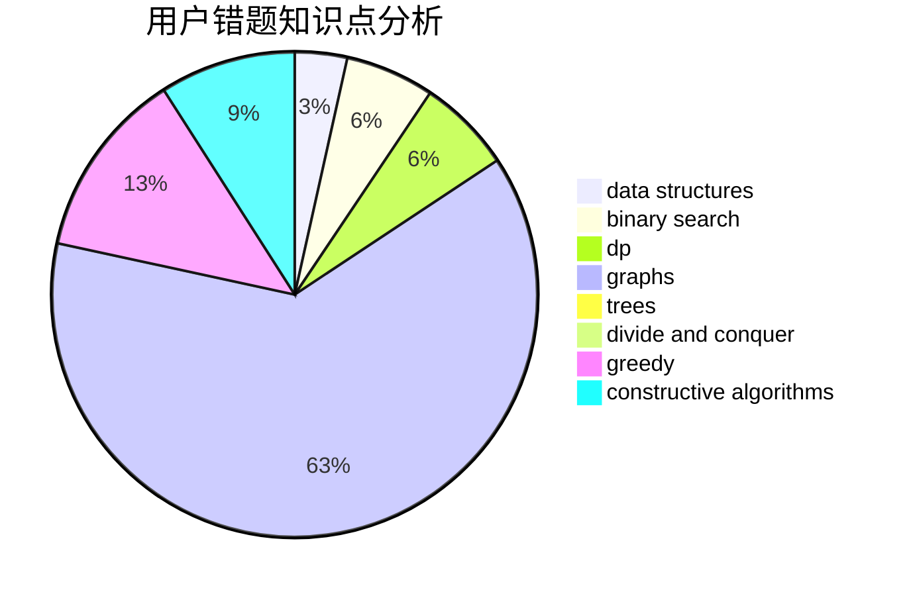

# huagaohan

<!-- tabs:start -->

#### **用户提交结果分析**

#### **用户做题类型偏好分析**

#### **用户错题知识点分析**

<!-- tabs:end -->
# 推荐题目
[1340B](https://codeforces.com/contest/1340/problem/B)		bitmasks,
                        dp,
                        graphs,
                        greedy		  
[1175C](https://codeforces.com/contest/1175/problem/C)		binary search,
                        brute force,
                        greedy		  
[1157F](https://codeforces.com/contest/1157/problem/F)		constructive algorithms,
                        dp,
                        greedy,
                        two pointers		  
[523A](https://codeforces.com/contest/523/problem/A)		*special problem,
                        implementation		  
[888G](https://codeforces.com/contest/888/problem/G)		bitmasks,
                        constructive algorithms,
                        data structures		  
[174B](https://codeforces.com/contest/174/problem/B)		dp,
                        greedy,
                        implementation		  
[835A](https://codeforces.com/contest/835/problem/A)		math		  
[417E](https://codeforces.com/contest/417/problem/E)		constructive algorithms,
                        math,
                        probabilities		  
[1117A](https://codeforces.com/contest/1117/problem/A)		implementation,
                        math		  
[742E](https://codeforces.com/contest/742/problem/E)		dsu,graphs,sortings,trees		  
