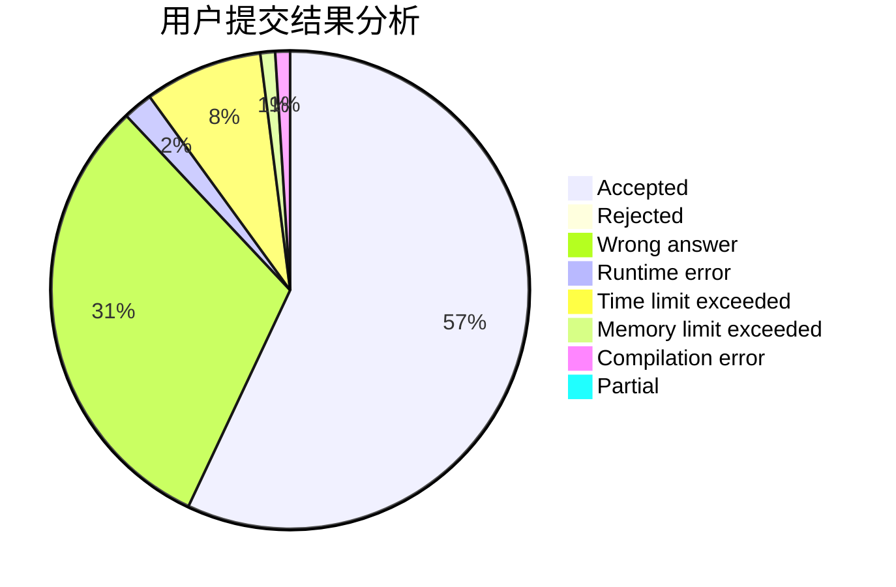
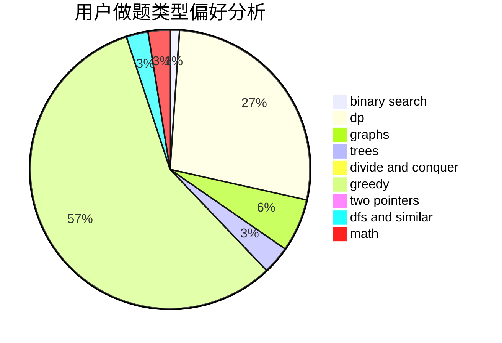

# huagaohan

<!-- tabs:start -->

#### **用户提交结果分析**

#### **用户做题类型偏好分析**

<!-- tabs:end -->
# 推荐题目
[1347A](https://codeforces.com/contest/1347/problem/A)
[1178C](https://codeforces.com/contest/1178/problem/C)
[115B](https://codeforces.com/contest/115/problem/B)
[548B](https://codeforces.com/contest/548/problem/B)
[908F](https://codeforces.com/contest/908/problem/F)
[1B](https://codeforces.com/contest/1/problem/B)
[852G](https://codeforces.com/contest/852/problem/G)
[442D](https://codeforces.com/contest/442/problem/D)
[1118E](https://codeforces.com/contest/1118/problem/E)
[763B](https://codeforces.com/contest/763/problem/B)
