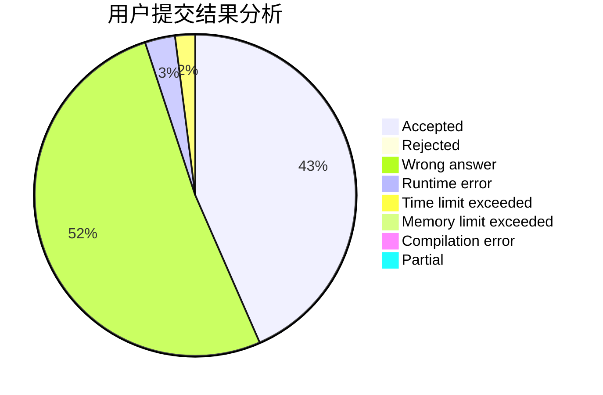
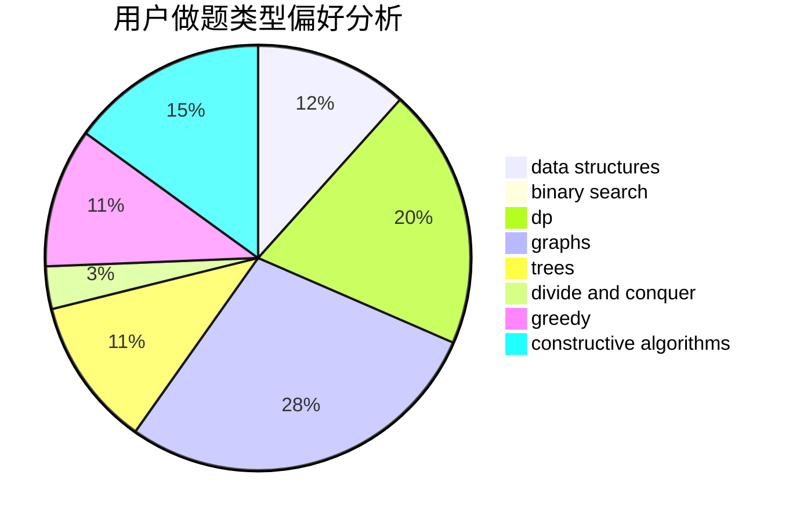
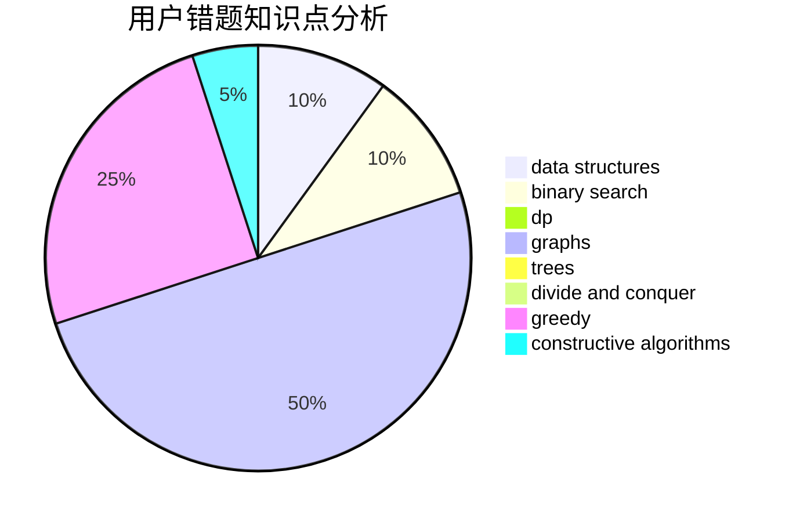

# huahua

<!-- tabs:start -->

#### **用户提交结果分析**

#### **用户做题类型偏好分析**

#### **用户错题知识点分析**

<!-- tabs:end -->
# 推荐题目
[977F](https://codeforces.com/contest/977/problem/F)		dp		  
[1416D](https://codeforces.com/contest/1416/problem/D)		data structures,
                        dsu,
                        graphs,
                        implementation,
                        trees		  
[1369F](https://codeforces.com/contest/1369/problem/F)		dfs and similar,
                        dp,
                        games		  
[990A](https://codeforces.com/contest/990/problem/A)		implementation,
                        math		  
[730C](https://codeforces.com/contest/730/problem/C)		binary search,
                        dfs and similar		  
[706A](https://codeforces.com/contest/706/problem/A)		brute force,
                        geometry,
                        implementation		  
[544D](https://codeforces.com/contest/544/problem/D)		dsu,graphs,sortings,trees		  
[7A](https://codeforces.com/contest/7/problem/A)		brute force,
                        constructive algorithms		  
[922C](https://codeforces.com/contest/922/problem/C)		brute force,
                        number theory		  
[456B](https://codeforces.com/contest/456/problem/B)		math,
                        number theory		  
