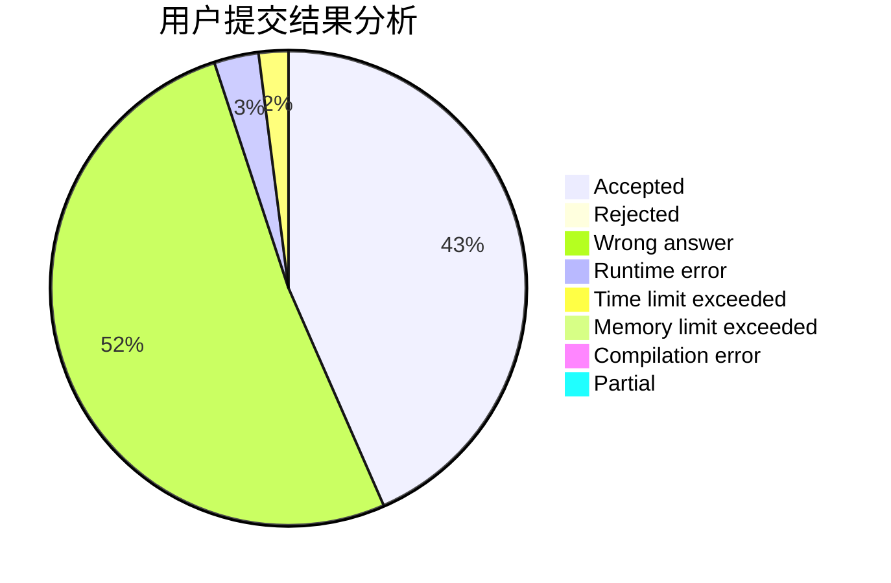
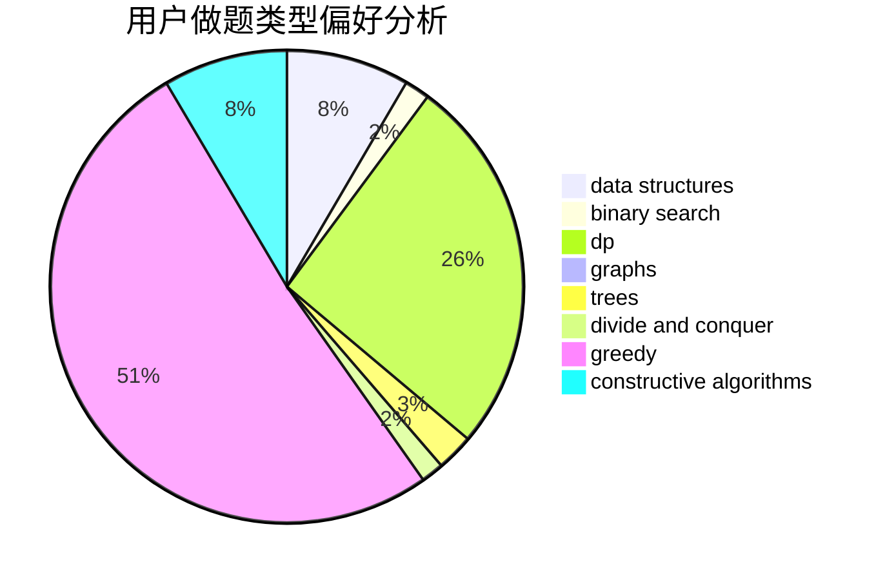
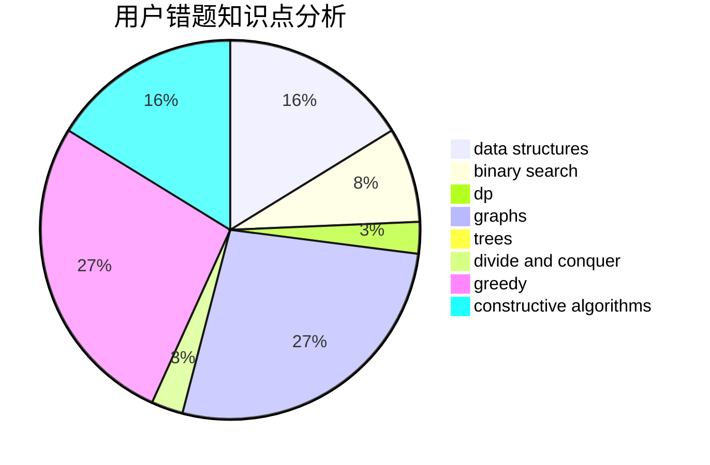

# huahua

<!-- tabs:start -->

#### **用户提交结果分析**

#### **用户做题类型偏好分析**

#### **用户错题知识点分析**

<!-- tabs:end -->
# 推荐题目
[956B](https://codeforces.com/contest/956/problem/B)		dsu,graphs,sortings,trees		  
[1405C](https://codeforces.com/contest/1405/problem/C)		dsu,graphs,sortings,trees		  
[1362A](https://codeforces.com/contest/1362/problem/A)		implementation		  
[976B](https://codeforces.com/contest/976/problem/B)		implementation,
                        math		  
[70E](https://codeforces.com/contest/70/problem/E)		dp,
                        implementation,
                        trees		  
[682A](https://codeforces.com/contest/682/problem/A)		constructive algorithms,
                        math,
                        number theory		  
[519B](https://codeforces.com/contest/519/problem/B)		data structures,
                        implementation,
                        sortings		  
[781C](https://codeforces.com/contest/781/problem/C)		dsu,graphs,sortings,trees		  
[908B](https://codeforces.com/contest/908/problem/B)		brute force,
                        implementation		  
[436B](https://codeforces.com/contest/436/problem/B)		implementation,
                        math		  
