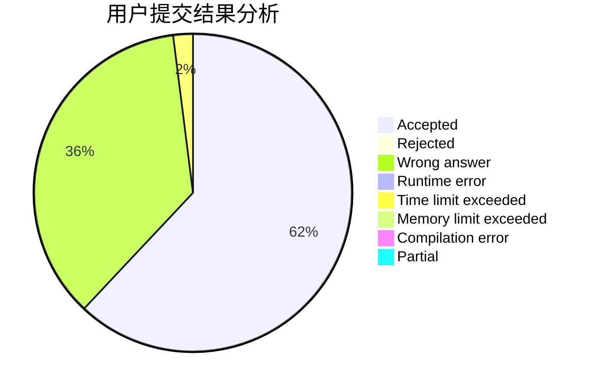
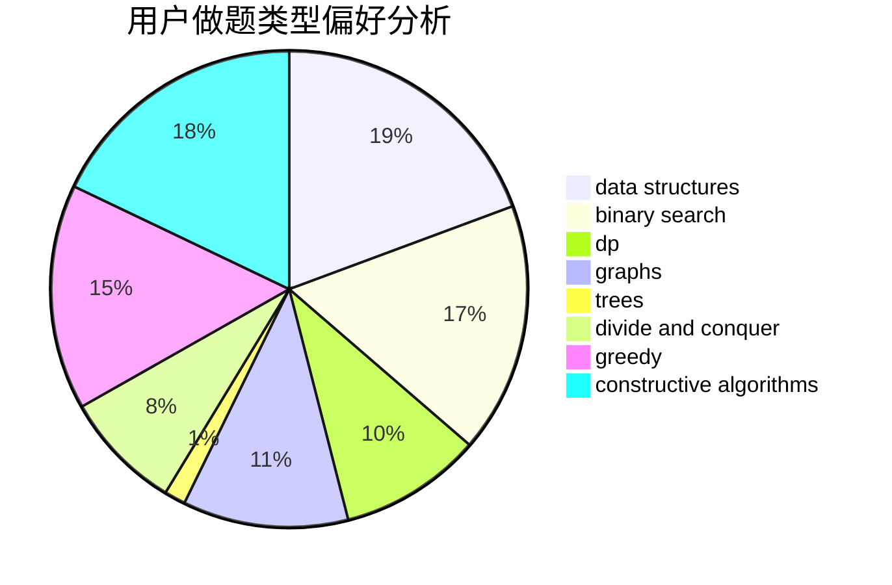
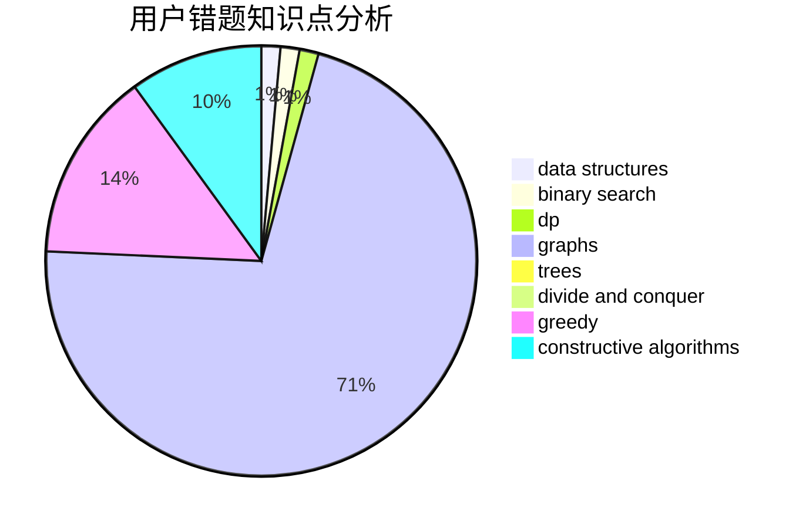

# huaji035

<!-- tabs:start -->

#### **用户提交结果分析**

#### **用户做题类型偏好分析**

#### **用户错题知识点分析**

<!-- tabs:end -->
# 推荐题目
[1066E](https://codeforces.com/contest/1066/problem/E)		data structures,
                        implementation,
                        math		  
[911C](https://codeforces.com/contest/911/problem/C)		brute force,
                        constructive algorithms		  
[1281B](https://codeforces.com/contest/1281/problem/B)		greedy		  
[883G](https://codeforces.com/contest/883/problem/G)		dfs and similar,
                        graphs		  
[1473E](https://codeforces.com/contest/1473/problem/E)		graphs,
                        shortest paths		  
[762E](https://codeforces.com/contest/762/problem/E)		binary search,
                        data structures		  
[478A](https://codeforces.com/contest/478/problem/A)		implementation		  
[869A](https://codeforces.com/contest/869/problem/A)		brute force,
                        implementation		  
[167B](https://codeforces.com/contest/167/problem/B)		dp,
                        math,
                        probabilities		  
[1162B](https://codeforces.com/contest/1162/problem/B)		brute force,
                        greedy		  
