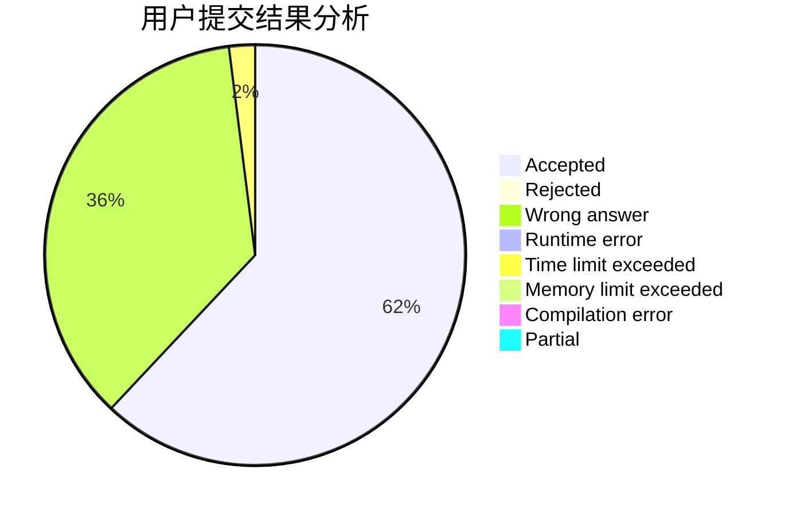
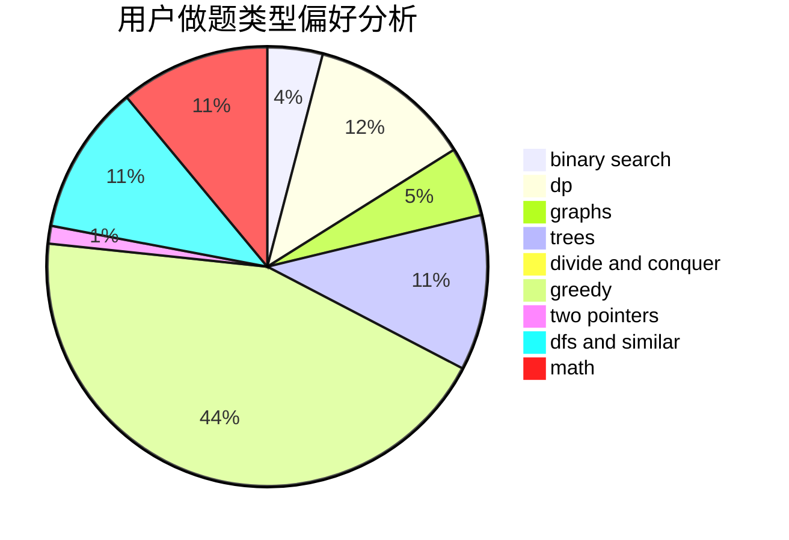

# huaji035

<!-- tabs:start -->

#### **用户提交结果分析**

#### **用户做题类型偏好分析**

<!-- tabs:end -->
# 推荐题目
[1067B](https://codeforces.com/contest/1067/problem/B)
[928B](https://codeforces.com/contest/928/problem/B)
[1287B](https://codeforces.com/contest/1287/problem/B)
[901A](https://codeforces.com/contest/901/problem/A)
[1482B](https://codeforces.com/contest/1482/problem/B)
[781C](https://codeforces.com/contest/781/problem/C)
[498A](https://codeforces.com/contest/498/problem/A)
[888D](https://codeforces.com/contest/888/problem/D)
[193C](https://codeforces.com/contest/193/problem/C)
[1164I](https://codeforces.com/contest/1164/problem/I)
