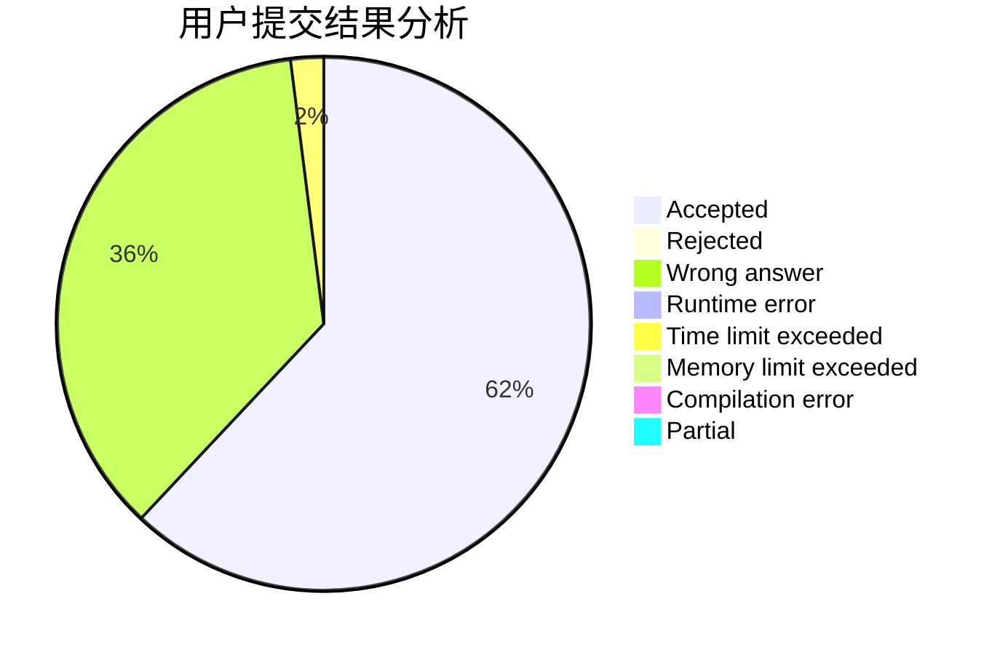
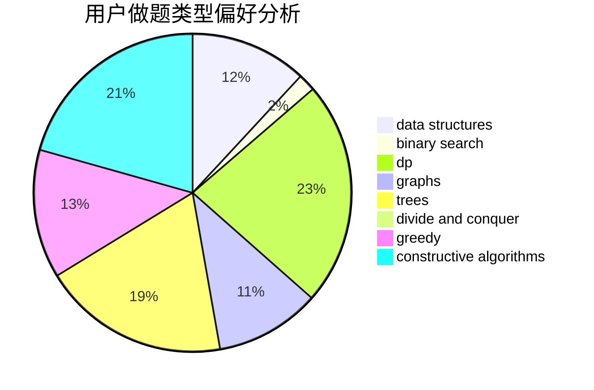
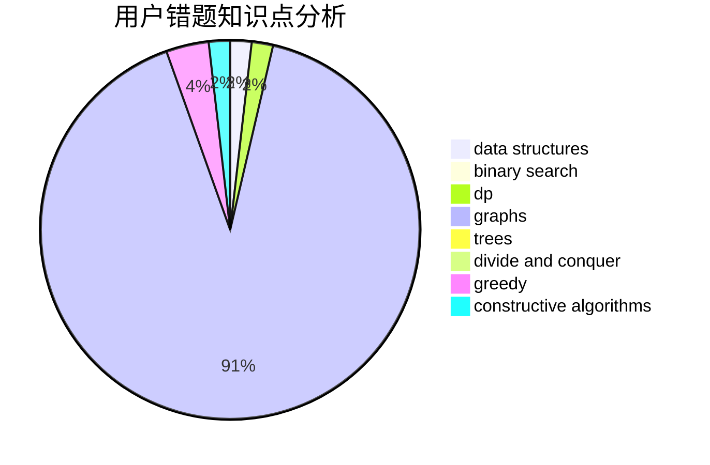

# huaji035

<!-- tabs:start -->

#### **用户提交结果分析**

#### **用户做题类型偏好分析**

#### **用户错题知识点分析**

<!-- tabs:end -->
# 推荐题目
[1067B](https://codeforces.com/contest/1067/problem/B)		dfs and similar,
                        graphs,
                        shortest paths		  
[928B](https://codeforces.com/contest/928/problem/B)		*special problem,
                        dp		  
[1287B](https://codeforces.com/contest/1287/problem/B)		brute force,
                        data structures,
                        implementation		  
[901A](https://codeforces.com/contest/901/problem/A)		constructive algorithms,
                        trees		  
[1482B](https://codeforces.com/contest/1482/problem/B)		implementation,
                        math		  
[781C](https://codeforces.com/contest/781/problem/C)		dsu,graphs,sortings,trees		  
[498A](https://codeforces.com/contest/498/problem/A)		geometry		  
[888D](https://codeforces.com/contest/888/problem/D)		combinatorics,
                        dp,
                        math		  
[193C](https://codeforces.com/contest/193/problem/C)		constructive algorithms,
                        greedy,
                        math,
                        matrices		  
[1164I](https://codeforces.com/contest/1164/problem/I)		dsu,graphs,sortings,trees		  
