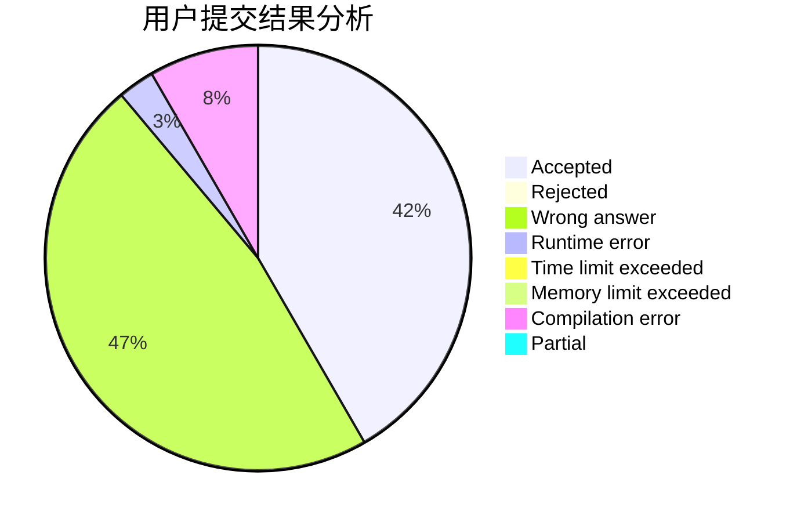
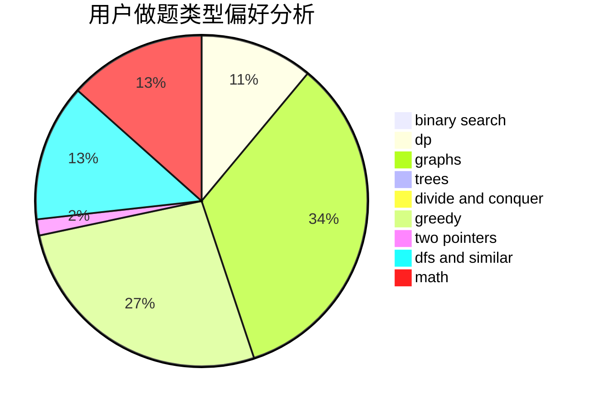

# hualian

<!-- tabs:start -->

#### **用户提交结果分析**

#### **用户做题类型偏好分析**

<!-- tabs:end -->
# 推荐题目
[542D](https://codeforces.com/contest/542/problem/D)
[917B](https://codeforces.com/contest/917/problem/B)
[1423G](https://codeforces.com/contest/1423/problem/G)
[1070D](https://codeforces.com/contest/1070/problem/D)
[644B](https://codeforces.com/contest/644/problem/B)
[453E](https://codeforces.com/contest/453/problem/E)
[1422D](https://codeforces.com/contest/1422/problem/D)
[573E](https://codeforces.com/contest/573/problem/E)
[1351C](https://codeforces.com/contest/1351/problem/C)
[1425F](https://codeforces.com/contest/1425/problem/F)
