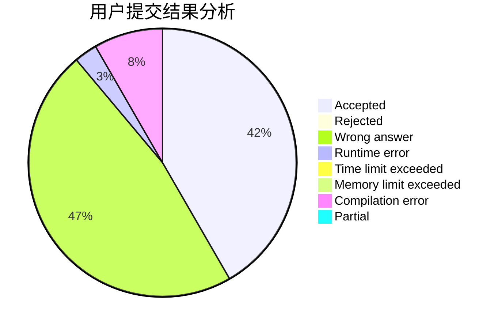
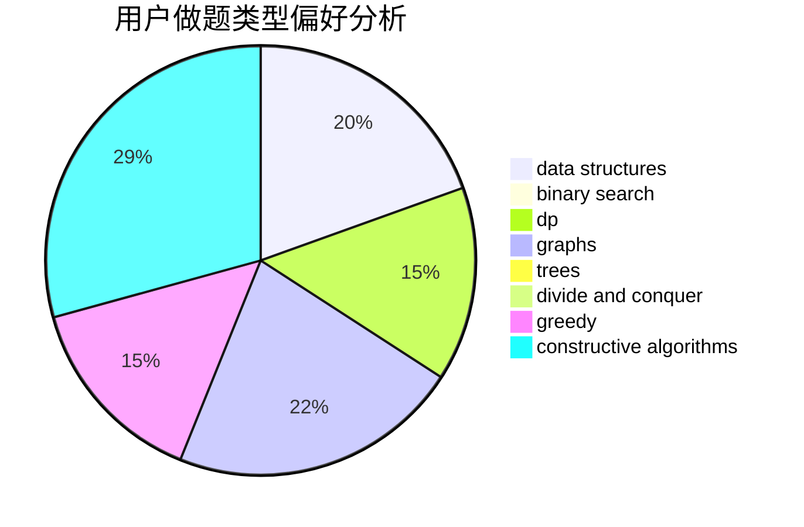

# hualian

<!-- tabs:start -->

#### **用户提交结果分析**

#### **用户做题类型偏好分析**

#### **用户错题知识点分析**

<!-- tabs:end -->
# 推荐题目
[542D](https://codeforces.com/contest/542/problem/D)		dfs and similar,
                        dp,
                        hashing,
                        math,
                        number theory		  
[917B](https://codeforces.com/contest/917/problem/B)		dfs and similar,
                        dp,
                        games,
                        graphs		  
[1423G](https://codeforces.com/contest/1423/problem/G)		data structures		  
[1070D](https://codeforces.com/contest/1070/problem/D)		greedy		  
[644B](https://codeforces.com/contest/644/problem/B)		*special problem,
                        constructive algorithms,
                        data structures,
                        two pointers		  
[453E](https://codeforces.com/contest/453/problem/E)		data structures		  
[1422D](https://codeforces.com/contest/1422/problem/D)		graphs,
                        shortest paths,
                        sortings		  
[573E](https://codeforces.com/contest/573/problem/E)		data structures,
                        greedy		  
[1351C](https://codeforces.com/contest/1351/problem/C)		data structures,
                        implementation		  
[1425F](https://codeforces.com/contest/1425/problem/F)		interactive		  
