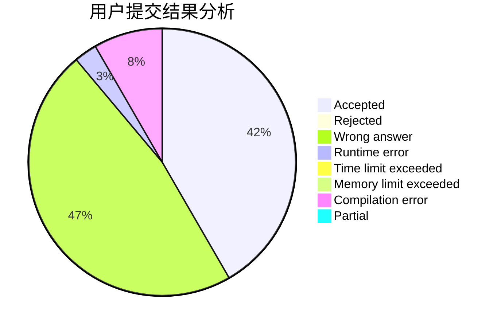
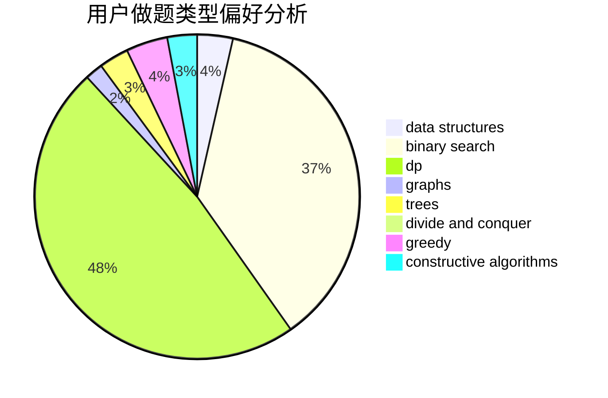

# hualian

<!-- tabs:start -->

#### **用户提交结果分析**

#### **用户做题类型偏好分析**

#### **用户错题知识点分析**

<!-- tabs:end -->
# 推荐题目
[515C](https://codeforces.com/contest/515/problem/C)		greedy,
                        math,
                        sortings		  
[900D](https://codeforces.com/contest/900/problem/D)		bitmasks,
                        combinatorics,
                        dp,
                        math,
                        number theory		  
[1415C](https://codeforces.com/contest/1415/problem/C)		brute force,
                        dp,
                        implementation		  
[1070A](https://codeforces.com/contest/1070/problem/A)		dp,
                        graphs,
                        number theory,
                        shortest paths		  
[620F](https://codeforces.com/contest/620/problem/F)		data structures,
                        strings,
                        trees		  
[433B](https://codeforces.com/contest/433/problem/B)		dp,
                        implementation,
                        sortings		  
[1413B](https://codeforces.com/contest/1413/problem/B)		implementation		  
[548C](https://codeforces.com/contest/548/problem/C)		dsu,graphs,sortings,trees		  
[1344D](https://codeforces.com/contest/1344/problem/D)		binary search,
                        greedy,
                        math		  
[1418B](https://codeforces.com/contest/1418/problem/B)		greedy,
                        sortings		  
