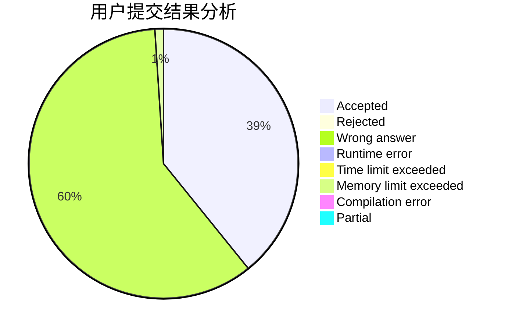
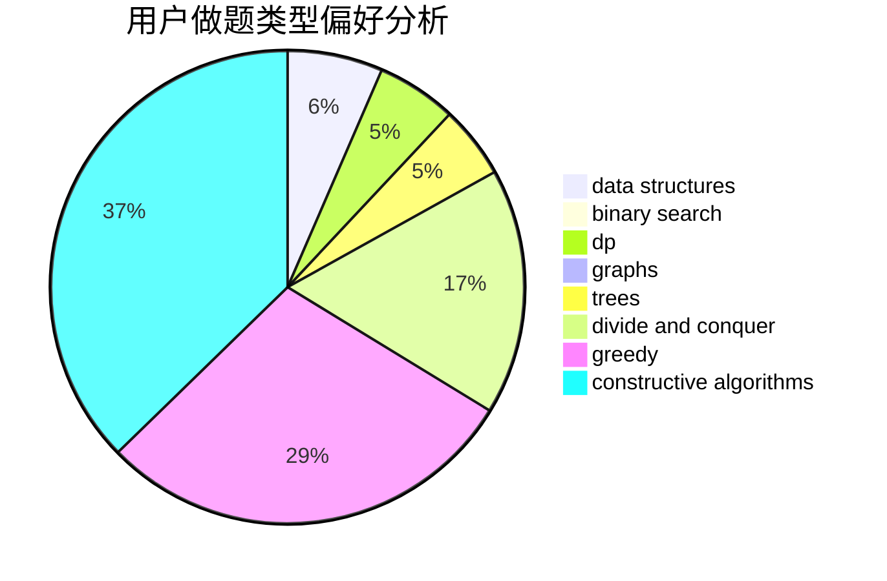

# huangda_

<!-- tabs:start -->

#### **用户提交结果分析**

#### **用户做题类型偏好分析**

#### **用户错题知识点分析**

<!-- tabs:end -->
# 推荐题目
[743E](https://codeforces.com/contest/743/problem/E)		binary search,
                        bitmasks,
                        brute force,
                        dp		  
[1288B](https://codeforces.com/contest/1288/problem/B)		math		  
[1215A](https://codeforces.com/contest/1215/problem/A)		greedy,
                        implementation,
                        math		  
[238A](https://codeforces.com/contest/238/problem/A)		constructive algorithms,
                        math		  
[795K](https://codeforces.com/contest/795/problem/K)		dsu,graphs,sortings,trees		  
[436B](https://codeforces.com/contest/436/problem/B)		implementation,
                        math		  
[757E](https://codeforces.com/contest/757/problem/E)		brute force,
                        combinatorics,
                        dp,
                        number theory		  
[1423I](https://codeforces.com/contest/1423/problem/I)		bitmasks		  
[1350D](https://codeforces.com/contest/1350/problem/D)		dsu,graphs,sortings,trees		  
[1203B](https://codeforces.com/contest/1203/problem/B)		greedy,
                        math		  
