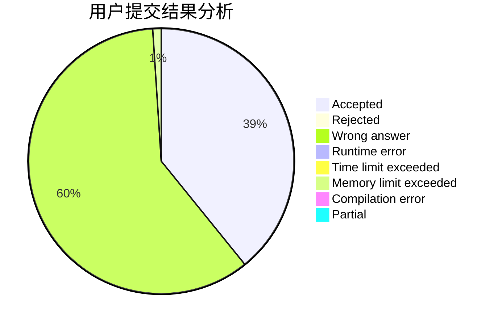
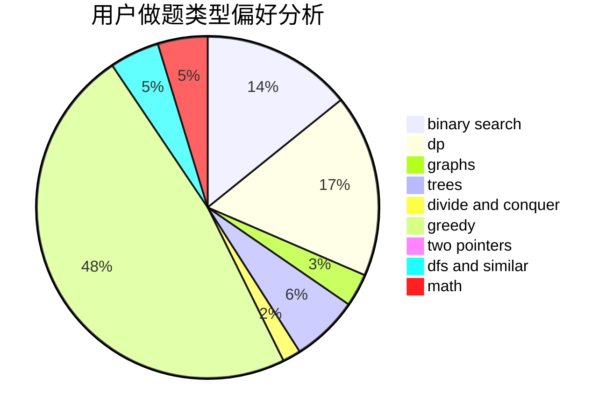

# huangda_

<!-- tabs:start -->

#### **用户提交结果分析**

#### **用户做题类型偏好分析**

<!-- tabs:end -->
# 推荐题目
[764A](https://codeforces.com/contest/764/problem/A)
[1295D](https://codeforces.com/contest/1295/problem/D)
[1220E](https://codeforces.com/contest/1220/problem/E)
[25D](https://codeforces.com/contest/25/problem/D)
[810A](https://codeforces.com/contest/810/problem/A)
[456B](https://codeforces.com/contest/456/problem/B)
[776D](https://codeforces.com/contest/776/problem/D)
[1431D](https://codeforces.com/contest/1431/problem/D)
[13577](https://codeforces.com/contest/1357/problem/7)
[1207F](https://codeforces.com/contest/1207/problem/F)
